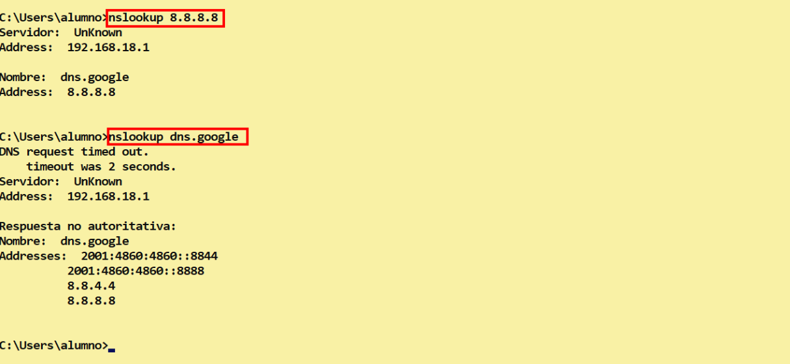
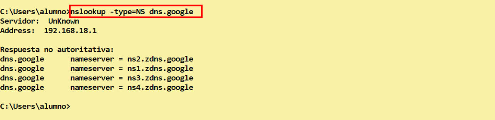
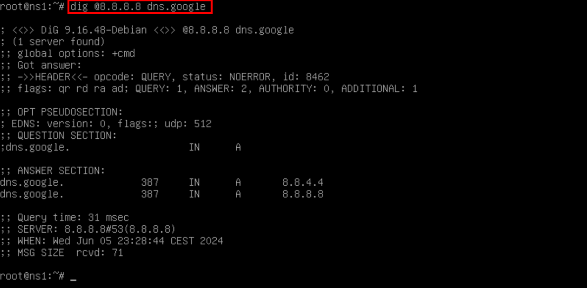
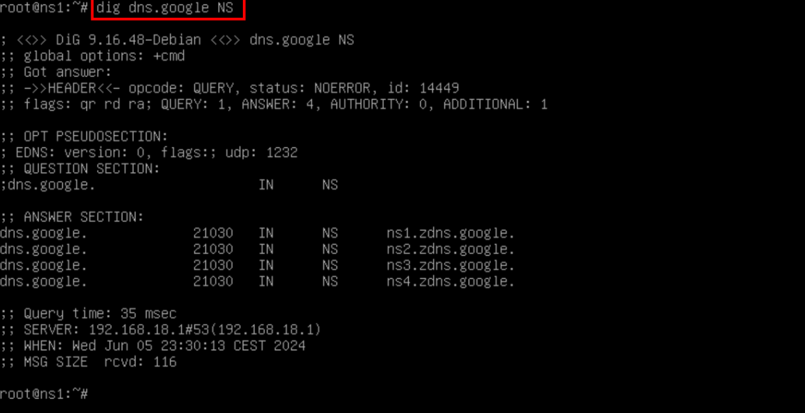

# 🧭🔎 Resulución de Nombres con Comandos ***nslookup*** , ***dig*** , ***hosts***

**📑 Indice** 
- [🧭🔎 Resulución de Nombres con Comandos ***nslookup*** , ***dig*** , ***hosts***](#-resulución-de-nombres-con-comandos-nslookup--dig--hosts)
  - [📘 1. Definición de Comandos](#-1-definición-de-comandos)
    - [🧩 1.1 **`nslookup`**](#-11-nslookup)
    - [🧪 1.2 **`dig`**](#-12-dig)
    - [🧭 1.3 **`host`**](#-13-host)
  - [2. Ejecución de  Comandos](#2-ejecución-de--comandos)
    - [2.1 Comandos ***nslookup***](#21-comandos-nslookup)
    - [2.2 Comandos ***dig***](#22-comandos-dig)

## 📘 1. Definición de Comandos 

### 🧩 1.1 **`nslookup`**

>El comando nslookup se utiliza para obtener información de servidores de nombres de dominio **(DNS)**. En Debian, **`nslookup`** ya no está incluido por defecto, en su lugar se recomienda utilizar el comando **`dig`**. En **Windows**, **`nslookup`** sigue siendo una herramienta de línea de comandos que se puede utilizar para realizar consultas **DNS**.

### 🧪 1.2 **`dig`**

> El comando **`dig`** es utilizado en sistemas **Linux**, como **Debian** , para realizar consultas sobre registros **DNS**. Muestra información detallada sobre un dominio , como direcciones **`ip`** y servidores de correo asociados. En **Windows** , no viene preinstalado, pero se puede instalar a través de herramientas adicionales **Microsoft** .

### 🧭 1.3 **`host`**

>El comando **`host`** en **Debian** es utilizado para realizar consultas de resolución de nombres de dominio, es decir, para obtener información sobre una dirección **`ip`** a partir de un nombre de dominio. Sin embargo, en **Windows** no existe un comando específico llamado **`host`**, pero se puede realizar consultas **DNS** usando el comando **`nslookup`** . En resumen, el comando host funciona en **Debian** para hacer consultas de resolución de nombres, mientras que en **Windows** se puede usar **`nslookup`** para realizar la misma función.

## 2. Ejecución de  Comandos

### 2.1 Comandos ***nslookup***

Con el comando ***nslookup*** podemos podemos ver la ip y el nombre con el siguiente comando . Con la ip ya podmeos ver el nombre como en el siguiente ejemplo 

~~~
nslookup 8.8.8.8
~~~
~~~
nslookup dns.google
~~~

También podemos ver los registros de recursos . Se puede ver de con el los servidores ***NS*** de google de la sigueinte manera 

~~~
nslookup -type=NS dns.google
~~~

### 2.2 Comandos ***dig***

El comando dig podemos añadir la ip y el dominio al mismo tiempo , se peude hacer de la siguiente manera 

~~~
dig @8.8.8.8 dns.google
~~~

Para ver los registros del dominio se puede hacer de esta manera , ejemplo 

