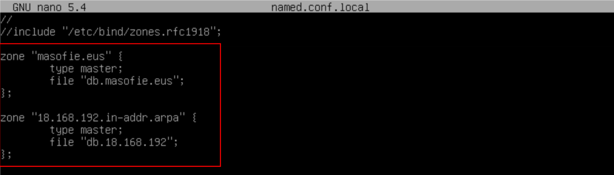

# Servidor ***BIND*** Primario (Maestro)

## Indice 

## Definición 

Un ***servidor primario*** o maestro es un servidor principal en una red de computadoras que tiene la capacidad de almacenar y gestionar bases de datos, archivos y otros recursos compartidos. Este servidor actúa como el punto central de la red, controlando y distribuyendo la información a otros dispositivos conectados a la red.

El ***servidor primario o maestro*** proporciona servicios de administración de usuarios, control de acceso, almacenamiento de archivos, copias de seguridad, entre otros. También puede ser utilizado para gestionar el tráfico de red, asignar direcciones **IP** y controlar el acceso a recursos compartidos.

En resumen, un ***servidor primario o maestro*** es esencial en una red de computadoras para coordinar y gestionar la comunicación entre los diferentes dispositivos de la red y facilitar el acceso a los recursos compartidos.

### 1. Configuración de ***bind***

### 1.1 Añadiendo Reenviadores 

EL primer fichero ha configurar es fichero de renviadores que esta en la siguiente ruta 

~~~
nano /etc/bind/named.conf.options
~~~

### 1.2 Definimos la zona Directa e Inversa

Para definir las zona directa e inversa del servidor dns se puede encontrar en el siguiente fichero 

~~~
nano /etc/bind/named.conf.local
~~~

