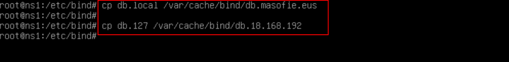

# Servidor ***BIND*** Primario (Maestro)

## Indice 

## Definición 

Un ***servidor primario*** o maestro es un servidor principal en una red de computadoras que tiene la capacidad de almacenar y gestionar bases de datos, archivos y otros recursos compartidos. Este servidor actúa como el punto central de la red, controlando y distribuyendo la información a otros dispositivos conectados a la red.

El ***servidor primario o maestro*** proporciona servicios de administración de usuarios, control de acceso, almacenamiento de archivos, copias de seguridad, entre otros. También puede ser utilizado para gestionar el tráfico de red, asignar direcciones **IP** y controlar el acceso a recursos compartidos.

En resumen, un ***servidor primario o maestro*** es esencial en una red de computadoras para coordinar y gestionar la comunicación entre los diferentes dispositivos de la red y facilitar el acceso a los recursos compartidos.

### 1. Configuración de ***bind***

### 1.1 Añadiendo Reenviadores 

EL primer fichero ha configurar es fichero de renviadores que esta en la siguiente ruta 

~~~
nano /etc/bind/named.conf.options
~~~

### 1.2 Definimos la Zona Directa e Inversa

Para definir las zona directa e inversa del servidor dns se puede encontrar en el siguiente fichero 

~~~
nano /etc/bind/named.conf.local
~~~

### 1.3 Crear Zonas 

Para crear las zonas directa e inversa podemos hacer una copia de los siguientes ficheros por defecto que tenemos y lo podemos hacer de la siguiente manera 

~~~
cp /etc/db.local /var/cache/bind/db.masofie.eus
~~~
~~~
cp /etc/db.127 /var/cache/bind/db.18.168.192
~~~

### 1.4 Añadiendo Registro Zona Directa

En el siguiente fichero podemos definir los registos que tendrá la ***zona directa*** , hay que tener en cuenta que el registro ***SOA*** añadimos el registro ***NS*** (es el servidor con autoridad de la zona)

### 1.5 Añadiendo Registro Zona Inversa

En el fichero de la ***zona inversa*** lo primero que hay que hacer es añadir el registo ***NS*** para dar autoridad a la zona . Y los otros registos son de tipo ***PTR*** y ninguno otro más 

~~~
nano /var/cache/bind/db.18.168.192
~~~

