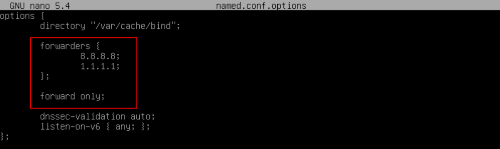
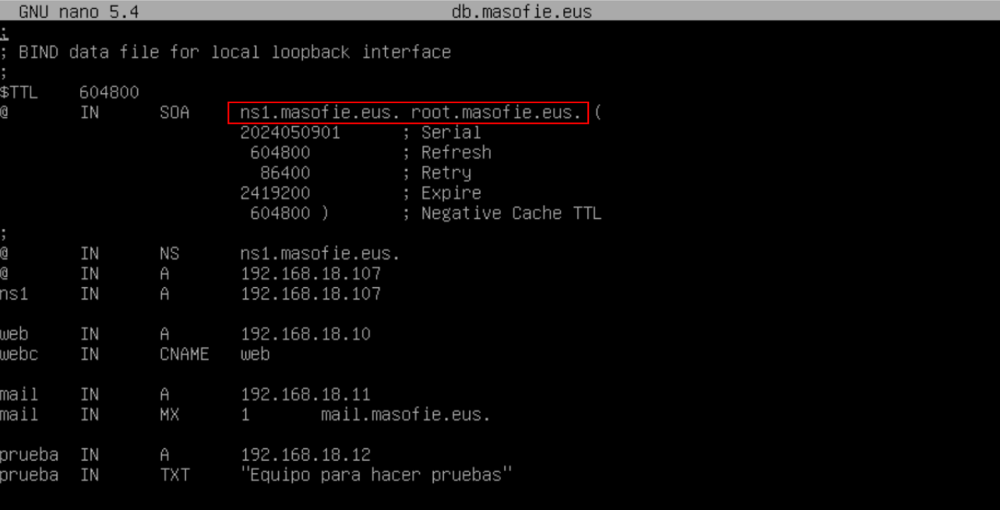
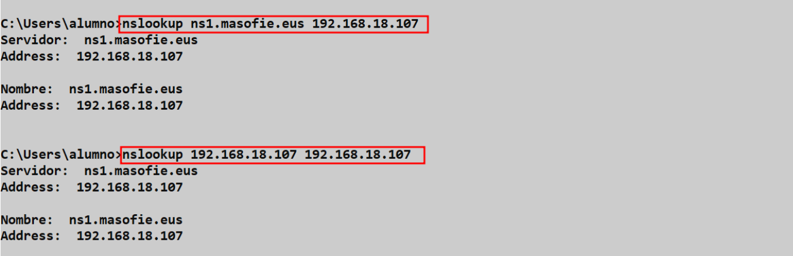
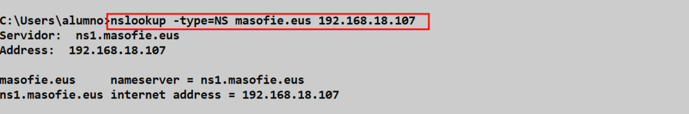
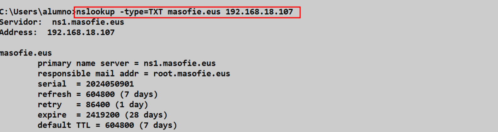
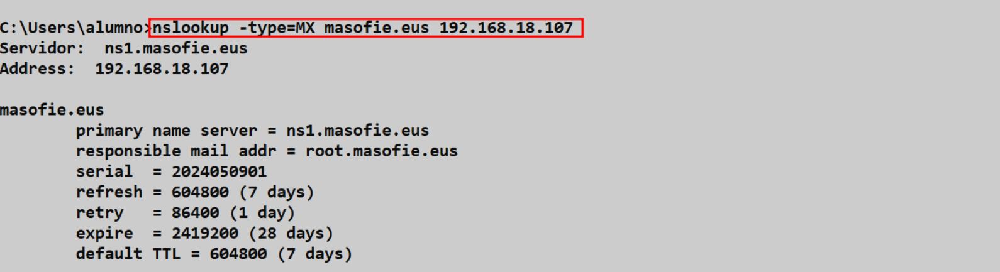

# 🖥️ Servidor **BIND** Primario (Maestro)

**📑 Indice** 
- [🖥️ Servidor **BIND** Primario (Maestro)](#️-servidor-bind-primario-maestro)
  - [📝 Definición](#-definición)
  - [⚙️ 1. Configuración de **BIND**](#️-1-configuración-de-bind)
    - [📍 1.1 Añadiendo Reenviadores](#-11-añadiendo-reenviadores)
    - [🆕 1.2 Definición de Zona Directa e Inversa](#-12-definición-de-zona-directa-e-inversa)
    - [➕ 1.3 Creación de Zonas](#-13-creación-de-zonas)
    - [➕ 1.4 Añadiendo Registro en Zona Directa](#-14-añadiendo-registro-en-zona-directa)
    - [1.5 Añadiendo Registro en Zona Inversa](#15-añadiendo-registro-en-zona-inversa)
  - [🧪 2. Comprobaciones en Cliente Windows](#-2-comprobaciones-en-cliente-windows)
    - [✅ 2.1 Verificación de Zona Directa e Inversa](#-21-verificación-de-zona-directa-e-inversa)
    - [📛 2.2 Registro **`ns`**](#-22-registro-ns)
    - [📝 2.3 Registro **`txt`**](#-23-registro-txt)
    - [📬 2.4 Registro **`mx`**](#-24-registro-mx)

 

## 📝 Definición 

Un ***servidor primario*** o maestro es un servidor principal en una red de computadoras que tiene la capacidad de almacenar y gestionar bases de datos, archivos y otros recursos compartidos. Este servidor actúa como el punto central de la red, controlando y distribuyendo la información a otros dispositivos conectados a la red.

El ***servidor primario o maestro*** proporciona servicios de administración de usuarios, control de acceso, almacenamiento de archivos, copias de seguridad, entre otros. También puede ser utilizado para gestionar el tráfico de red, asignar direcciones **`ip`** y controlar el acceso a recursos compartidos.

En resumen, un ***servidor primario o maestro*** es esencial en una red de computadoras para coordinar y gestionar la comunicación entre los diferentes dispositivos de la red y facilitar el acceso a los recursos compartidos.

## ⚙️ 1. Configuración de **BIND**

### 📍 1.1 Añadiendo Reenviadores 

EL primer fichero ha configurar es fichero de renviadores que esta en la siguiente ruta 

~~~
nano /etc/bind/named.conf.options
~~~

### 🆕 1.2 Definición de Zona Directa e Inversa

Para definir las zona directa e inversa del servidor dns se puede encontrar en el siguiente fichero 

~~~
nano /etc/bind/named.conf.local
~~~

### ➕ 1.3 Creación de Zonas

Para crear las zonas directa e inversa podemos hacer una copia de los siguientes ficheros por defecto que tenemos y lo podemos hacer de la siguiente manera 

~~~
cp /etc/db.local /var/cache/bind/db.masofie.eus
~~~
~~~
cp /etc/db.127 /var/cache/bind/db.18.168.192
~~~

### ➕ 1.4 Añadiendo Registro en Zona Directa

En el siguiente fichero podemos definir los registos que tendrá la ***zona directa*** , hay que tener en cuenta que el registro ***SOA*** añadimos el registro ***NS*** (es el servidor con autoridad de la zona)

~~~
nano /var/cache/bind/db.masofie.eus
~~~

### 1.5 Añadiendo Registro en Zona Inversa

En el fichero de la ***zona inversa*** lo primero que hay que hacer es añadir el registo ***NS*** para dar autoridad a la zona . Y los otros registos son de tipo ***PTR*** y ninguno otro más 

~~~
nano /var/cache/bind/db.18.168.192
~~~

## 🧪 2. Comprobaciones en Cliente Windows 

### ✅ 2.1 Verificación de Zona Directa e Inversa

Comprobando zona ***directa e inversa*** de la siguiente manera 

### 📛 2.2 Registro **`ns`**

Comprobar regristo **`ns`** , para ver el servidor con autoridad 

### 📝 2.3 Registro **`txt`**

Ahora comprobamos el registro **`txt`** , para ver si esta funcionando correctamente 

### 📬 2.4 Registro **`mx`**

Si queremos comprobar el registro **`mx`** ,  solo hay que hacer lo siguiente comando 

 

**💡 Consejo Final**

Configurar y mantener un servidor BIND es fundamental para asegurar una resolución DNS eficiente y estable. Recuerda estos puntos clave para optimizar tu trabajo:

> - ✅ Verifica siempre tus configuraciones después de realizar cambios para evitar fallos inesperados.
> - 💾 Mantén copias de seguridad actualizadas de tus archivos de zona y configuración.
> - 🔄 Prueba y valida tus zonas directas e inversas regularmente, tanto en clientes Windows como en otros sistemas.
> - 📚 Sigue aprendiendo y experimentando con diferentes tipos de registros y configuraciones avanzadas.
> - 🛠️ Utiliza herramientas de diagnóstico para identificar y resolver problemas rápidamente.
>
> Con dedicación y práctica constante, dominarás la gestión DNS y asegurarás un funcionamiento óptimo para tus redes. ¡Ánimo y éxito! 🚀🌐