# 🧱 Servidor BIND Secundario (Respaldo)

**📑 Indice** 

- [🧱 Servidor BIND Secundario (Respaldo)](#-servidor-bind-secundario-respaldo)
  - [ℹ️ Definición](#ℹ️-definición)
  - [🛠️ 1. Cambios en el Servidor Primario](#️-1-cambios-en-el-servidor-primario)
    - [🔐 1.2 Cláusula **`allow-transfer`**](#-12-cláusula-allow-transfer)
    - [🗂️ 1.2 Modificaciones en las Zonas](#️-12-modificaciones-en-las-zonas)
  - [🧩 2. Configuración en Servidor Secundario](#-2-configuración-en-servidor-secundario)
    - [📍 2.1 Definición de Zonas](#-21-definición-de-zonas)
    - [🔄 2.2 Visualizar Transferencia de Zonas](#-22-visualizar-transferencia-de-zonas)
    - [📝 2.3  Ajustes de Formato de Texto](#-23--ajustes-de-formato-de-texto)
  - [🧪 3. Comprobaciones en Cliente Windows](#-3-comprobaciones-en-cliente-windows)
    - [📛 3.1 Verificación del Registro **`ns`**](#-31-verificación-del-registro-ns)
    - [🌐 3.1 Prueba de Resolución de Dominio](#-31-prueba-de-resolución-de-dominio)
    - [🚨 3.2 Simulación de Caída del Servidor Primario](#-32-simulación-de-caída-del-servidor-primario)

 

## ℹ️ Definición 

Un ***servidor secundario*** es un servidor que contiene una copia de la información almacenada en un servidor principal. Su función principal es actuar como respaldo en caso de que el servidor principal falle o se vuelva inaccesible. 

Además de servir como ***respaldo***, los servidores secundarios también pueden ser utilizados para distribuir la carga de trabajo, mejorar la disponibilidad de los servicios y garantizar la redundancia en caso de falla en el servidor principal. También pueden utilizarse para mejorar la velocidad de acceso a los datos al estar distribuidos geográficamente.

 

## 🛠️ 1. Cambios en el Servidor Primario

### 🔐 1.2 Cláusula **`allow-transfer`** 

Utilizamos la siguiente clausula en el fichero de definción de zonas y de definición de los reenviadores , tiene que estar de la siguiente forma 

~~~
allow-transfer { 192.168.18.109; };
forwardes{};
~~~

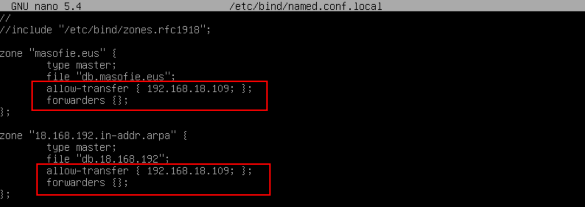

~~~
allow-transfer { 192.168.18.109; };
~~~

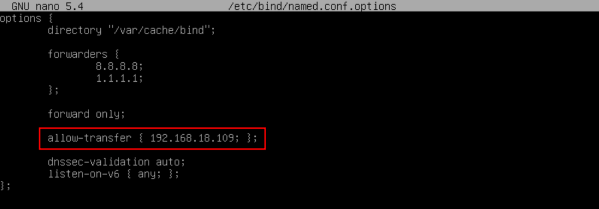

###  🗂️ 1.2 Modificaciones en las Zonas

Modificamos el fichero de zonas directa y zona inversa y añadimos el registro **`ns`** para definir el servidor secundario que vamos ha asignar para el dominio 

~~~
ns2 IN  NS  ns2.masofie.eus.
ns2 IN  A   192.168.18.109
~~~

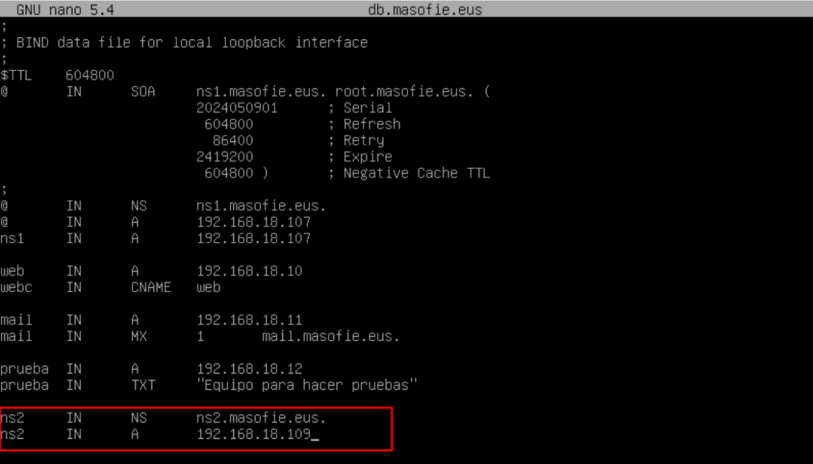

~~~
109 IN  PTR ns2.masofie.eus.
~~~

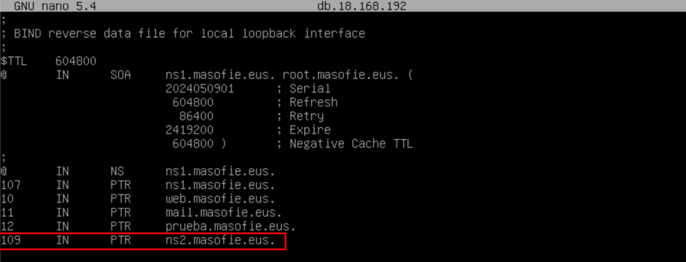

## 🧩 2. Configuración en Servidor Secundario

### 📍 2.1 Definición de Zonas 

Aqui vamos ha defir las zonas directas e inversas y que van a tener una directiva **`slave`** o sea esclavo o secundario de otro directorio y otra directiva llamada **`masters`** para ahí añadir los servidores maestros 

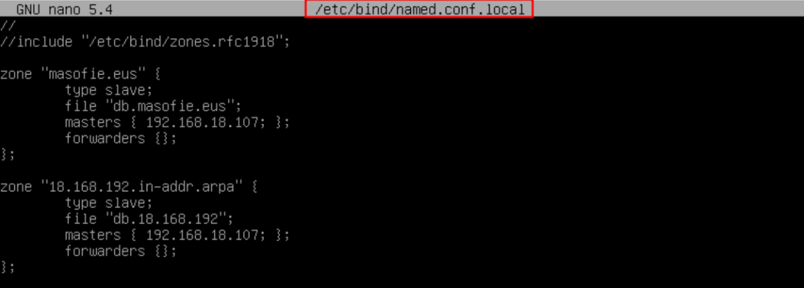

### 🔄 2.2 Visualizar Transferencia de Zonas

Para transferir las zonas reiniciamos nuestro servicio de **`bind9`** , de la siguiente manera y accedemos a la ruta donde estan las zonas por defecto y como podes ver se ha trasferido correctamente 

~~~
systemctl restart bind9
~~~

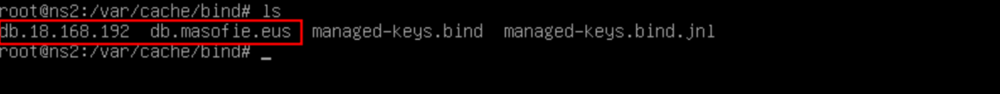

### 📝 2.3  Ajustes de Formato de Texto

Hay un problema que cuando se trasfire las zonas nos las manda en iun formato inlegible , ose nos aprece ce la siguiente manera si habrimos el fichero de una de las zonas 

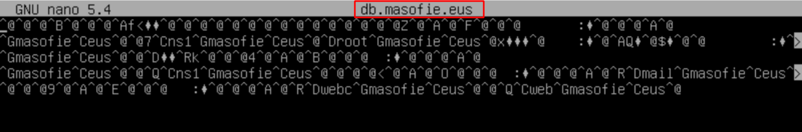

Para solucionar este problema podemos hacer el siguiente comando

~~~
named-compilezone -f raw -F text -o db.masofie.eus masofie.eus db.masofie.eus
~~~

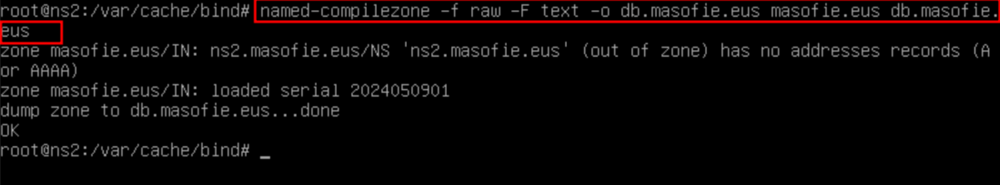

Comprobamos el fichero de zona para ver si acambiado el formato y este mas legible para nosotros 

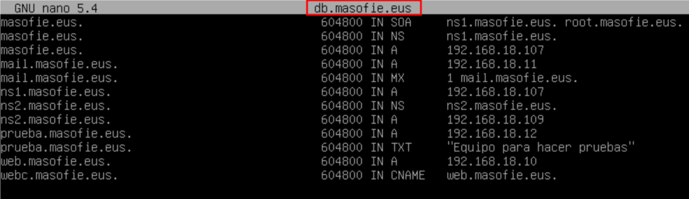

## 🧪 3. Comprobaciones en Cliente Windows

### 📛 3.1 Verificación del Registro **`ns`**

Lo primero que hay que hacer es comprobar el registro **`ns`** esto para ver si encuentra el servidor secundario .***(Hacemos la pregunta al servidor primario)***

~~~
nslookup -type=NS masofie.eus 192.168.18.107
~~~

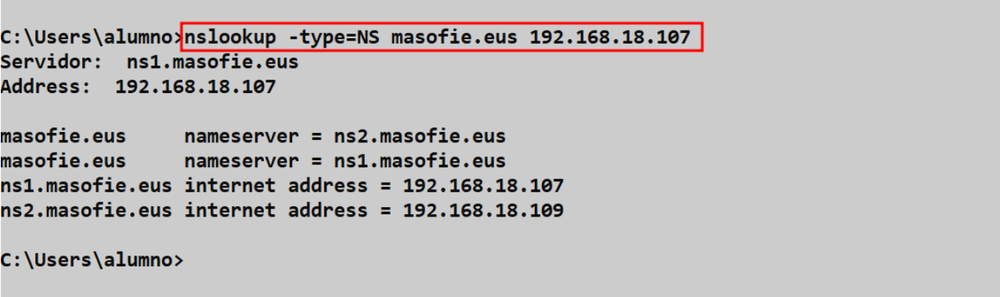

### 🌐 3.1 Prueba de Resolución de Dominio

Para comprobar el dominio vamos ha preguntarle tanto al servidor primerio y al secundario para ver si responden correctamente

~~~
nslookup masofie.eus 192.168.18.107
~~~
~~~
nslookup masofie.eus 192.168.18.109
~~~

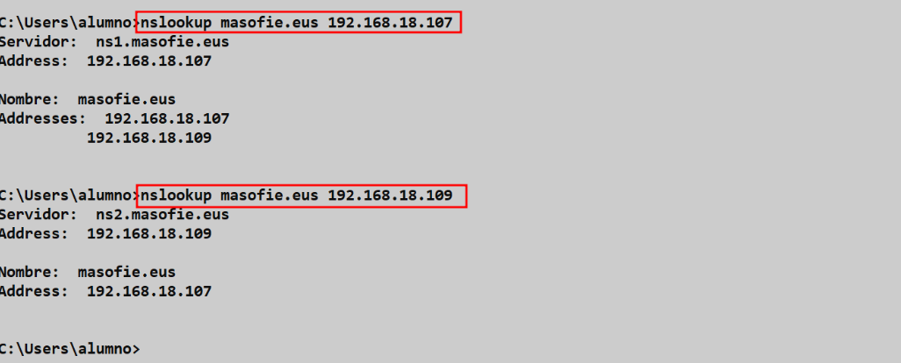

### 🚨 3.2 Simulación de Caída del Servidor Primario

Vamos ha realizar una prueba , para comprobar que el servidor secundario esta funcionando correctamente . Para eso apagamos el servidor principal y hacemos una pregunta desde el cliente .
Como podemos ver no funciona 

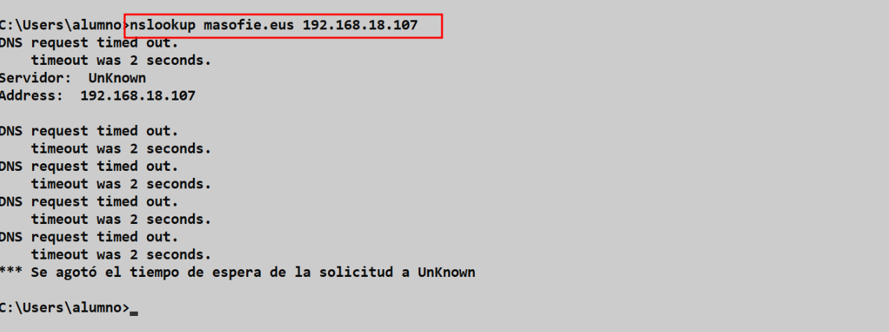

Luego le preguntamos al servidor secundario , en este caso esta funcionando correctamente 

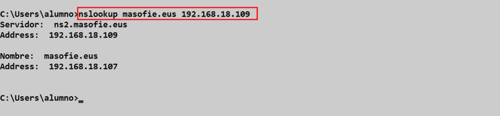

 

**💡 Consejo Final**

> Tener un servidor BIND Secundario no es solo una copia del primario, ¡es tu red de seguridad! 🛡️
> - 🔁 Verifica regularmente las transferencias de zonas para asegurarte de que el servidor secundario está sincronizado.
> - 🔐 Protege el acceso con la cláusula **`allow-transfer`** para evitar fugas de información.
> - 🧪 Haz pruebas de fallo del primario para garantizar que el secundario responde correctamente.
> - 📋 Lleva un registro de cambios y monitorea el sistema para actuar rápido ante cualquier imprevisto.
> Un sistema DNS robusto es aquel que no se cae cuando algo falla, sino que sigue funcionando gracias a una buena planificación.