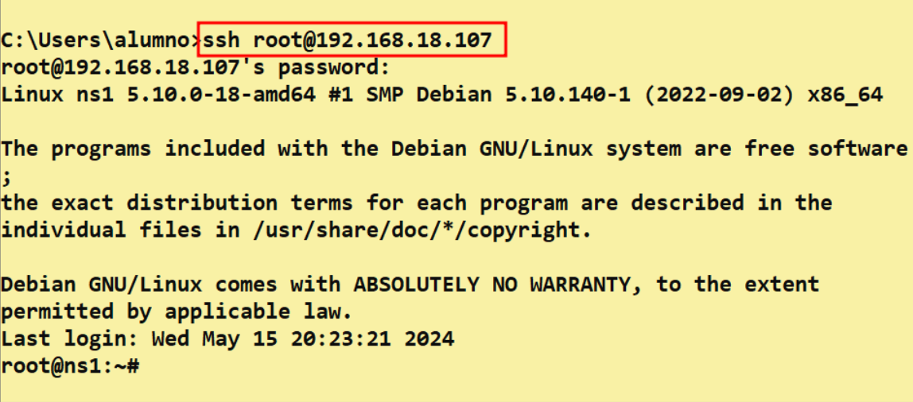
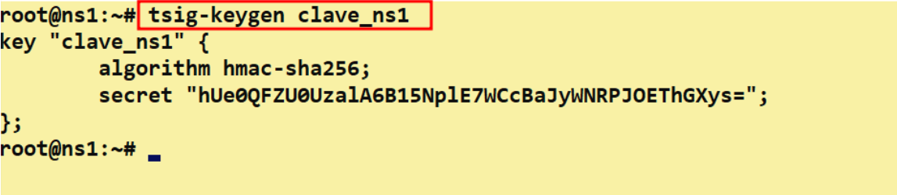
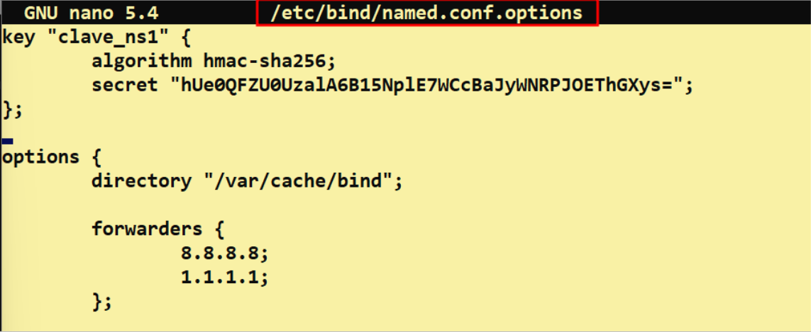
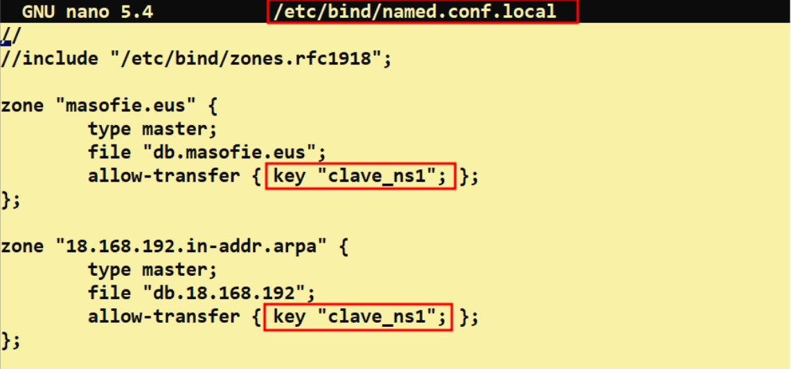
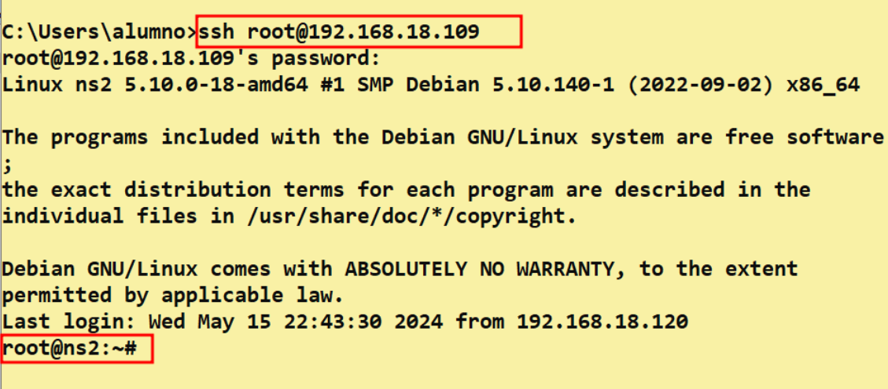
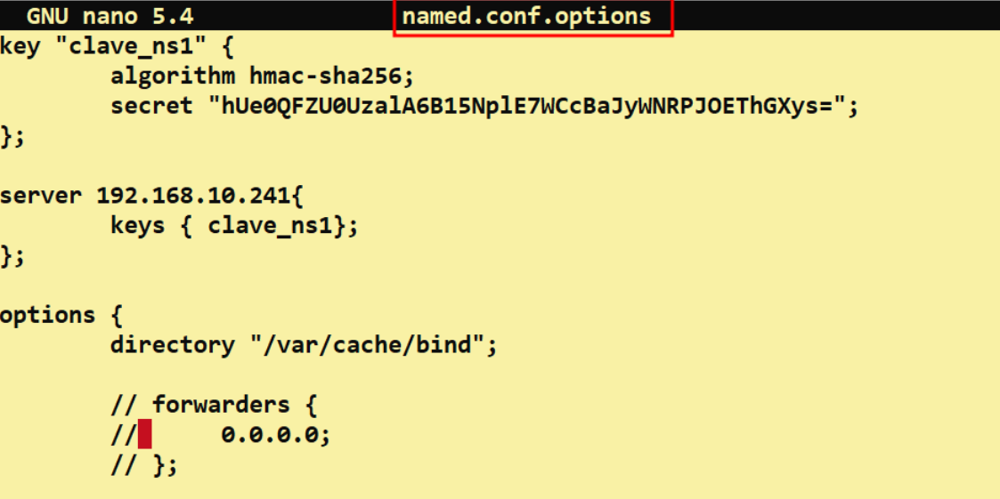

# Servidor ***BIND*** Secundario con **Clave TSIG**

## Indice 

## Definición

Una ***Clave TSIG (Transaction Signature)*** es una forma de autenticación utilizada en servidores **DNS** como **BIND9** para asegurarse de que las comunicaciones entre un servidor maestro y un servidor esclavo son seguras y auténticas. Esta clave se utiliza para firmar digitalmente las transferencias de zona entre servidores **DNS** y garantizar la integridad de los datos transmitidos. Las ***Claves TSIG*** se configuran con un algoritmo de hash y una clave compartida entre los servidores para asegurar la autenticidad de las comunicaciones.

## 1. Cambios en Servidor Principal 

### 1.1 Conexión ***ssh***

Vamos ha crear la ***clave tsig*** en el servidor principal para crearla . Pero antes nos conectaremos por ***ssh*** al servidor para poder copiar la clave desde un equipo w10 (interfaz grafica) 

~~~
ssh root@192.168.18.107
~~~

### 1.2 Creación de ***Clave TSIG***

Creamos la clave en el servidor primario con el siguiente comando en el terminal , primero se añade el comando y luego el nombre de la clave  

~~~
 tsig-keygen clave_ns1
~~~

Una vez creada la clave la copiamos y la añadimos al fichero ***named.conf.options*** , de la siguiente manera . **Tiene que estar antes de la directiva ***options*** la clave**

~~~
nano /etc/bind/named.conf.options
~~~

También tenemos que hacer cambios en el fichero ***named.conf.local*** , cambimos el la ip del secundario por la clave creadad 

~~~
nano /etc/bind/named.conf.local
~~~

No olviden reinciar y ver el estado del servicio de bind para que se guarden los cambios ellos anteriormente 

~~~
systemct restart bind9
~~~
~~~
systemct status bind9
~~~

## 2. Cambios en Servidor Secundario

### 2.1 Conexión ***ssh***

Nos conectamos por ***ssh*** para poder copiar la clave del servidor primario 

~~~
ssh root@192.168.18.109
~~~

### 2.2 Copiando ***Clave TSIG***

Copiamos la clave en el fichero ***named.conf.options*** y añadimos unas lineas a mayores para especificar el servidor primario que es dueño la clave 

~~~
server 192.168.18.107 {
    keys { clave_ns1 };
};
~~~

