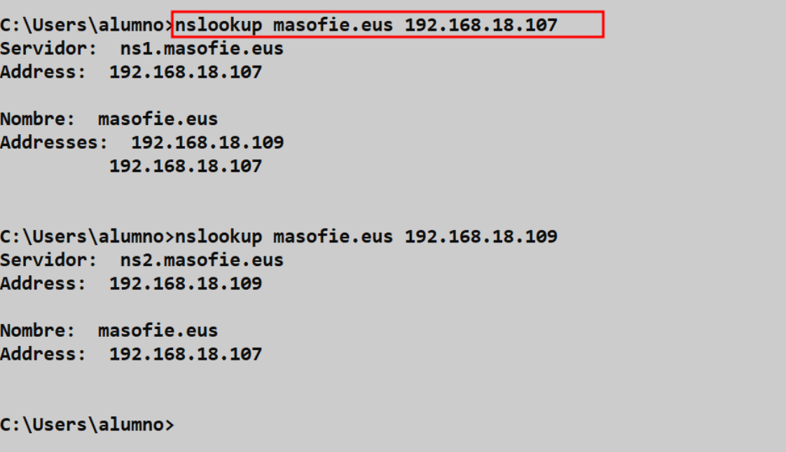

# 🔐 Servidor *``BIND``* Secundario con *``Clave TSIG``*
 

**📑 Indice** 
- [🔐 Servidor *``BIND``* Secundario con *``Clave TSIG``*](#-servidor-bind-secundario-con-clave-tsig)
  - [ℹ️ Definición](#ℹ️-definición)
  - [🛠️ 1. Cambios en Servidor Principal](#️-1-cambios-en-servidor-principal)
    - [🔗 1.1 Conexión vía *``SSH``*](#-11-conexión-vía-ssh)
    - [🧾 1.2 Creación de la *``Clave TSIG``*](#-12-creación-de-la-clave-tsig)
  - [🔧 2. Cambios en el Servidor Secundario](#-2-cambios-en-el-servidor-secundario)
    - [🔗 2.1 Conexión vía SSH](#-21-conexión-vía-ssh)
    - [📂 2.2 Copiar la Clave TSIG](#-22-copiar-la-clave-tsig)
  - [🧪 3. Comprobación desde Cliente Windows 10](#-3-comprobación-desde-cliente-windows-10)

 

## ℹ️ Definición
 

Una *``Clave TSIG (Transaction Signature)``* es una forma de autenticación utilizada en servidores *``DNS``* como *``BIND9``* para asegurarse de que las comunicaciones entre un servidor maestro y un servidor esclavo son seguras y auténticas. Esta clave se utiliza para firmar digitalmente las transferencias de zona entre servidores *``DNS``* y garantizar la integridad de los datos transmitidos. Las *``Claves TSIG``* se configuran con un algoritmo de hash y una clave compartida entre los servidores para asegurar la autenticidad de las comunicaciones.

 

## 🛠️ 1. Cambios en Servidor Principal
  

### 🔗 1.1 Conexión vía *``SSH``*

Vamos ha crear la *``clave tsig``* en el servidor principal para crearla . Pero antes nos conectaremos por *``ssh``* al servidor para poder copiar la clave desde un equipo w10 (interfaz grafica) 

~~~
ssh root@192.168.18.107
~~~

 
 

### 🧾 1.2 Creación de la *``Clave TSIG``*

1 - Creamos la clave en el servidor primario con el siguiente comando en el terminal , primero se añade el comando y luego el nombre de la clave  

~~~
 tsig-keygen clave_ns1
~~~

 
 

2 - Una vez creada la clave la copiamos y la añadimos al fichero *``named.conf.options``* , de la siguiente manera . Tiene que estar antes de la directiva *``options la clave``* , asi como se muestra .

~~~
nano /etc/bind/named.conf.options
~~~

 
 

3 - También tenemos que hacer cambios en el fichero *``named.conf.local``* , cambimos el la *``ip``* del secundario por la clave creadad 

~~~
nano /etc/bind/named.conf.local
~~~

 
 

4 - No olviden reinciar y ver el estado del servicio de *``bind``* para que se guarden los cambios ellos anteriormente 

~~~
# Reiniciar servicio
systemct restart bind9

# Ver estado el servicio
systemct status bind9
~~~
 
 

## 🔧 2. Cambios en el Servidor Secundario
 

### 🔗 2.1 Conexión vía SSH

Nos conectamos por *``ssh``* para poder copiar la clave del servidor primario 

~~~
ssh root@192.168.18.109
~~~

 
 

### 📂 2.2 Copiar la Clave TSIG

1 - Copiamos la clave en el fichero *``named.conf.options``* y añadimos unas lineas a mayores para especificar el servidor primario que es dueño la clave 

~~~
server 192.168.18.107 {
    keys { clave_ns1 };
};
~~~

 
 

2 - Solo nos queda reinciar y ver ele estado para guradar los cambios 

~~~
# Reiniciar servicio bind
systemct restart bind9

# Ver estado de bind
systemct status bind9
~~~

## 🧪 3. Comprobación desde Cliente Windows 10
 

Hacemos una petición desde el cliente al dominio desde el cliete preguntandole tanto al primario y al secundario 

~~~
nslookup masofie.eus 192.168.18.107

nslookup masofie.eus 192.168.18.109
~~~

 
 

**💡 Consejo Final**

> Usar una clave **TSIG** garantiza que las transferencias entre servidores DNS sean seguras y confiables 🔒. Aquí tienes algunas recomendaciones clave:
> 
> - ✅ Genera claves únicas y robustas, evitando claves simples o genéricas.
> - 📁 Asegúrate de copiar la clave exactamente igual en ambos servidores para evitar errores de autenticación.
> - 🔍 Revisa los logs en caso de fallo de transferencia: muchas veces el problema está en una mala firma o clave mal configurada.
> - 🧪 Haz pruebas periódicas para validar que el mecanismo TSIG sigue funcionando correctamente con cada cambio.