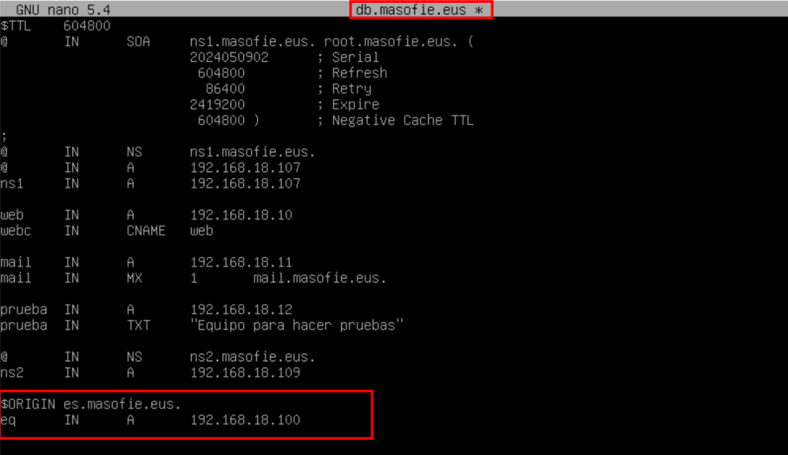
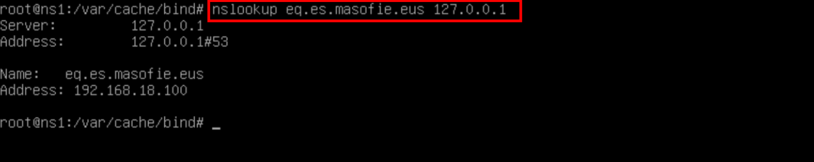
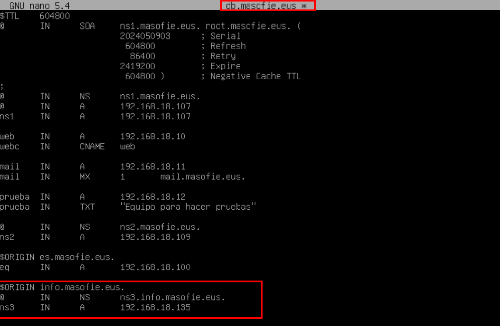
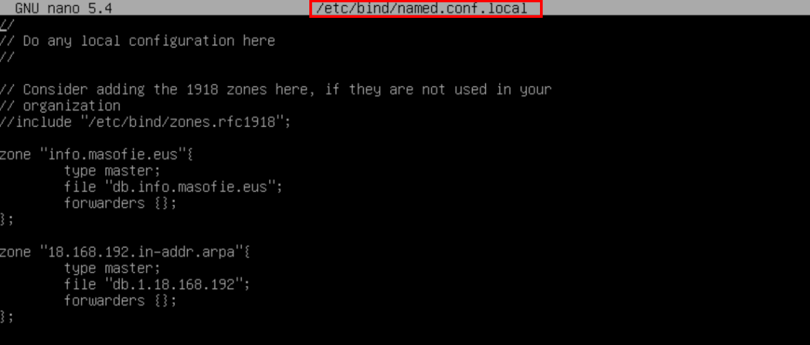
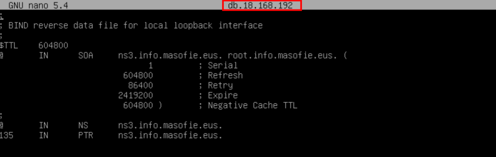
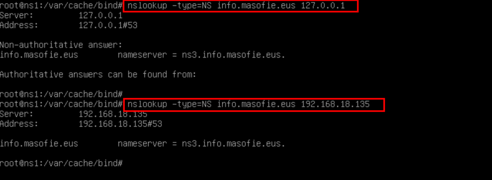

# 🌐 Creación de Subdominios
 

**📑 Indice** 
- [🌐 Creación de Subdominios](#-creación-de-subdominios)
  - [ℹ️  Definición](#ℹ️--definición)
  - [🏷️ 1. Dominio Virtual](#️-1-dominio-virtual)
    - [🧾 1.1 Definir el Registro del Subdominio](#-11-definir-el-registro-del-subdominio)
    - [🔍 1.2 Consultar Subdominio](#-12-consultar-subdominio)
  - [🛰️ 2. Dominio Delegado](#️-2-dominio-delegado)
    - [📌 2.1 Registrar Subdominio en el Servidor Principal](#-21-registrar-subdominio-en-el-servidor-principal)
    - [🗂️ 2.2 Crear Zonas del Subdominio](#️-22-crear-zonas-del-subdominio)
    - [🧾 2.3 Definir Registros dentro de la Zona](#-23-definir-registros-dentro-de-la-zona)
    - [🧪 2.4 Comprobaciones y Validación](#-24-comprobaciones-y-validación)

 

## ℹ️  Definición 
 

Un *``subdominio virtual``* es un término utilizado en el ámbito de las tecnologías de internet para referirse a un dominio dentro de un dominio principal. Por ejemplo, si tenemos el dominio principal *``ejemplo.com``*, un subdominio virtual podría ser *``subdominio.ejemplo.com``*. Los subdominios virtuales se utilizan comúnmente para organizar y estructurar un sitio web.

Por otro lado, un *``delegado``* es una persona o entidad designada para actuar en nombre de otra persona o entidad. En el contexto de los servidores de nombres de dominio *``(DNS)``*, un delegado es una entidad autorizada para administrar ciertos aspectos de un dominio. Por ejemplo, un delegado puede ser responsable de la gestión de los registros *``DNS``* de un subdominio virtual.

En resumen, la diferencia entre un *``subdominio virtual``* y un *``delegado``* radica en que un subdominio virtual es un dominio dentro de un dominio principal, mientras que un delegado es una entidad designada para administrar ciertos aspectos de un dominio, como los registros *``DNS``*.

 

## 🏷️ 1. Dominio Virtual

 

### 🧾 1.1 Definir el Registro del Subdominio

Para crear un dominio virtual se usa la clausula *``$ORIGIN``* para definir el dominio , se hace de la siguiente manera , sin tener en cuenta el registo *``ns``* *``(NO)``*

 
 

### 🔍 1.2 Consultar Subdominio

Para consultar el subdominios usamos el comando *´``nslookup``* 

 
 

## 🛰️ 2. Dominio Delegado
 

### 📌 2.1 Registrar Subdominio en el Servidor Principal

Definimos el el sudomnio delegado en el servidor principal de la siguiente manera , para los delegados simpre tiene que tener un registro *``ns``* *``(SI)``*

 
 

### 🗂️ 2.2 Crear Zonas del Subdominio

Creamos las zonas directa e inversa en el equipo *``ns3``* , hay que tener en cuenta que un subdominio delegado también pueden definirse en otro equipo , asi como lo estamos haciendo 

 
 

### 🧾 2.3 Definir Registros dentro de la Zona

 - *``ZONA DIRECTA``*

 
 

 - *``ZONA INVERSA``*

 
 

### 🧪 2.4 Comprobaciones y Validación

Hacemos las consultas al subdominios para ver si responde corretamente tanto en el servidor principal y en el subdominios 

 
 

 

**💡 Consejo Final**

> Configurar subdominios correctamente es esencial para mantener una estructura *``DNS``* clara, funcional y escalable 🌐✨.
>
> - Planifica la jerarquía de nombres antes de crear registros. Esto te ayudará a mantener el control y facilitar futuras ampliaciones.
> - Distingue cuándo usar dominios virtuales y cuándo delegar:
>   - Los virtuales son rápidos y locales 🧩.
>   - Los delegados ofrecen independencia y distribución de servicios 🛰️.
> - Revisa la configuración de zonas y registros cuidadosamente antes de hacer pruebas.
> - Utiliza herramientas como *``dig ``* o *``nslookup``* para comprobar que todo está funcionando como esperas 🔎.
>
> Una estructura de subdominios bien diseñada mejora la administración, el rendimiento y la seguridad de tu red.
