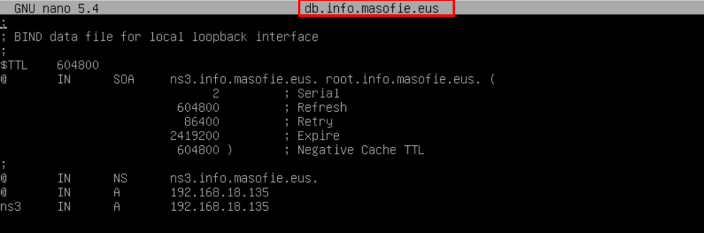

# Creación de Subdominios

## Indice 
- [Creación de Subdominios](#creación-de-subdominios)
  - [Indice](#indice)
  - [Definición](#definición)
  - [1. Dominio Virtual](#1-dominio-virtual)
    - [1.1 Definir Registro](#11-definir-registro)
    - [1.2 Consultar Subdominio](#12-consultar-subdominio)
  - [2. Dominio Delegado](#2-dominio-delegado)
    - [2.1 Definir Registro en Servidor Principal](#21-definir-registro-en-servidor-principal)
    - [2.2 Creación de Zonas](#22-creación-de-zonas)
    - [2.1 Definir Registros de Zonas](#21-definir-registros-de-zonas)
    - [2.2 Comprobaciones](#22-comprobaciones)

## Definición 

Un ***subdominio virtual*** es un término utilizado en el ámbito de las tecnologías de internet para referirse a un dominio dentro de un dominio principal. Por ejemplo, si tenemos el dominio principal **"ejemplo.com"**, un subdominio virtual podría ser **"subdominio.ejemplo.com"**. Los subdominios virtuales se utilizan comúnmente para organizar y estructurar un sitio web.

Por otro lado, un ***delegado** es una persona o entidad designada para actuar en nombre de otra persona o entidad. En el contexto de los servidores de nombres de dominio **(DNS)**, un delegado es una entidad autorizada para administrar ciertos aspectos de un dominio. Por ejemplo, un delegado puede ser responsable de la gestión de los registros **DNS** de un subdominio virtual.

En resumen, la diferencia entre un ***subdominio virtual*** y un ***delegado*** radica en que un subdominio virtual es un dominio dentro de un dominio principal, mientras que un delegado es una entidad designada para administrar ciertos aspectos de un dominio, como los registros **DNS**.

## 1. Dominio Virtual 

### 1.1 Definir Registro 

Para crear un dominio virtual se usa la clausula **'$ORIGIN'** para definir el dominio , se hace de la siguiente manera , sin tener en cuenta el registo ***NS*** **(NO)**

### 1.2 Consultar Subdominio 

Para consultar el subdominios usamos el comando ***nslookup*** 

## 2. Dominio Delegado

### 2.1 Definir Registro en Servidor Principal 

Definimos el el sudomnio delegado en el servidor principal de la siguiente manera , para los delegados simpre tiene que tener un registro ***NS*** **(SI)**

### 2.2 Creación de Zonas 

Creamos las zonas directa e inversa en el equipo ns3 , hay que tener en cuenta que un subdominio delegado también pueden definirse en otro equipo , asi como lo estamos haciendo 

### 2.1 Definir Registros de Zonas

**ZONA DIRECTA**

**ZONA INVERSA**

### 2.2 Comprobaciones 

Hacemos las consultas al subdominios para ver si responde corretamente tanto en el servidor principal y en el subdominios 

