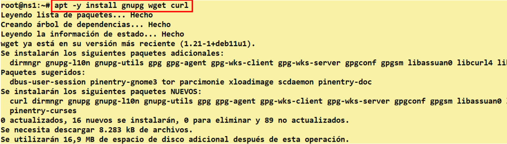
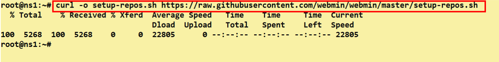
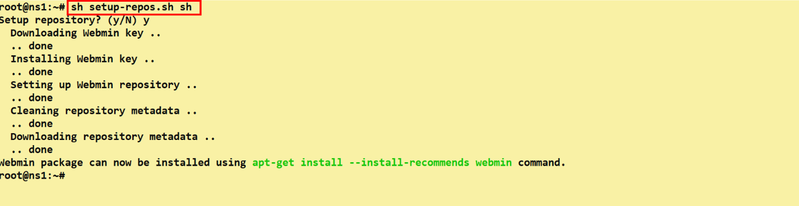
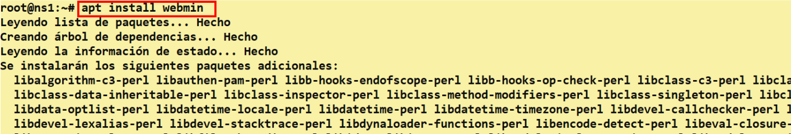
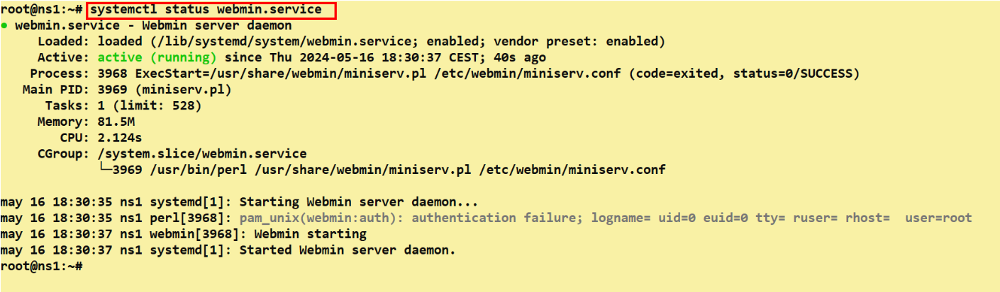
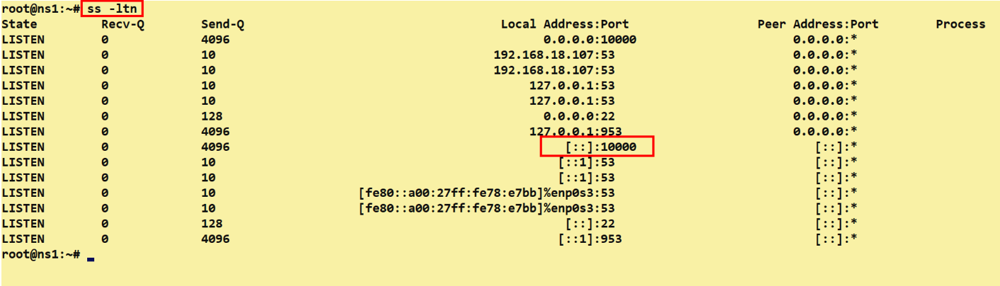
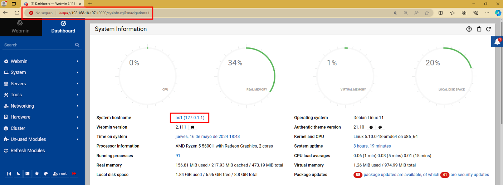

# 🛠️ Instalación de Webmin en Servidor Primario
 

**📑 Indice** 
- [🛠️ Instalación de Webmin en Servidor Primario](#️-instalación-de-webmin-en-servidor-primario)
  - [ℹ️ Definición](#ℹ️-definición)
  - [🧰 1. Herramienta Webmin](#-1-herramienta-webmin)
    - [📦 1.1 Instalación de Paquetes](#-11-instalación-de-paquetes)
    - [🔐 1.2 Descarga de GPG Keys](#-12-descarga-de-gpg-keys)
    - [💾 1.3 Instalación de Webmin](#-13-instalación-de-webmin)
    - [🌐 1.4 Acceder a Webmin](#-14-acceder-a-webmin)

 

## ℹ️ Definición
 

*``Webmin``* es una herramienta de administración basada en la web que se utiliza para gestionar servidores de forma remota, incluido el servidor *``DNS BIND9``* . Con *``Webmin``* , los administradores pueden realizar tareas de configuración, monitoreo y mantenimiento en servidores de forma sencilla a través de una interfaz web intuitiva.

En el caso de *``BIND9``*, *``Webmin``* ofrece funcionalidades como la configuración de zonas *``DNS``* , la gestión de registros de recursos, la configuración de servidores de nombres secundarios, la monitorización del rendimiento del servidor *``DNS``* , entre otras tareas relacionadas con la gestión de un servidor *``BIND9``*.

En resumen, *``Webmin``* es una herramienta útil para facilitar la administración y el mantenimiento de servidores *``DNS``* , como *``BIND9``* , a través de una interfaz web fácil de usar.

 

## 🧰 1. Herramienta Webmin
 

### 📦 1.1 Instalación de Paquetes

Primero tenemos que instalar algunos paquetes necesarios para la instalación y administración de *``webmin``* , ejecuta el siguiente comando 

~~~
apt -y install gnupg wget curl
~~~

 
 

###  🔐 1.2 Descarga de GPG Keys

1 - Descargamos el configurable de repositorio *``GPG keys``*

~~~
 curl -o setup-repos.sh https://raw.githubusercontent.com/webmin/webmin/master/setup-repos.sh
~~~

 
 

2 - Ejecutamos el configurable que acabamos de descargar en el terminal

~~~
sh setup-repos.sh
~~~

 
 

### 💾 1.3 Instalación de Webmin

1 - Ahora instalamos el *``Webmin``* cuando este todo configurado antes

~~~
apt install webmin
~~~

 
 

2 - Después reiniciamos el servidor de *``Webmin``* y mostramos el estado .

~~~
# Reiniciamos el estado
systemctl restart webmin.service

# Mostramos el estado
systemctl status webmin.service
~~~

 
 

3 - Mostramos el puerto que utiliza , usamos los siguientes comandos

~~~
ss -ltn
~~~

 
 

### 🌐 1.4 Acceder a Webmin

1 - Para acceder lo vamos hacer desde el navegador de w10 añadindo la *``ip``* y el puerto , de la siguiente manera 

~~~
192.168.18.107:10000
~~~

 
 

2 - Como podemos ver hemos iniciado correctamente a nuesta herramienta desde el navegador

 
 

**💡 Consejo Final**

> Webmin es una poderosa herramienta de administración web que facilita la configuración de servidores sin necesidad de editar archivos manualmente 💻🌐.
>
> - 🔐 Asegúrate de acceder siempre mediante HTTPS para mantener segura la conexión.
> - 📁 Una vez instalado, explora su panel para familiarizarte con las opciones: *``DNS``* , usuarios, red , firewall y más.
> - ⚙️ Ideal para quienes prefieren una interfaz gráfica en lugar de la terminal, pero ¡ojo! siempre es útil saber qué hay detrás.