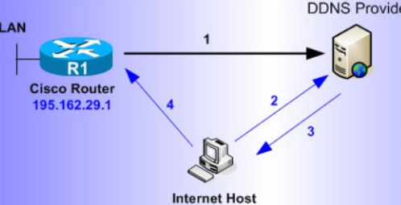

# DDNS utilidad y Proveedores que los Proporcionan

## Indice 

## 1 . DDNS

### 1.1 Qué es DDNS y cual es su utilizad ?

***En estos casos la a utilidad más común es en casos en que una dirección ip asignada a una dispositivo o equipo cambie de forma frecuente*** .
También este servicio que permite la actualización en tiempo real de la información sombre los nombres de
dominios situados en un servidor de nombres .
El **DDNS** sirve de ayuda a la hora de reenviar las direcciones ip de una red domestica , osea que cambian
constantemente a un nombre de dominio fijo 

### 1.2 Función Principal

La función principal del **DDNS** es mantener actualizado el nombre de dominio reconocible para los usuarios y la
dirección ip asignada a los equipos o dispositivos en cuestión .
Entonces de esta manera conseguimos que los usuarios puedan acceder al sitio web , a un servidor otros equipos o
dispositivos conectados a internet , utilizando un nombre fácil de recordar para los usuarios que van acceder al
sitio web .

### 1.3 Funcionamiento entre Servidor y Cliente

El funcionamiento del **DDNS** básico es un software cliente instalado en un dispositivo que esta asociado a un
nombre de dominio . Lo que hace este software es detectar cambios en las direcciones ip asignadas a los
dispositivos y notificar los cambios a un servidor **DDNS** , y este a su vez actualizan la información almacenada en la
base de datos **DNS** .  

**Ejemplo :**  

Cuando un usuario intenta acceder al dispositivos que utiliza el nombre de dominio , el sistema de resolución DNS
se encarga de traducir estos nombres en la dirección ip correspondiente y así es como se establece la conexión con
el dispositivo deseado .