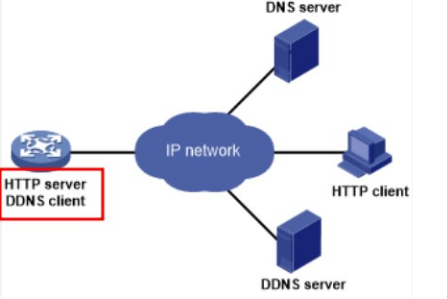

# DDNS utilidad y Proveedores que los Proporcionan

## Indice 
- [DDNS utilidad y Proveedores que los Proporcionan](#ddns-utilidad-y-proveedores-que-los-proporcionan)
  - [Indice](#indice)
  - [1 . DDNS](#1--ddns)
    - [1.1 Qué es DDNS y cual es su utilizad ?](#11-qué-es-ddns-y-cual-es-su-utilizad-)
    - [1.2 Función Principal](#12-función-principal)
    - [1.3 Funcionamiento entre Servidor y Cliente](#13-funcionamiento-entre-servidor-y-cliente)
    - [1.4 Pasos de Comunicación entre Cliente y Servidor](#14-pasos-de-comunicación-entre-cliente-y-servidor)
    - [1.5 Ventajas](#15-ventajas)
    - [1.6 Desventajas](#16-desventajas)
    - [1.7 Requisitos](#17-requisitos)
    - [1.8 Proveedores de Servicios DDNS](#18-proveedores-de-servicios-ddns)
  - [2. Diferencia entre DDNS y DNS](#2-diferencia-entre-ddns-y-dns)
    - [2.1 DDNS](#21-ddns)
    - [2.2 DNS](#22-dns)
  - [3. Servidores DDNS Gratuitos](#3-servidores-ddns-gratuitos)
    - [3.1 Duck DNS](#31-duck-dns)
    - [3.2 Con-ip](#32-con-ip)
    - [3.3 DNS Exit](#33-dns-exit)
  - [3.4 FreeDNS](#34-freedns)
  - [4. Creación de Cuentas en DNS Exit](#4-creación-de-cuentas-en-dns-exit)
    - [4.1 Cuenta Nueva](#41-cuenta-nueva)

## 1 . DDNS

### 1.1 Qué es DDNS y cual es su utilizad ?

***En estos casos la a utilidad más común es en casos en que una dirección ip asignada a una dispositivo o equipo cambie de forma frecuente*** .
También este servicio que permite la actualización en tiempo real de la información sombre los nombres de
dominios situados en un servidor de nombres .
El **DDNS** sirve de ayuda a la hora de reenviar las direcciones ip de una red domestica , osea que cambian
constantemente a un nombre de dominio fijo 

### 1.2 Función Principal

La función principal del **DDNS** es mantener actualizado el nombre de dominio reconocible para los usuarios y la
dirección ip asignada a los equipos o dispositivos en cuestión .
Entonces de esta manera conseguimos que los usuarios puedan acceder al sitio web , a un servidor otros equipos o
dispositivos conectados a internet , utilizando un nombre fácil de recordar para los usuarios que van acceder al
sitio web .

### 1.3 Funcionamiento entre Servidor y Cliente

El funcionamiento del **DDNS** básico es un software cliente instalado en un dispositivo que esta asociado a un
nombre de dominio . Lo que hace este software es detectar cambios en las direcciones ip asignadas a los
dispositivos y notificar los cambios a un servidor **DDNS** , y este a su vez actualizan la información almacenada en la
base de datos **DNS** .  

**Ejemplo :**  

Cuando un usuario intenta acceder al dispositivos que utiliza el nombre de dominio , el sistema de resolución DNS
se encarga de traducir estos nombres en la dirección ip correspondiente y así es como se establece la conexión con
el dispositivo deseado .

### 1.4 Pasos de Comunicación entre Cliente y Servidor

- **Paso 1 ( Registrar Dominio ) :** El cliente se registra en un servicio DDNS y selecciona un dominio a su
gusto .

- **Paso 2 ( Instalación del Cliente DDNS ) :** Cuando ya este registro el cliente en el servicio DDNS , este instala
el software o aplicación DDNS . El software se encargara de actualizar automáticamente las direcciones ip ’ s
del servidor cada vez que se cambie .

- **Paso 3 ( Obtener Dirección inicial ) :** Después inicia en el software o aplicación descargado anteriormente y
obtenemos la dirección ip actual del servidor .

- **Paso 4 ( Enviar dirección ip al Servidor DDNS ) :** Luego software DDNS envía la dirección ip al servidor
DDNS , eso lo hace a través de una conexión cifrada , que puede ser por HTTPS .

- **Paso 5 ( Restar Dirección ip en el Servidor DDNS ) :** El servido DDNS registra la dirección ip proporcionada
por el cliente junto con el dominio asociado en la base de datos de la aplicación .

- **Paso 6 ( Actualizaciones ) :** El software DDNS se ejecuta en segundo plano en el servidor y hace una
verificación periódicamente . Esto lo hace para ver si la dirección ip ha cambiado .

- **Paso 7 ( Detectar cambio de dirección ip ) :** Entonces si la dirección ip del servidor cambia , el software
DDNS lo detecta y actualiza automáticamente la dirección ip en el servidor .

- **Paso 8 ( Petición de resolución DNS ) :** Ahora cunado el usuario intenta acceder al servidor a través del
dominio registrado en el servicio DDNS , el dispositivo realiza una petición de resolución de DNS .
•
- **Paso 9 ( Recuperación de dirección ip actualizada ) :** El servidor DNS proveedor DDNS recibe , a petición
de resolución DNS y este busca en su base de datos el dominio solicitado .
•
- **Paso 10 ( Respuesta de dirección ip actualizada ) :** Después el servidor DNS responde al dispositivo del
usuarios con la dirección ip actualizada del servidor .
•
- **Paso 11 ( Establecimiento de la conexión ) :** Este dispositivo del usuarios utiliza la dirección ip recibida para
establecer una conexión con el servidor .
•
- **Paso 12 ( Comunicación entre el servidor y el cliente ) :** La conexión se establece correctamente , el cliente
y el servidor pueden comunicarse entre si , utilizando protocolos como , ( HTTPS , FTP , SSH , etc )

### 1.5 Ventajas

- **Facilidad de acceso :** Es mas fácil a la hora de acceder al servicio DDNS a los servicios - en red locales .
- **Usar nombres :** Nos permite utilizar nombres de dominio en lugar de direcciones ip ’ s que es mucho más
fácil de recordar para los usuarios .
- **Actualizaciones :** Permite actualizar de manera automática la dirección ip en el caso que cambie .
- **Mejor Gestión :** Es mucho más fácil controlar los servicios desde una única interfaz .
- **Nivel Económico :** es más rentable y barato que estar poniendo direcciones ip ’ s estáticas .

### 1.6 Desventajas

- **Seguridad :** Al usar un DDNS se requiere de muchos dispositivos se autentiquen en el servidor DDNS .
Puede haber posibles atacantes .
- **Fiabilidad :** Estos servicios pueden ser menos confiables . Esto se debe a que los proveedores pueden sufrir
interrupciones por problemas técnicos que afectan a capacidad de acceder a los dispositivos .
- **Dependencia de Proveedor DDNS :** Esto implica que los usuarios dependen de los proveedores externos
para mantener la resolución DNS de una dirección ip . O sea si el proveedor deja de funcionar no se podrá
acceder a los datos de forma remota .
- **Latencia :** La latencia puede aumentar , porque se debe a que el proceso de actualización de la dirección ip
a través del servicio DDNS . Por eso se pueden producir retrasos en la conexión .

### 1.7 Requisitos

- **Conexión a Internet :** Conexión fiable para acceder al servicio DDNS .
- **Router Compatible :** El router debe ser compatible con los servicios DDNS que vamos ha utilizar .
- **Cuenta en DDNS :** Hay que tener una cuenta en un servicio DDNS .
- **Configurar Router :** Tenemos que añadir la la configuración al router para permitir que las direcciones se actualicen
automáticamente .
- **Configuración de Dispositivos :** Hay que tener un dispositivo para acceder a la red local a través de una dirección
DDNS .

### 1.8 Proveedores de Servicios DDNS

Para poder hacer uso del servidor DDNS , es necesario contar con un proveedor de servicios DNS que los podemos
encontrar en la web . Así como también nos da la posibilidad de administración y actualización de los registros DNS
correspondientes a nuestras necesidades .   
Existen muchos proveedores de servicios DDNS tanto gratuitos como de pago , estos ofreciendo diferentes
características , los de pago tiene más funcionalidades y son más seguros a la hora de usarlos , si tienes un
problema van ha responder más rápido tu consulta .   

## 2. Diferencia entre DDNS y DNS

### 2.1 DDNS

Las siglas significan Sistemas de Nombres de Dominio Dinámico . Este es una extensión del DNS que nos permite
asignar nombres de dominios a direcciones ip que pueden cambiar periódicamente o pueden ser dinámicas por
defecto .   
Es muy útil porque en situaciones en que una conexión a internet no tiene dirección ip fija como redes domesticas ,
en lugar de tener que recordar o acceder a direcciones ip ’ s , se puede utilizar un nombre de dominio que se
actualiza automáticamente cada vez que cambia la dirección ip de otros dispositivos .   
Ejemplo :
Una casa con conexión a internet que tiene una dirección ip dinámica , en lugar de tener que recordar siempre la
dirección ip cada ves que tengamos que acceder a un dispositivo de la casa , se puede utilizar un nombre de
dominio asignado a través de un proveedor DDNS de internet . Entonces el proveedor se encargara de actualizar
automáticamente el nombre de dominio cada ve que cambie la dirección ip del la casa . Así permitiendo el acceso
mas sencillo a la red .

### 2.2 DNS

Sus siglas significan Sistema de Nombres de Dominio . Es un sistema que se encarga de traducir los nombres de
dominio en direcciones ip ’ s .   
Ejemplo : www . google . es > 8 . 8 . 8 . 8 ( introducimos un nombre ( www . google . es ) en el navegador web . El DNS
se encarga de buscar la dirección ip asociada este nombre de dominio y si el navegador sabe a quien
pertenece este enviá la solicitud para mostrar la página web )   
Ha sido una parte fundamental de internet desde que inicio , esto permitiendo que los usuarios no tengan que
recordar las direcciones ip , sino que pueden usar nombres de dominios para traducirlas más fácilmente y así
recordarlas mejor .   
Los servidores DNS están organizados en forma jerárquica , donde el principal se llama servidor raíz , que son
servidores a nivel mundial que contienen información sobre la ubicación de los servidores de dominio a nivel
superior , como . com , . org . es . net entre otros .

## 3. Servidores DDNS Gratuitos

### 3.1 Duck DNS

Nos sirve para asignar un nombre de dominio permanente a una dirección ip dinámica , esto nos facilita el acceso
remoto a dispositivos en la red local . También es gratuito y simplemente la mejor opción que existe actualmente .
Dispone de aplicaciones y script para multitud de sistemas operativos . Además , se preocupan por garantizar
nuestra privacidad .

### 3.2 Con-ip

Sirve para controlar y gestionar el acceso a la red basándose en las direcciones ip de los dispositivos , así mejorando
la seguridad y el control de la red , en su versión gratuita sólo permite la configuración de tres dominios .

### 3.3 DNS Exit

Es una herramienta que nos proporciona servicios que permiten a los usuarios gestionar y optimizar la fCuenta Nuevay se redirige el tráfico de sus nombres de dominio , osea servicio de alojamiento web en Ohio

## 3.4 FreeDNS

Es un servicio gratuito que te permite asignar nombres de dominio a direcciones ip , lo cual es muy útil para tener
sitios web , redireccionar dominios y acceder a dispositivos de una forma remotos .

## 4. Creación de Cuentas en DNS Exit

### 4.1 Cuenta Nueva

Primero vamos a la página web de DNS Exit y creamos una cuenta de la siguiente manera , nombre de usuario
contraseña y un correo .

Esperamos un momento a que nos compruebe y le damos clic en continuar

Después de crear la cuenta iniciamos sesión con el nombre que añadimos y la contraseña .

Como podemos ver se ha iniciado correspondiente en el proveedor DDNS gratuito

Aquí también tenemos acceso a la información sobre nuestra cuenta en el proveedor

También podemos nos da la posibilidad de añadir algunos servicios adicionales .

Tenemos un panel de control de para ajustes de nuestro servidor

Y hay un contacto de soporte por si pasa algún problema con el servicio , nos podemos comunicar .