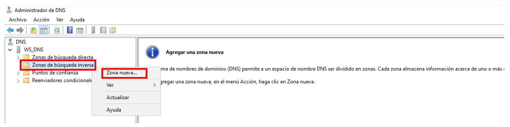
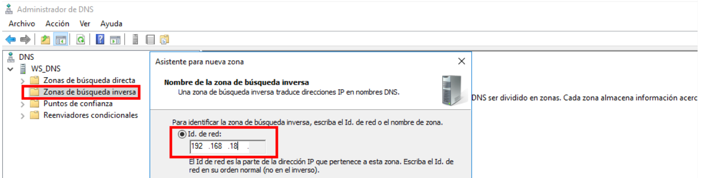
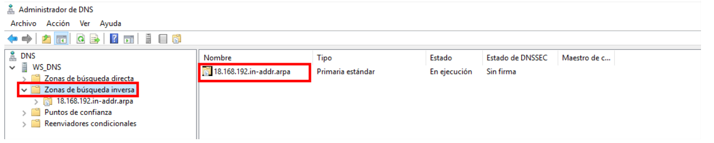
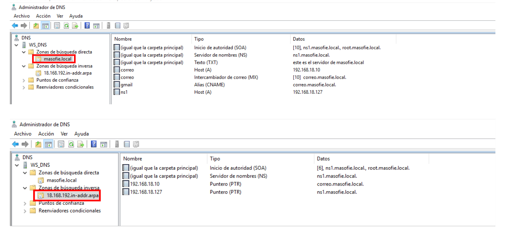
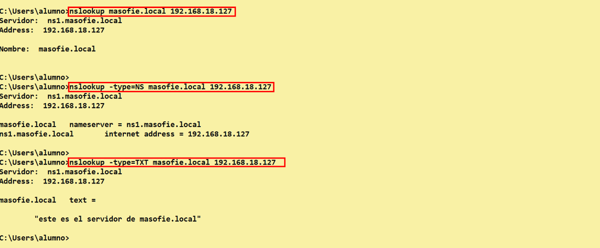

# DNS Maestro en Windows Server

## Indice 
- [DNS Maestro en Windows Server](#dns-maestro-en-windows-server)
  - [Indice](#indice)
  - [1. Instalación de DNS](#1-instalación-de-dns)
    - [1.2 Agregar Rol DNS](#12-agregar-rol-dns)
  - [2. Configuración DNS](#2-configuración-dns)
    - [2.1 Reenviadores](#21-reenviadores)
    - [2.2 Creación de Zona Busqueda Directa](#22-creación-de-zona-busqueda-directa)
    - [2.2 Creación de Zona Busqueda Inversa](#22-creación-de-zona-busqueda-inversa)
    - [2.2 Añadir Registros Directa/Iversa](#22-añadir-registros-directaiversa)
  - [3. Compracioneas con ***nslookup***](#3-compracioneas-con-nslookup)
    - [3.1 Cliente Windows](#31-cliente-windows)

## 1. Instalación de DNS 

### 1.2 Agregar Rol DNS

Añadimos el rol para instalar el servidor dns en nuestro sistema operativo 

## 2. Configuración DNS

### 2.1 Reenviadores 

### 2.2 Creación de Zona Busqueda Directa

### 2.2 Creación de Zona Busqueda Inversa

### 2.2 Añadir Registros Directa/Iversa

## 3. Compracioneas con ***nslookup***

### 3.1 Cliente Windows 

