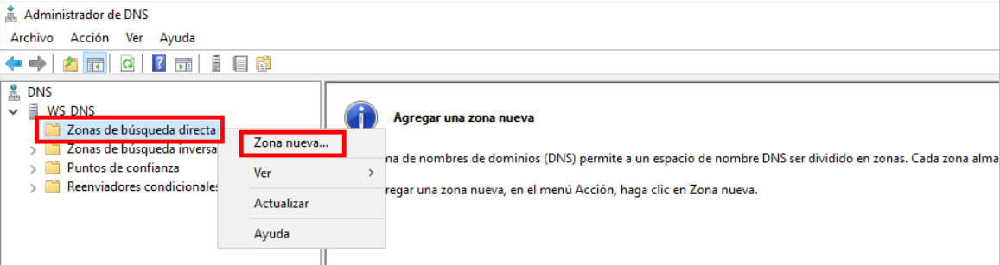
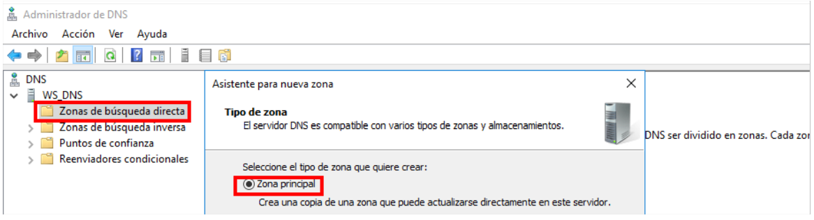
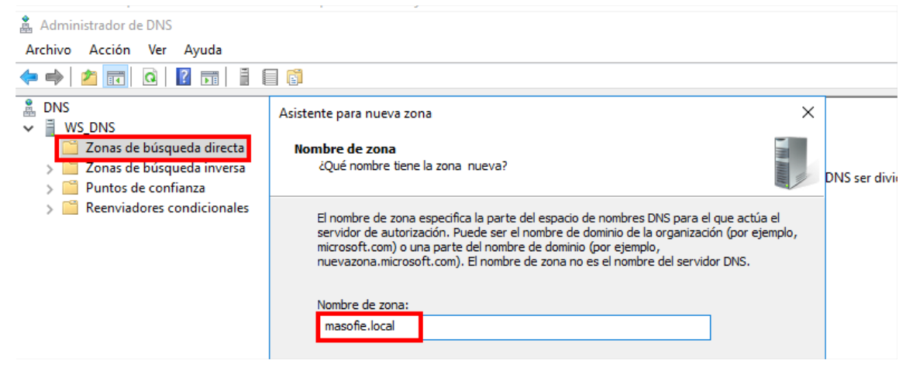
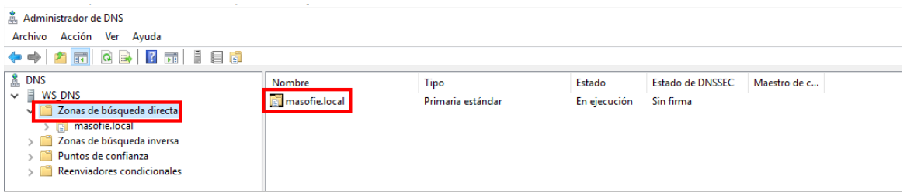

# DNS Maestro en Windows Server

## Indice 

## 1. Instalación de DNS 

### 1.2 Agregar Rol DNS

Añadimos el rol para instalar el servidor dns en nuestro sistema operativo 

## 2. Configuración DNS

### 2.1 Reenviadores 

### 2.2 Creación de Zona Busqueda Directa

