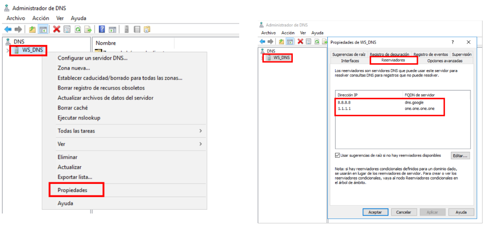

# 🪟🧭 DNS Maestro en Windows Server 
 

**📑 Indice** 
- [🪟🧭 DNS Maestro en Windows Server](#-dns-maestro-en-windows-server)
  - [🛠️ 1. Instalación de *``DNS``*](#️-1-instalación-de-dns)
    - [➕ 1.1 Agregar Rol *``DNS``*](#-11-agregar-rol-dns)
  - [⚙️ 2. Configuración de *``DNS``*](#️-2-configuración-de-dns)
    - [🔁 2.1 Reenviadores](#-21-reenviadores)
    - [📂 2.2 Zona de Búsqueda Directa](#-22-zona-de-búsqueda-directa)
    - [2.3 Zona de Búsqueda Inversa](#23-zona-de-búsqueda-inversa)
    - [🧩 2.4 Añadir Registros Directa/Inversa](#-24-añadir-registros-directainversa)
  - [🔎 3. Comprobaciones con *``nslookup``*](#-3-comprobaciones-con-nslookup)
    - [💻 3.1 Cliente Windows](#-31-cliente-windows)

 

## 🛠️ 1. Instalación de *``DNS``*
 

### ➕ 1.1 Agregar Rol *``DNS``*

Añadimos el rol para instalar el servidor dns en nuestro sistema operativo 

 
 

## ⚙️ 2. Configuración de *``DNS``*
 

### 🔁 2.1 Reenviadores

Definimos los reenviadores que vamos ha utilizar para cuando el servidor no encuentre donde buscar le pidan la peticiones a ellos

 
 

###  📂 2.2 Zona de Búsqueda Directa

1 - Una en la siguiente pestaña damos clic derecho en *``zona directa``* y creamos una nueva zona , de la siguiente manera 

 
 

2 - Seleccionamos el tipo de zona que deseamos y como es un servidor maestro seleccionamos *``zona principal``*

 
 

3 - Le damos un nombre alusivo a nuestra zona

 
 

4 - Aquí esta la zona directa creada correctamente 

 
 

###  2.3 Zona de Búsqueda Inversa

1 - Hacemos clic derecho ay creamos zona de busqueda inversa 

 
 

2 - Le damos el nombre a nustra zona , como es una zona inversa y el nombre depende de la red que tengas al momento de crearla

 
 

3 - La zona inversa se ha creado correctamente 

 
 

### 🧩 2.4 Añadir Registros Directa/Inversa

Añadimos un par de registros a nustra zona para hacer luegos las comprobaciones en el cliente

 
 

## 🔎 3. Comprobaciones con *``nslookup``*
 

### 💻 3.1 Cliente Windows
Accedemos al cliente y hacemos las siguientes comprobaciones , esto para ver si funciona correctamente 

 
 

**💡 Consejo Final**

>La correcta configuración del *``DNS``* Maestro en Windows Server es esencial para garantizar la resolución rápida y precisa de nombres en una red interna 🧠⚡.
>
> - 📌 Verifica que las zonas estén correctamente creadas *``(directa e inversa)``* y que los registros correspondan al *``nombre``* y *``IP``* esperados.
> - 🔁 Los reenviadores permiten una navegación externa más eficiente.
> - 🧪 Utiliza nslookup para comprobar la resolución y detectar errores tempranos.
> - 🔐 ¡Y no olvides los permisos y el cortafuegos si usas máquinas virtuales o múltiples redes!