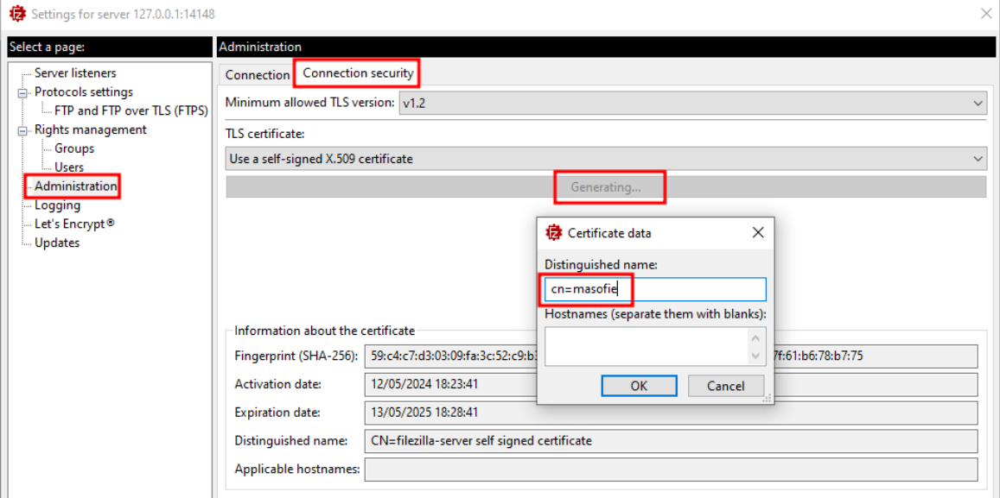
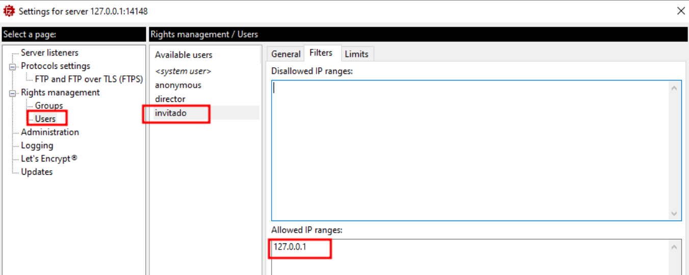

# 🖥️📂 Servidor FTP en FileZilla Server
 

**📑 Indice**
- [🖥️📂 Servidor FTP en FileZilla Server](#️-servidor-ftp-en-filezilla-server)
  - [🧾 Definición](#-definición)
  - [⚙️ 1. Configuración](#️-1-configuración)
    - [🛠️ 1.1 Administrar Servidor](#️-11-administrar-servidor)
    - [👤 Creación de Usuarios](#-creación-de-usuarios)
    - [👥 Creación de Grupos](#-creación-de-grupos)

 

## 🧾 Definición
 

Claro, un servidor *``FTP Filezilla Server``* es un software de servidor *``FTP (Protocolo de Transferencia de Archivos)``* que permite a los usuarios conectarse y transferir archivos a través de Internet de forma segura. 

*``Filezilla Server``* es una aplicación de servidor *``ftp``* de código abierto que es ampliamente utilizado debido a su facilidad de uso y fiabilidad. Permite la configuración de usuarios con distintos niveles de acceso, la encriptación de las conexiones para mayor seguridad, y la supervisión de las transferencias de archivos en tiempo real.

En resumen, un servidor *``ftp``* Filezilla Server es una herramienta que permite a los usuarios compartir y transferir archivos de forma segura a través de Internet utilizando el protocolo *``ftp``*.

 
 

##  ⚙️ 1. Configuración 
 

### 🛠️ 1.1 Administrar Servidor

1 - Cambiar contraseña y puerto del servidor 

 
 

2 - Tiempo global o general para login y actividad en el servidor 

 
 

3 - Mensaje de Bienvenida al servidor 

 
 

4 - Para crear un certicado podemos hacerlo de la siguiente manea , es un certicado personal 

 
 

5 - Para ver los *``logs``* modemos verlo desde la siguiente ruta 

 
 

### 👤 Creación de Usuarios

1 - Crear usuarios en el servidor con sus directorios

 
 

2 - Para admitir solo usuarios desde una *``ip``* podemos hacerlo de la siguiente , en este caso la vanos ha admitir 

 
 

### 👥 Creación de Grupos

Hay que crear los grupos con sus despectivas *``pahs``*

 

**🧠💡 Consejo Final**

> Recuerda siempre configurar correctamente los permisos de usuario y grupo para evitar accesos no autorizados.
> Además, si tu servidor *``ftp``* va a estar expuesto a internet, considera usar *``ftp``* sobre *``TLS (FTPS)``* para mantener la transferencia de archivos segura. 🔐🌐
>
> Un servidor bien configurado es clave para evitar errores y garantizar una experiencia fluida. ✅📁