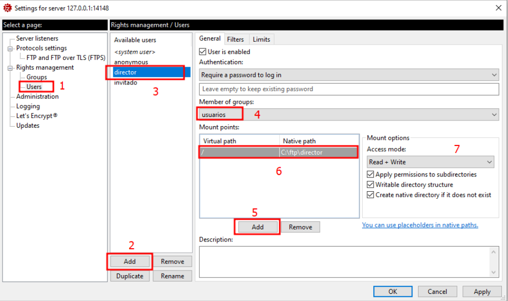

# Servidor FTP Filezilla Server

## Indice 

- [Servidor FTP Filezilla Server](#servidor-ftp-filezilla-server)
  - [Indice](#indice)
  - [Definición](#definición)
  - [Configuración](#configuración)
    - [Administrar Servidor](#administrar-servidor)
    - [Creación Usuarios](#creación-usuarios)
    - [Creación de Grupos](#creación-de-grupos)

## Definición 

Claro, un servidor **FTP Filezilla Server** es un software de servidor ***FTP (Protocolo de Transferencia de Archivos)*** que permite a los usuarios conectarse y transferir archivos a través de Internet de forma segura. 

**Filezilla Server** es una aplicación de servidor **FTP** de código abierto que es ampliamente utilizado debido a su facilidad de uso y fiabilidad. Permite la configuración de usuarios con distintos niveles de acceso, la encriptación de las conexiones para mayor seguridad, y la supervisión de las transferencias de archivos en tiempo real.

En resumen, un servidor **FTP** Filezilla Server es una herramienta que permite a los usuarios compartir y transferir archivos de forma segura a través de Internet utilizando el protocolo **FTP**.

## Configuración 
### Administrar Servidor 

Cambiar contraseña y puerto del servidor 

Tiempo global o general para login y actividad en el servidor 

Mensaje de Bienvenida al servidor 

Para ver los ***logs*** modemos verlo desde la siguiente ruta 

### Creación Usuarios

Crear usuarios en el servidor con sus directorios

### Creación de Grupos 

Hay quw crear los grupos con sus despectivas ***pahs***

