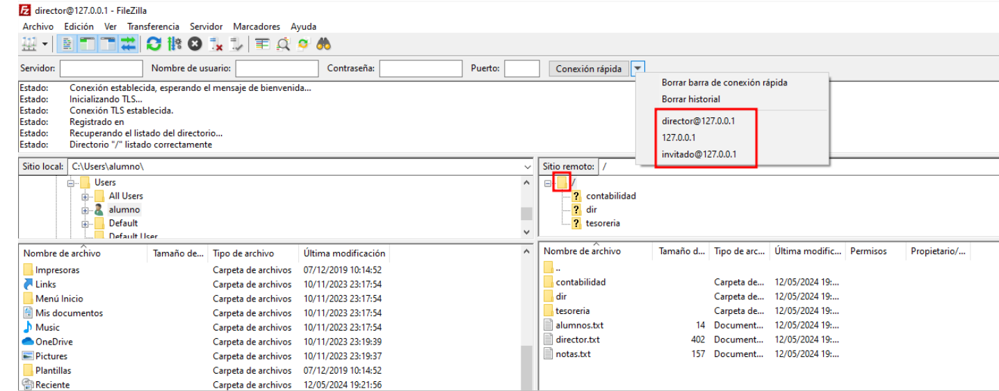

# 🧪🔍💻 Realizando Pruebas en Clientes 

**📑 Indice**

- [🧪🔍💻 Realizando Pruebas en Clientes](#-realizando-pruebas-en-clientes)
  - [📝 Definición](#-definición)
  - [🔧 1.1 Comprobar Configuración de FileZilla Server](#-11-comprobar-configuración-de-filezilla-server)
    - [▶️ Iniciar Sesión](#️-iniciar-sesión)

 

## 📝 Definición

**FileZilla Client** es un software de código abierto y gratuito que se utiliza como cliente de **FTP (File Transfer Protocol)** y **SFTP (Secure File Transfer Protocol)** para transferir archivos entre un servidor y un ordenador. Permite la transferencia de archivos de manera rápida y segura, así como la gestión de sitios remotos y la edición de archivos directamente en el servidor. **FileZilla** es ampliamente utilizado por administradores de sitios web y desarrolladores para subir y bajar archivos a sus servidores de forma eficiente.

 

## 🔧 1.1 Comprobar Configuración de FileZilla Server
 

### ▶️ Iniciar Sesión

Para comprobar los usuarios creados anteriormente usamos ***filezillaclient*** de la siguiente manera . Mostramos uno para comprobar 

