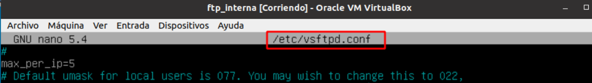
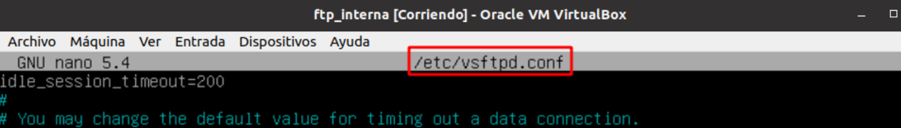
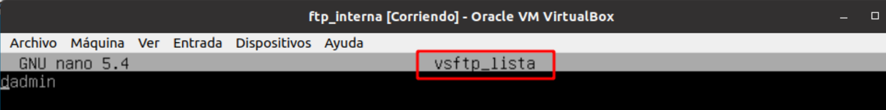
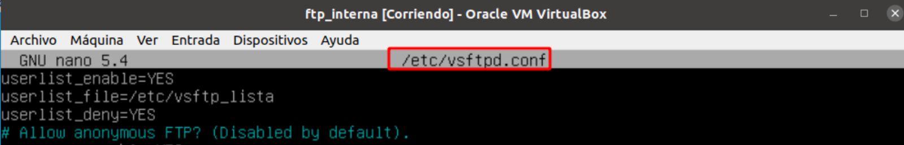
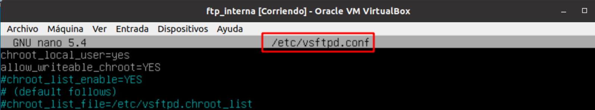
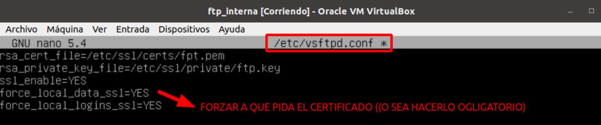

# Configuración en el Servidor ***vsftpd***

## Indice 

- [Configuración en el Servidor ***vsftpd***](#configuración-en-el-servidor-vsftpd)
  - [Indice](#indice)
  - [1. Configuración](#1-configuración)
    - [1.1 Servidor](#11-servidor)
    - [1.2 Usuarios anónimos (anonymous)](#12-usuarios-anónimos-anonymous)
    - [1.3 Usuarios Locales](#13-usuarios-locales)
  - [2. Información Adicional](#2-información-adicional)

## 1. Configuración 

### 1.1 Servidor 

Ver los logs de ftp , están en el directorio ***/var/log/vsftpd.log*** . 

Añadir el mensaje de bienvenida al conectarse en el servidor  

Máximo número de conexiones  

Tiempo de conexión

### 1.2 Usuarios anónimos (anonymous)

Permitir conexión con el usuario anonymous y escritura 

### 1.3 Usuarios Locales 

Permitir que los conexiones de los usuarios locales y poder escribir en el servidor 

Permitir que usuarios específicos se puedan conectar si o no (hay que crear el fichero antes) . El usuario dadmin no se va ha poder conectar al servidor , porque la denegación la tenemos en YES 

Permitir o no ver los home de los demás usuarios . Aquí estamos diciendo que solo puede ver su misma home porque esta a YES 

Creamos un certificado y añadimos las rutas de la clave privada y la publica y forzar a que pida el certificado (o sea obligarlo)

## 2. Información Adicional

Instalar servidor ***vsftpd*** en Debian

~~~
sudo apt install vsftpd
~~~

Fichero principal de configuración

~~~
nano /etc/vsftpd.conf
~~~

Reiniciar servidor 

~~~
systemctl restart vsftpd.service
~~~

Ver el estado el servidor 

~~~
systemctl status vsftpd.service
~~~