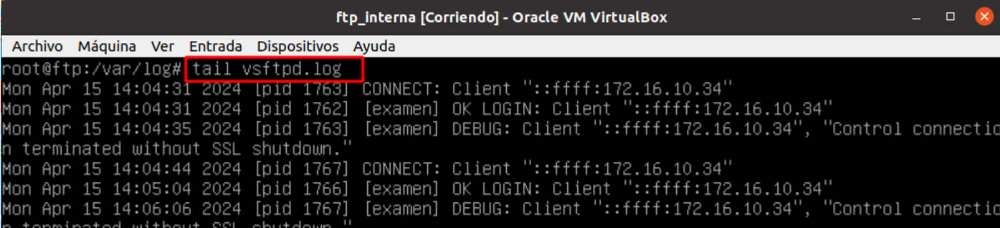
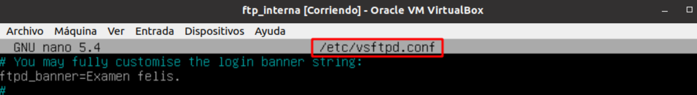
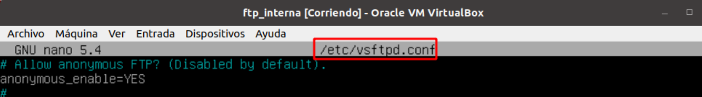

# Servidor vsftpd

## Indice 

## 1. Configuración en el Servidor 

Ver los logs de ftp , están en el directorio /var/log/vsftpd.log . 

Añadir el mensaje de bienvenida al conectarse en el servidor  

## 2. Usuarios anónimos (anonymous)

Permitir conexión con el usuario anonymous y escritura 

Permitir que los conexiones de los usuarios locales y poder escribir en el servidor 
