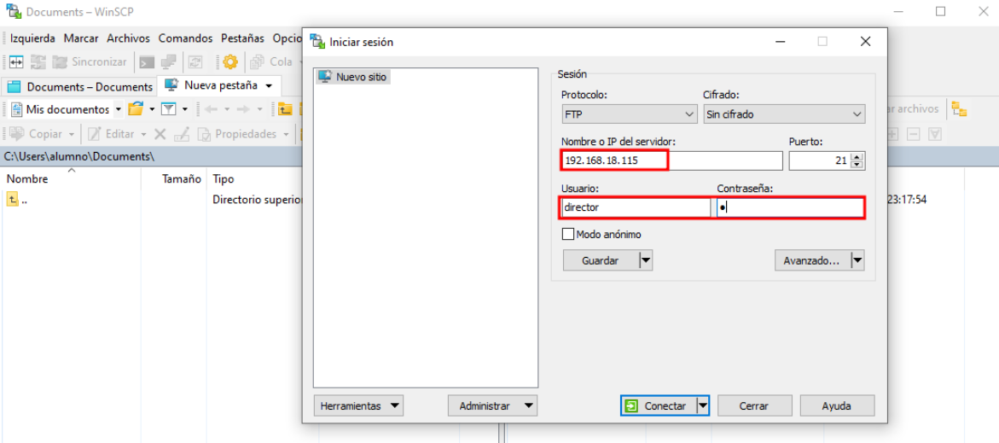
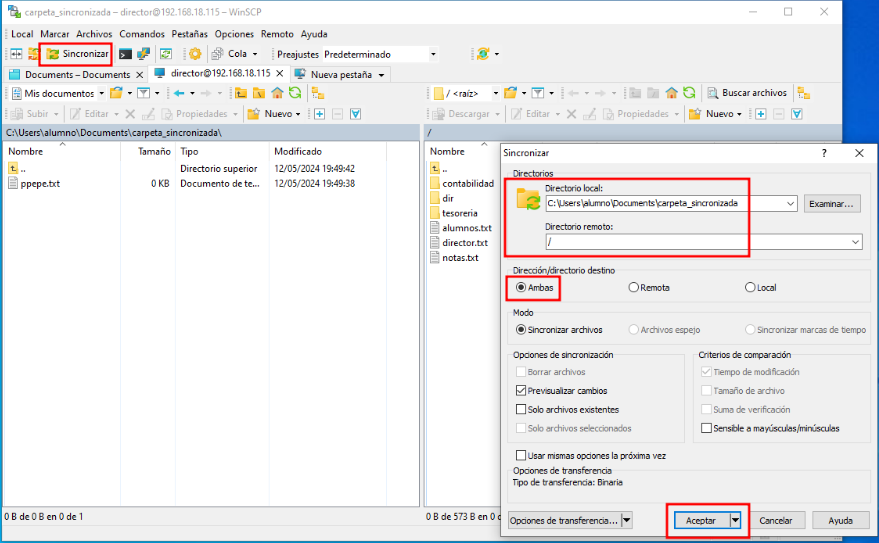
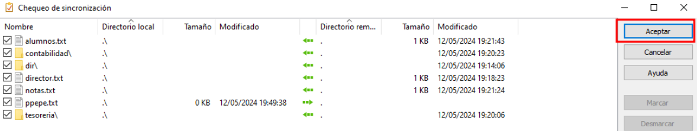
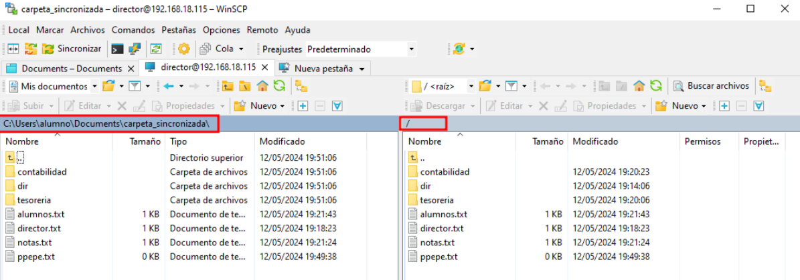

# Cliente WinSCP

## Indice 

- [Cliente WinSCP](#cliente-winscp)
  - [Indice](#indice)
  - [Definición](#definición)
  - [1. Comprobaciones](#1-comprobaciones)
    - [1.1 Iniciar Sesión](#11-iniciar-sesión)
    - [1.2 Sincronizar Directorios](#12-sincronizar-directorios)

## Definición

***WinSCP*** es un cliente de transferencia de archivos gratuito y de código abierto para los protocolos de transferencia de archivos **SCP (Secure Copy Protocol)** y **SFTP (SSH File Transfer Protocol)**. Permite a los usuarios conectarse de forma segura a servidores remotos para transferir archivos de forma rápida y segura. ***WinSCP*** ofrece una interfaz de usuario intuitiva y funciones avanzadas como la sincronización de directorios, la edición remota de archivos y la gestión de sitios favoritos.

## 1. Comprobaciones

### 1.1 Iniciar Sesión 

Para inciar sesión a un servidor ***ftp*** desde **winscp** podemos crear un sitio de la siguiente manera 

### 1.2 Sincronizar Directorios 

Para sincronizar directorios locales y remotos , lo podemos hacer de la siguiente manera .

Primero seleccionamos los directorios que queremos sincronizar y le damos clic en seleccionar **ambos** , para que se sincronicen los dos 

Damos la confirmación de son los directorios que queremos sincronizar y le damos clic en **aceptar**

Como podemos ver se ha sincronizado correctamente los directorios

