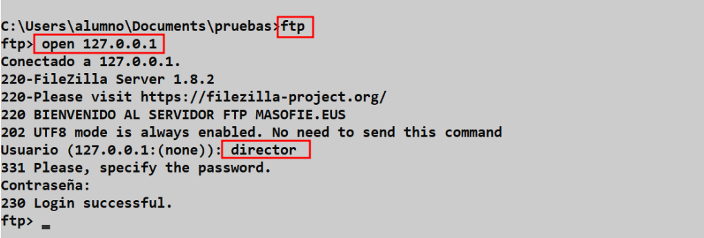
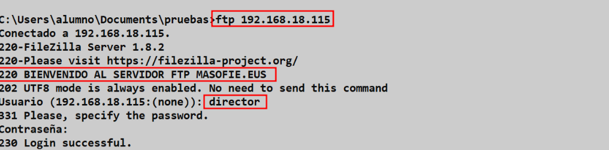
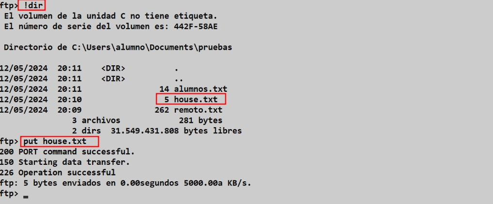

# Cliente FTP desde lineas de Comandos (Terminal)

## Indice 

- [Cliente FTP desde lineas de Comandos (Terminal)](#cliente-ftp-desde-lineas-de-comandos-terminal)
  - [Indice](#indice)
  - [Defición](#defición)
  - [1. Terminal Windows](#1-terminal-windows)
    - [1.1 Ayuda **FTP**](#11-ayuda-ftp)
    - [1.2 Métodos de Acceso](#12-métodos-de-acceso)
      - [1.2.1 Primer Métodos de Acceso](#121-primer-métodos-de-acceso)
      - [1.2.2 Segundo Métodos de Acceso](#122-segundo-métodos-de-acceso)
    - [Subir Fichero](#subir-fichero)

## Defición 

Para usar un terminal que usa **FTP** como cliente, primero debes asegurarte de que el cliente de **FTP** esté instalado en tu terminal. Luego, puedes abrir una sesión de terminal y utilizar los comandos de **FTP** para conectarte a un servidor remoto y transferir archivos.

Recuerda que para utilizar **FTP** es necesario tener los permisos adecuados para acceder al servidor remoto. Además, asegúrate de proteger tus credenciales de acceso y no compartir información confidencial a través de **FTP**, ya que es un protocolo poco seguro en términos de encriptación de datos

## 1. Terminal Windows

### 1.1 Ayuda **FTP**

Para consultar la ayuda del ***ftp*** en el terminal de windows podemos hacaer el siguiente comando 

~~~
?
~~~

### 1.2 Métodos de Acceso

#### 1.2.1 Primer Métodos de Acceso

Podemos haceder de forma interactiva , usando primero el comando y después eñ servidor 

#### 1.2.2 Segundo Métodos de Acceso

El segundo método es utilizar el comando ***ftp*** en una sola linea , de la siguiente manera 

### Subir Fichero 

Primero miramos el fichero que queremos subir desde el equipo local usando el ***(!)*** y usamos el comando ***put*** para subir el fichero al servidor remoto

~~~
put fichero_local
~~~

