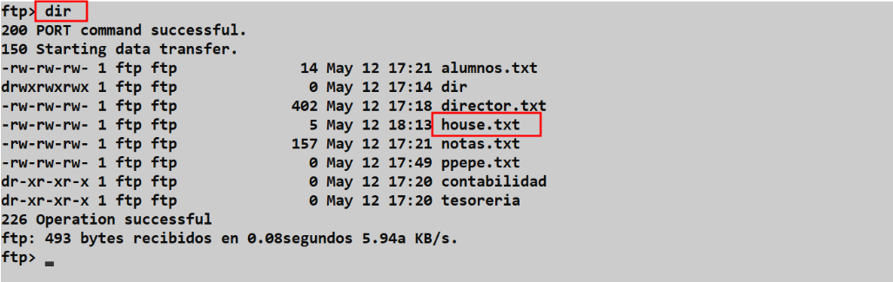
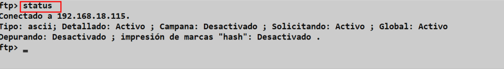
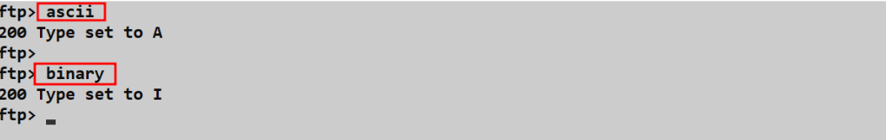
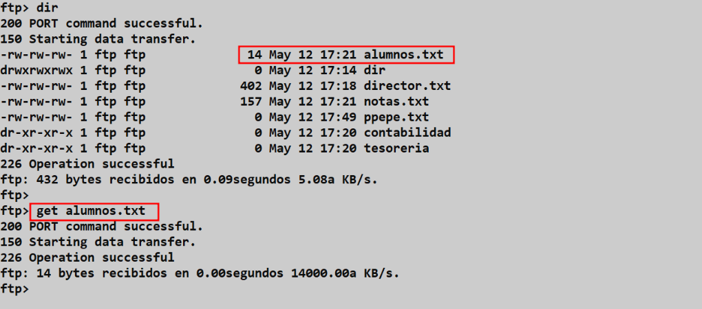
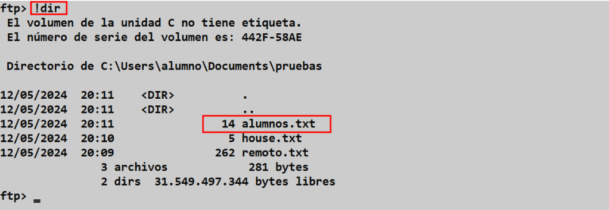

# ⚙️📟🖥️ Cliente FTP desde Línea de Comandos (Terminal) 

**📑 Indice** 

- [⚙️📟🖥️ Cliente FTP desde Línea de Comandos (Terminal)](#️️-cliente-ftp-desde-línea-de-comandos-terminal)
  - [📝 Definición](#-definición)
  - [💻 1. Terminal Windows](#-1-terminal-windows)
    - [❓ 1.1 Ayuda FTP](#-11-ayuda-ftp)
    - [🔑 1.2 Métodos de Acceso](#-12-métodos-de-acceso)
      - [1️⃣ 1.2.1 Primer Método de Accesoo](#1️⃣-121-primer-método-de-accesoo)
      - [2️⃣ 1.2.2 Segundo Método de Acceso](#2️⃣-122-segundo-método-de-acceso)
    - [📤 1.3 Subir Archivo](#-13-subir-archivo)
    - [📊 1.4 Estado de la Sesión FTP](#-14-estado-de-la-sesión-ftp)
    - [🔤 1.5 Tipo de Formato](#-15-tipo-de-formato)
    - [📥 1.6 Descargar Archivo](#-16-descargar-archivo)
    - [📚 2. Bibliografía](#-2-bibliografía)

 

## 📝 Definición
Para usar un terminal que usa **FTP** como cliente, primero debes asegurarte de que el cliente de **FTP** esté instalado en tu terminal. Luego, puedes abrir una sesión de terminal y utilizar los comandos de **FTP** para conectarte a un servidor remoto y transferir archivos.

Recuerda que para utilizar **FTP** es necesario tener los permisos adecuados para acceder al servidor remoto. Además, asegúrate de proteger tus credenciales de acceso y no compartir información confidencial a través de **FTP**, ya que es un protocolo poco seguro en términos de encriptación de datos

 

## 💻 1. Terminal Windows
 

### ❓ 1.1 Ayuda FTP

Para consultar la ayuda del **`ftp`** en el terminal de windows podemos hacaer el siguiente comando 

~~~
?
~~~

### 🔑 1.2 Métodos de Acceso
 

#### 1️⃣ 1.2.1 Primer Método de Accesoo

Podemos haceder de forma interactiva , usando primero el comando y después eñ servidor 

#### 2️⃣ 1.2.2 Segundo Método de Acceso

El segundo método es utilizar el comando **`ftp`** en una sola linea , de la siguiente manera 

### 📤 1.3 Subir Archivo

Primero miramos el fichero que queremos subir desde el equipo local usando el **`(!)`** y usamos el comando **`put`** para subir el fichero al servidor remoto

~~~
put fichero_local
~~~

Volvemos ha ver los ficheros remotos con el servidor , para comprobar que se subido correctamente el fichero al servidor remoto 

~~~
dir 
~~~

### 📊 1.4 Estado de la Sesión FTP

Para comprobar el estado de nuestro servicio hay que usar el siguiente comando 

~~~
status
~~~

### 🔤 1.5 Tipo de Formato

Para comprobar el formarto de archivo **`ftp`** hay dos tipos que son los siguientes 

~~~
binary
~~~
~~~
ascii
~~~

### 📥 1.6 Descargar Archivo

Para descargar ficheo de un servidor **`ftp`** usamos el comando **`get`** de la siguiente manera 

~~~
get fichero_remoto
~~~

Ahora comprobamos si el fichero remoto que hemos descagado del servidor **`ftp`** esta ahí

~~~
!dir
~~~

 
 
### 📚 2. Bibliografía

>   - **Página Oficial Microsof :** https://learn.microsoft.com/es-es/windows-server/administration/windows-commands/ftp
>   - **Página ***IONOS*** :** https://www.ionos.es/digitalguide/servidores/know-how/comandos-ftp/
>   - **dpgsmr.wordpress.com :** https://dpgsmr.wordpress.com/wp-content/uploads/2017/10/comandos-ftp.pdf