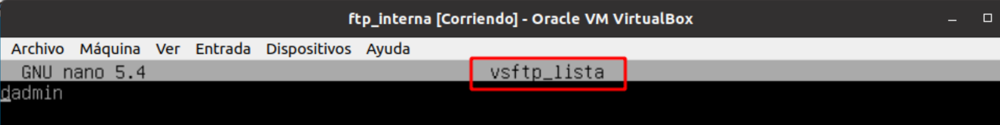
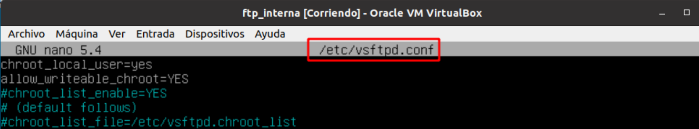

# 🛠️ Configuración en el Servidor vsftpd

**📑 Indice** 

- [🛠️ Configuración en el Servidor vsftpd](#️-configuración-en-el-servidor-vsftpd)
  - [🧾 Definición](#-definición)
  - [⚙️ 1. Configuración](#️-1-configuración)
    - [🔐 1.1 Servidor](#-11-servidor)
    - [👤 1.2 Usuarios Anónimos **`anonymous`**](#-12-usuarios-anónimos-anonymous)
    - [🧑‍💻 1.3 Usuarios Locales](#-13-usuarios-locales)
  - [ℹ️ 2. Información Adiciona](#ℹ️-2-información-adiciona)
  - [📚 Biografía](#-biografía)

 

## 🧾 Definición

Un servidor **`vsftpd`** es un servidor **FTP (File Transfer Protocol)** de código abierto, rápido y seguro que se puede utilizar para transferir archivos entre un cliente y un servidor a través de una red. 

El servidor **`vsftpd`** se utiliza principalmente para permitir a los usuarios subir y descargar archivos de un servidor remoto de manera segura y eficiente. Proporciona funciones de autenticación segura y soporta conexiones seguras a través de **SSL/TLS**.

En resumen, un servidor **`vsftpd`** actúa como un intermediario entre los clientes que desean transferir archivos y el servidor remoto donde se almacenan estos archivos, permitiendo una transferencia de archivos rápida, segura y fiable.

 

## ⚙️ 1. Configuración
 

### 🔐 1.1 Servidor 

Ver los logs de ftp , están en el directorio **`/var/log/vsftpd.log`** . 

Añadir el mensaje de bienvenida al conectarse en el servidor  

Máximo número de conexiones  

Tiempo de conexión

### 👤 1.2 Usuarios Anónimos **`anonymous`**

Permitir conexión con el usuario anonymous y escritura 

### 🧑‍💻 1.3 Usuarios Locales

Permitir que los conexiones de los usuarios locales y poder escribir en el servidor 

Permitir que usuarios específicos se puedan conectar si o no (hay que crear el fichero antes) . El usuario dadmin no se va ha poder conectar al servidor , porque la denegación la tenemos en **`YES`** 

Permitir o no ver los home de los demás usuarios . Aquí estamos diciendo que solo puede ver su misma home porque esta a **`YES`** 

Creamos un certificado y añadimos las rutas de la clave privada y la publica y forzar a que pida el certificado (o sea obligarlo)

## ℹ️ 2. Información Adiciona

- Instalar servidor **`vsftpd`** en Debian

  ~~~~~~~~~~~~~~~~~~~~~~~~
  sudo apt install vsftpd
  ~~~~~~~~~~~~~~~~~~~~~~~~

- Fichero principal de configuración

  ~~~~~~~~~~~~~~~~~~~~~
  nano /etc/vsftpd.conf
  ~~~~~~~~~~~~~~~~~~~~~

- Reiniciar servidor 

  ~~~~~~~~~~~~~~~~~~~~~~~~~~~~~~~~~
  systemctl restart vsftpd.service
  ~~~~~~~~~~~~~~~~~~~~~~~~~~~~~~~~~

- Ver el estado el servidor 

  ~~~~~~~~~~~~~~~~~~~~~~~~~~~~~~~~
  systemctl status vsftpd.service
  ~~~~~~~~~~~~~~~~~~~~~~~~~~~~~~~~

## 📚 Biografía

> Página Oficial Debian :
> - https://wiki.debian.org/vsftpd
> - http://vsftpd.beasts.org/vsftpd_conf.html
> - https://security.appspot.com/vsftpd.html
>
> Wikipedia :
>
> - https://en.wikipedia.org/wiki/Vsftpd