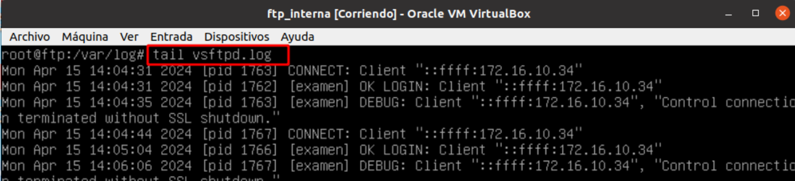
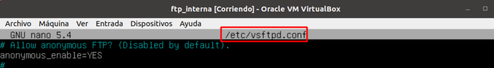

# 🛠️ Configuración en el Servidor *``vsftpd``*
 

**📑 Indice** 
- [🛠️ Configuración en el Servidor *``vsftpd``*](#️-configuración-en-el-servidor-vsftpd)
  - [🧾 Definición](#-definición)
  - [⚙️ 1. Configuración](#️-1-configuración)
    - [🔐 1.1 Servidor](#-11-servidor)
    - [👤 1.2 Usuarios Anónimos **`anonymous`**](#-12-usuarios-anónimos-anonymous)
    - [🧑‍💻 1.3 Usuarios Locales](#-13-usuarios-locales)
  - [ℹ️ 2. Información Adiciona](#ℹ️-2-información-adiciona)
  - [📚 Biografía](#-biografía)

 

## 🧾 Definición
 

Un servidor *``vsftpd``* es un servidor *``FTP (File Transfer Protocol)``* de código abierto, rápido y seguro que se puede utilizar para transferir archivos entre un cliente y un servidor a través de una red. 

El servidor *``vsftpd``* se utiliza principalmente para permitir a los usuarios subir y descargar archivos de un servidor remoto de manera segura y eficiente. Proporciona funciones de autenticación segura y soporta conexiones seguras a través de *``SSL/TLS``*.

En resumen, un servidor *``vsftpd``* actúa como un intermediario entre los clientes que desean transferir archivos y el servidor remoto donde se almacenan estos archivos, permitiendo una transferencia de archivos rápida, segura y fiable.

 

## ⚙️ 1. Configuración
 

### 🔐 1.1 Servidor 

1 - Mostrar los *``logs``*  que estan en el directorio *``/var/log/vsftpd.log``* 

 
 

2 - Añadir el mensaje de bienvenida al conectarse en el servidor  

 
 

3 - Agregamos el máximo número de conexiones  

 
 

4 - Incluimos el tiempo de conexión

 
 

### 👤 1.2 Usuarios Anónimos **`anonymous`**

1 - Permitimos la conexión y escritura con el usuario anonymous  

 
 

### 🧑‍💻 1.3 Usuarios Locales

1 - Permitir conexiones y escritura en el servidor con los usuarios locales  

 
 

2 - Permitir y denegar conexiones de usuarios en especifico (hay que crer un fichero antes) . 

 
 

3 - El usuario *``dadmin``* no se puede conectar al servidor . Porque la  clausula de denegación la tenemos en *``YES``* . *``Sin olvidar especificar el fichero creado antes``*

 
 

4 - Permitir o denegar mostrar los directorios *``home``* de los demás usuarios . Solo vamos ha permitir que vea su directorio *``home``* unicamente .

 
 

5 - Creamos un certificado , añadiendo la clave *``privada``* y *``pública``* . Forzando a que simpre pida el certificado *``(obligatorio)``* .

 
 

## ℹ️ 2. Información Adiciona
 

- Instalar servidor *``vsftpd``* en Debian

  *``sudo apt install vsftpd``*

- Fichero principal de configuración

  *``nano /etc/vsftpd.conf``*

- Reiniciar servidor 

  *``systemctl restart vsftpd.service``*

- Ver el estado el servidor 

  *``systemctl status vsftpd.service``*

 
 

## 📚 Biografía
 

**Página Oficial Debian :**
> - https://wiki.debian.org/vsftpd
> - http://vsftpd.beasts.org/vsftpd_conf.html
> - https://security.appspot.com/vsftpd.html
>
> Wikipedia :
>
> - https://en.wikipedia.org/wiki/Vsftpd