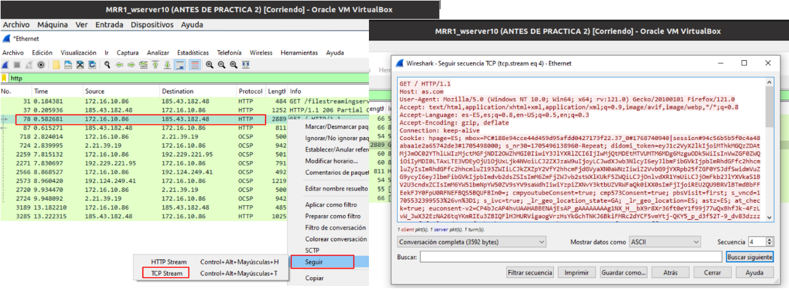

# Recursos con el Protocolo HTTP / HTTPS 

##
## 1. Conceptos URL , URI , URN 

### 1.1 Qué es una URL

Una **URL** , que su acrónimo significa ‘localizador de recursos uniformes’ . Es una cadena que denota la ubicación de recursos dados en una página de Internet , que pueden ser imágenes , páginas buzón , etc …

Una **URL** tiene las siguientes partes : 
• **Esquema (o método de acceso) :** es el protocolo que se usa en la RRL para acceder al recurso los más utilizados son **HTTP** y **HTTPS**.  
• **Dominio :** Es la parte que indica cual es el servidor que aloja el recurso . Puede ser llamado con un nombre de dominio o una dirección IP .  
• **Puerto :** Es el puerto donde se envía las solicitudes para acceder a los recursos   
• **Camino :** Es la ruta donde esta alojado el servidor  
• **Parámetros :** Es una información adicional opcional proporcionada por el servidor  
• **Ancla :** Representa una parte especifica dentro del recurso , también se puede llamar fragmento 

### 1.2 Qué es una URI

La **URI** , significa **Uniform Resource Identifier** , es una cadena que identifica un recurso que sigue el mismo formato que una **URL** .Permite identificar un recurso y al mismo tiempo le da instrucciones para acceder a el , ose que se entiende como un identificador . 
**URI**, también identifica un recurso a través de una dirección.

### 1.3 Qué es una URN 

Es un nombre uniforme de recursos y su alcance es identificar los recursos de manera que después que el recursos no exista . No proporciona ninguna información sobre la localización del recurso , si no que simplemente lo identifica , al igual que un URI puro .
• **NAMESPACE-IDENTIFIEER :** Es un marcador que representa una cadena que también representa la categoría de recursos que desea identificarlo .
• **NAMESPACE-SPECIFIC-STRING :** Es el identificador especifico del recurso y su formato depende del identificador del espacio de nombre .

### 1.4 Diferencia entre URL , URI y URN

**Url** es una cadena que localiza los recursos de de **Internet** como , páginas web , imágenes etc. URI es un cadena que identifica el recurso que estamos buscando y nos da el método para acceder a el , pero no proporciona pero no los localiza como la url . Y la URN no proporciona ninguna información sobre la localización solo que lo identifica como iguala URI puro , incluso después de que ese recurso ya no existe .

##
## 2. Intenta Buscar 3 conceptos sobre el mundo de la web 

### 2.1 CDN , AJAX y CÓDEC

**1. Qué y para que sirve CDN :**

Red de distribución de contenidos , aceleran la carga la carga de las páginas web para las aplicaciones que tienen un uso intenso de datos , como si fuera un servidor caché . En pocas palabras “Acceder más rápido a los recursos de las páginas web” . 

**2. Qué y para que sirve AJAX :**

Nos permite a las aplicaciones web validar información específica en formularios antes de que los usuarios los envíen.
“Permite actualizar en espacio de una pagina sin cambiar la url por completo” . 

**3. Qué y para que sirve CÓDEC :**

Es un programa, algoritmo, o dispositivo que codifica o decodifica un flujo de datos. Cada CÓDEC sabe cómo tratar un estándar específico de codificado o compresión.

##
## 3. NetCraft
### 3.1 Servidores as.com

|  RED      |   ACENDENTES    |   
|----------------------|----------------------|
| - Dominio : as.com   | - Fecha vista por primera vez : Abril de 1996 |
| - Admin DNS 	: hostmaster.nsone.net | - Lengua primaria : España |

### 3.2 Servidores celanova.gal

|  RED      |   ACENDENTES    |   
|----------------------|----------------------|
| - Dominio : celanova.gal  | - Título del sitio : Celanova Concello|
| - Nombre servador : ns.dinahosting.com | - Lengua primaria : Galego gallego|

### 3.3 Servidores lavozdegalicia.es

|  RED      |   ACENDENTES    |   
|----------------------|----------------------|
| - Dominio : lavozdegalicia.es  | - Fecha vista por primera vez : Junio de 1999	|
| - Admin DNS : root.lavoz.es | - Lengua primaria : España |

##
## 4. Navegadores Web
### 4.1 En qué Consistieron las Browser Wars 

Fue la primera guerra del navegador en el año **1995-2001** que enfrento Microsoft  . 

**Browser Wars** hace referencia a la competencia entre diferentes navegadores web para ganar las referencias de usuarios y dominar el mercado . Desde la década de los 90 varios navegadores como **Firefox** , **Internet Explorer** , **Chrome** , **Safari** y **Opera** han competido por ofrecer características y funcionalidades innovadoras , así como una experiencia de navegación rápida y seguro . 
 
La ventaja que nos dio estas ventajas fue que han llevado a una mejora significativa en la velocidad de carga de las páginas , el rendimiento general del navegador y la compatibilidad con estándares web . Esto beneficiando a los usuarios al darle más opciones y mejorando constantemente su experiencia en línea 

### 4.2 Características de los navegadores

| PRIVACIDAD Y SEGURIDAD  | PERSONALIZACIÓN  | ACCESIBILIDAD  |  HERRAMIENTAS DE DESARROLLO |  ACTUALIZACIONES |
|---|---|---|---|---|
|Bloqueadores de ventanas|Extensiones – PluginsTemas|Zoom|Código fuente|Soporte Lenguaje de Cliente|
|Manipulación de Cookies|Traductor Atajos del Teclado| Modo lectura (sin distraciones)|Consola Web| Gestores de descargas|
|Navegación de Incógnito|Sincronización de Navegadores|Gestión de Marcadores|Depurador Red|Extensiones|
|Gestor de Dispositivos de Seguridad|Corrector Ortográfico  (SPELL CHECKING)Navegación por pestañas|||
|Gestor de Historial|Corrector Ortográfico  (SPELL CHECKING)||||

### 4.3 En qué te puede afectar en tu trabajo de Administrador de Sistemas o Desarrollador Web

En un trabajo de **Administración de Sistemas** o **Desarrollo Web** es nos puede afectar que porque hay que estar al día con las actualizaciones y funcionalidades para darle una mejor experiencia a los clientes o usuarios . 

Puede que tengamos usuarios que manejen mejor **Chrome** y otros **Firefox** , por eso hay que estar entendido porque no sabemos que cambios puede haber y mantener a los clientes actualizados pero sin cambiar su funcionalidad básica donde mejor se desempeña cada usuario .

Lo principal que tenemos que tener en cuenta es la comodidad de los usuarios .

##
## 5. Navegadores Web

### 5.1 De qué forma se pueden visualizar y manipular las cookies en Mozilla Firefox y Google Chrome, de Forma Global

1 – Accedemos a nuestro navegador y ejecutamos F10 para que en la parte superior nos aparezca la barra de ajustes . Ahí seleccionamos la pestaña de Herramientas-Ajustes .   

2 – También podemos acceder con la combinación de letra F12 y le damos a Inspeccionar , como se muestra en la imagen . Nos aparecerá la siguiente ventaba y seleccionamos una url y nos abre una ventana a la derecha y seleccionamos cookies . Y ahí las tenemos correctamente     

1 – En Chrome también lo podemos encontrar de la siguiente manera en el navegador como esta en la imagen    

##
## 6. Navegación Web
### 6.1 Responde las siguientes preguntas 

1 – Primero vamos al navegador y accedemos a la url de as.com y ejecutamos el **Wireshark** y filtramos la palabra http y en una de ellas damos clic derecho y accedemos a **SEGUIR-TCP STREAM** , como se muestra en la imagen .  

  

**1. Qué versión HTTP emplea ? Que método se empleo en la primera petición HTTP?**
           - Emplea la versión 1.1 , se empleo el método GET (protocolo de transferencia de hipertexto) para solicitar datos de un servidor web
           
**2. Qué valor tiene la cabecera Host?**
           - La cabecera host es as.com osea el nombre de dominio 
           
**3. Que algoritmos de compresión soporta el navegador?**
           - Usa un algoritmo de compresión gzip 
	
**4. Se envía  cookies la petición HTTP?**
           - Si las cookies envían en las peticiones 
           
**5. Qué código de estado tiene la primera respuesta HTTP? Qué servidor web respuesta ?**
           - El código es el 301 ( indica que una página se ha movido permanentemente a una nueva ubicación)
           
**6. De que tipo MIME es el recurso enviado?**
           - Es de tipo text/html , aplication , xml-ml img etc …

**7. Empleándose conexiones persistentes, es decir, en una misma conexión TCP hay varias peticiones y respuesta HTTP?**
           - Si es posible tener varias conexiones persistentes en una misma conexión 

**8. Existen peticiones y respuesta de imágenes?**
           - Si en el mensaje se puede ver que hay imágenes en las peticiones y respuestas HTTP 

##
## 7. Mozilla Firefox y Google Chrome
### 7.1 Instala en Mozilla Firefox  y en Chrome las siguientes extensiones:

- Awesome Screenshot
- Cookie Quick Manager
- Language Tool
- Corrector de Galego
- HTTP Header Live
- FoxClocks

### 7.2 Explicación de cada una de las Extensiones 

**Awesome Screenshot :** Sirve para la captura , grabación e intercambio de capturas de pantalla y video . 
**Cookie Quick Manager :** Permite al sitio web detectar actualizaciones innecesarios de los datos del servidor .    
**Language Tool :** Es un sistema de escritura que combina las funciones clásicas de un corrector ortográfico con unas sugerencias de estilo y mejoras generales de la expresión escrita .   
**Corrector de Galego :** Nos da la oportunidad de corregir o mostrar los errores de escritura en el idioma galego .    
**HTTP Header Live :** Nos abre una ventana con las cabeceras HTTP que se van enviando y recibiendo a medida que se navega por los sitios web .   
**FoxClocks :** Muestras las horas alrededor del mundo en la parte de abajo de un navegador .
