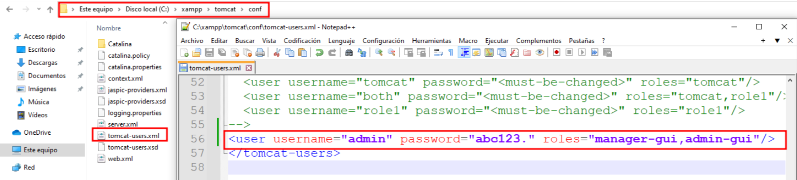
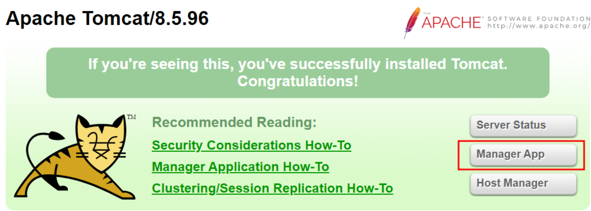

# Despligue de TROMCAT en Windows 
  
## INDICE 

## 1. Qué es TROMCAT 
  

Tromcat es un módulo web que permite la integración de **Tomcat en XAMPP**, un paquete de software que incluye **Apache** , **MySQL** , **PHP** y **Perl**. 

Tomcat es un servidor web de código abierto que se utiliza principalmente para ejecutar aplicaciones Java en un entorno web. Al integrar Tomcat en XAMPP, los usuarios pueden acceder a funcionalidades avanzadas para ejecutar aplicaciones Java y servlets en su servidor web local. Esto es útil para desarrolladores que trabajan con aplicaciones Java y desean probarlas en un entorno seguro y controlado antes de implementarlas en un entorno de producción.

##
## 1.1 Error al Iniciar el Tromcat 
 

Este es el error que nos da al iniciar el **TROMCAT** porque le hace falta una variable 
  

  

##
## 1.2 Solucionar Error de Tromcat 
 

Para solucionar el problema del inicio de **tromcat** debemos añadir la variable **java_home** de la siguiente manera : 
  

~~~
HKEY_LOCAL_MACHINE
FOFTWARE
JavaSoft
Java Development Kit >> JavaHome >> ruta del jdk
~~~

  

Volvemos comprobar que **tromcat** se ha iniciado correctamente
 

##
## 1.3 Crear Usuario Manager en Tromcat
 

Para poder manejaer como administrador podemos crear un usaurio para iniciar sesión, modificando el siguiente fichero :
  

  

Volvemos ha la página principal y damos clic a **Manager App** . 
  

  

Iniciamos con el usuario que hemos agreagado antes y como podemos ver inicia correctamente 
  

   

##
## 2. Información Adicional sombre el Despligue de Tromcat 
