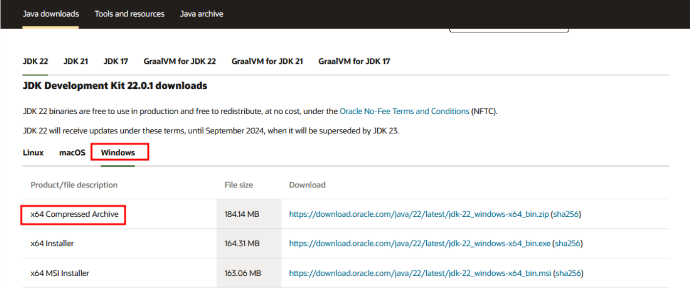
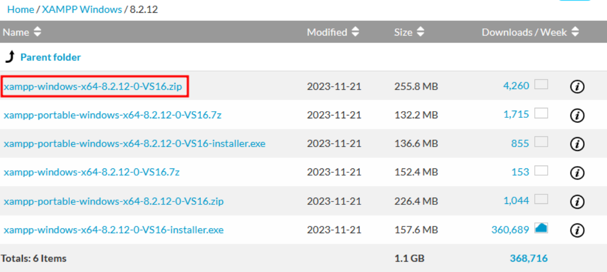
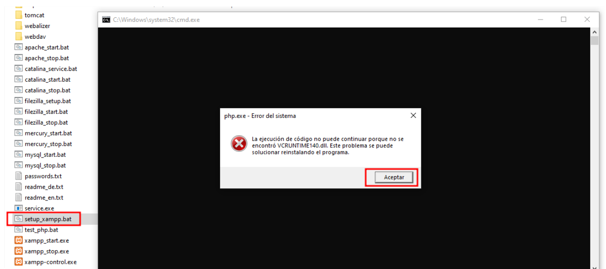
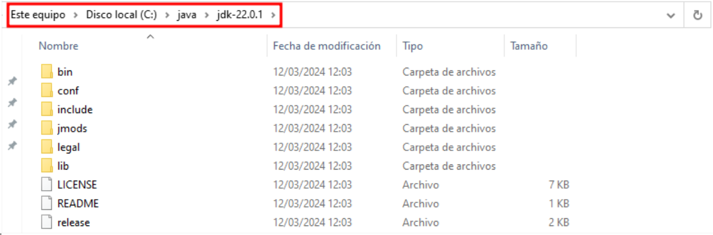
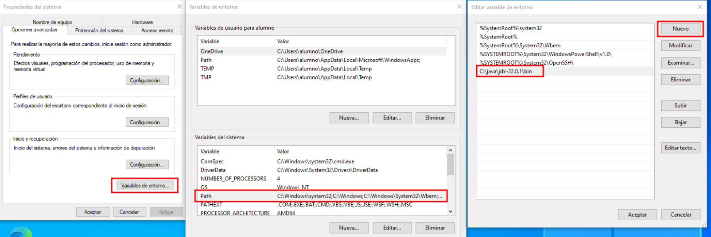
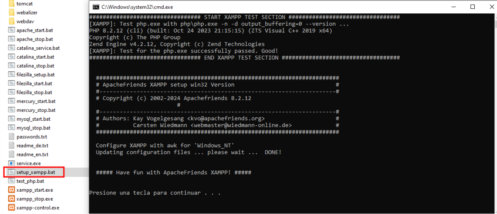
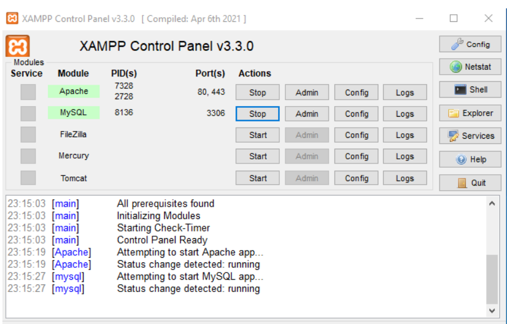
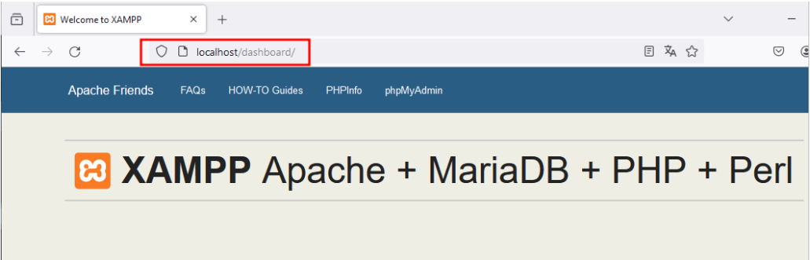

# 🪟🛠️⚙️🌐 Instalación y Configuración de Apache en Windows con XAMPP 

**📑 Indice**

- [🪟🛠️⚙️🌐 Instalación y Configuración de Apache en Windows con XAMPP](#️️-instalación-y-configuración-de-apache-en-windows-con-xampp)
  - [💡 Qué es y su utilidad ?](#-qué-es-y-su-utilidad-)
  - [🛠️ 1. Instalación y Congiguración](#️-1-instalación-y-congiguración)
    - [🔧 1.1 Instalación de Java](#-11-instalación-de-java)
    - [💽 1.2 Instalación de XAMPP](#-12-instalación-de-xampp)
    - [❗🧰 1.3 Corrección de Errores Comunes](#-13-corrección-de-errores-comunes)
    - [⚙️ 1.4 Configuración de Variables de Entorno](#️-14-configuración-de-variables-de-entorno)

 

## 💡 Qué es y su utilidad ?
 

>**XAMPP** es un software gratuito y de código abierto que permite crear un entorno de desarrollo web en sistemas Windows. **XAMPP** incluye varios componentes como **`apache`**, **`mysql`**, **`php`** y **`perl`**, que son necesarios para configurar un servidor web local en tu computadora. Esto facilita el desarrollo y prueba de aplicaciones web antes de subirlas a un servidor en línea..

 

## 🛠️ 1. Instalación y Congiguración
 

### 🔧 1.1 Instalación de Java 

Primero vamos a descargar el **`jdk`** para java que lo vamos a utilizar para iniciar nuestro xampp , lo puedes consultar en la siguiente url :

- ***ENLACE :*** ***https://www.oracle.com/es/java/technologies/downloads/#jdk22-windows***

### 💽 1.2 Instalación de XAMPP
 

En este caso apara instalar xammp utilizaremos un formato **`zip`** , para configuralo desde cero . Lo podemos encontrar
en el siguiente enlace 

- ***ENLACE :*** ***https://sourceforge.net/projects/xampp/files/XAMPP%20Windows/8.2.12/***

### ❗🧰 1.3 Corrección de Errores Comunes 
 

Cuando tenemos el xammp instalado y descomprimido lo ejecutamos pero nos da un error , ese error viene de las variables de entorno . El error ese el siguiente que se ve en la imagen :

  

### ⚙️ 1.4 Configuración de Variables de Entorno  

Para solucionar el problema añadimos el **`jdk (java)`** en las variables de entorno de la siguiente manera : 

Primero , copiamos la ruta de nustro **`jdk`** terminado en el directorio **`bin`** , asi como esta en la imagen 

  

Luego vamos a nuestra variables de entorno del sistema y en el **`path`** añadimos la ruta del **`jdk`** lo hacemos de 
la siguiente manera : 
  

  

Volvemos ha iniciar nuestro xampp y como podemos ver se ha iniciado correctamente
  

  

Iniciamos el **`apache`** y el **`mysql`** para ver si esta funcionando todo correctamente 

  

  

Comprobamos el funcionamiento del **`APACHE`** desde el navegador usando :
  

 

**💡Consejo Final**

>Después de instalar **XAMPP** , asegúrate de ejecutar el panel como administrador 🧑‍💻 y verificar que los puertos necesarios **(80 y 443)** no estén en uso por otras aplicaciones como **Skype** o **IIS** 🛑.
>También es recomendable guardar una copia de seguridad de tus archivos de configuración antes de hacer cambios importantes 🗂️🛟.