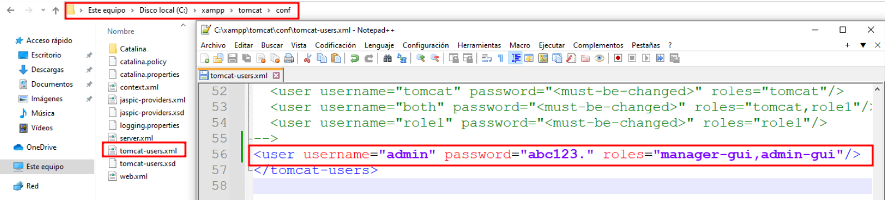
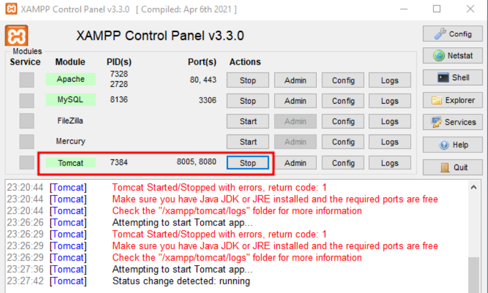
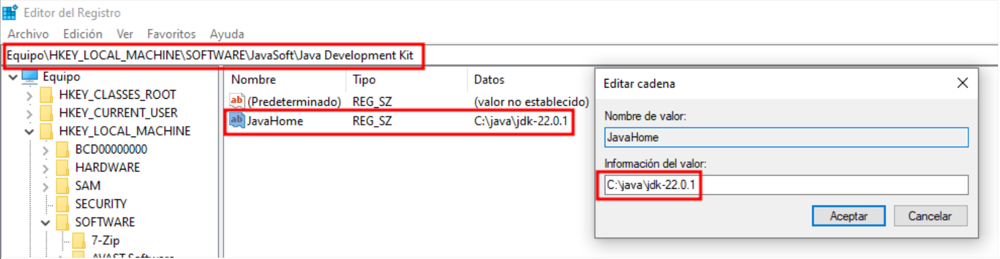
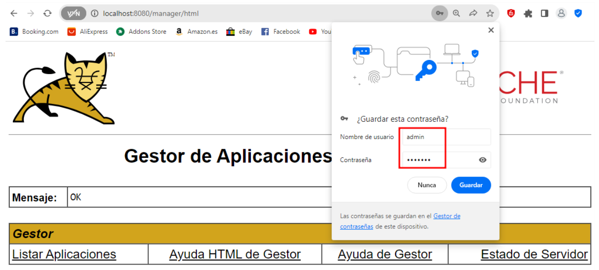

# 🪟🐱🚀 Despliegue de Tomcat en Windows 
 

**📑 Indice**
- [🪟🐱🚀 Despliegue de Tomcat en Windows](#-despliegue-de-tomcat-en-windows)
  - [🌐⚙️ ¿Qué es Apache Tomcat?](#️-qué-es-apache-tomcat)
  - [❌ 1. Error al Iniciar Tomcat](#-1-error-al-iniciar-tomcat)
  - [🛠️ 2. Solucionar Errores Comunes](#️-2-solucionar-errores-comunes)
  - [👤 1.3 Crear Usuario *``manager``* en Tomcat](#-13-crear-usuario-manager-en-tomcat)
  - [📎 2. Información Adicional sobre el Despliegue](#-2-información-adicional-sobre-el-despliegue)

 

##  🌐⚙️ ¿Qué es Apache Tomcat?
  

> Tomcat es un módulo web que permite la integración de **Tomcat en XAMPP**, un paquete de software que incluye *``apache``* , **``mysql``** , **``php``** y **``perl``**. 
>
> Es un servidor web de código abierto que se utiliza principalmente para ejecutar aplicaciones *``java``* en un entorno web. Al integrar *``tomcat``* en xampp , los usuarios pueden acceder a funcionalidades avanzadas para ejecutar aplicaciones *``java``* y servicios en su servidor web local. Esto es útil para desarrolladores que trabajan con aplicaciones *``java``* y desean probarlas en un entorno seguro y controlado antes de implementarlas en un entorno de producción.

 
 

## ❌ 1. Error al Iniciar Tomcat
 

Cuando intentamos iniciar *``tomcat``* no deja hacerlo , da error . Porque le falta una variable . 

 
 

## 🛠️ 2. Solucionar Errores Comunes 
 

1 - Para solucionar el problema , debemos añadir la variable *``java_home``* en el fichero *``conf``* (fichero de configuración) .

~~~~~~~~~~~~~~~~~~~~~~~~~~~~~~~~~~~~~~~~~~~~~~~~
HKEY_LOCAL_MACHINE
FOFTWARE
JavaSoft
Java Development Kit >> JavaHome >> ruta del jdk
~~~~~~~~~~~~~~~~~~~~~~~~~~~~~~~~~~~~~~~~~~~~~~~~

 
 

2 - Comprobamos iniciando *``tromcat``* nuevamente , se ha inciciado correctamente .

 
 

## 👤 1.3 Crear Usuario *``manager``* en Tomcat
 

1 - Si queremos iniciar sesión como *``administrador``* , creamos un usuario moficando el fichero de configuración . 

 
 

2 - En el editor de registro , y añadimos una cadena  con *``jdk``* .

~~~~
# Ruta 
HKEY_LOCAL_MACHINE\SOFTWARE\JavaSoft\Java Development Kit

# Añadir Cadena
Nombre + jdk
~~~~

 
 

3 - Iniciamos con el usuario *``admin``* , como podemos ver se ha iniciado correctamente .

 
 

## 📎 2. Información Adicional sobre el Despliegue 
 

> **Página oficial :**
>   - *``https://tomcat.apache.org/``*
> 
> **Wikipedia :**  
>   - *``https://es.wikipedia.org/wiki/Tomcat``*

 
 

**💡 Consejo Final**

> Antes de iniciar *``tomcat``* 🐱, asegúrate de que *``java_home``* esté correctamente configurada ⚙️☕ y que el puerto *``8080``* no esté siendo utilizado por otra aplicación 🚫🔌.
> Además, usa credenciales seguras para el usuario *``manager``* 👤🔐 y restringe el acceso si el servidor está en red pública 🌐🔒