# 🪟🌐 Instalación y Configuración del Servidor IIS en Windows 

**📑 Indice**
- [🪟🌐 Instalación y Configuración del Servidor IIS en Windows](#-instalación-y-configuración-del-servidor-iis-en-windows)
- [💡 Servidor IIS en Windows](#-servidor-iis-en-windows)
  - [🏗️ 1. Instalación del Servidor IIS](#️-1-instalación-del-servidor-iis)
  - [2. ⚙️🌍 Configuración del Sitio Global](#2-️-configuración-del-sitio-global)
  - [🧱🌐 3. Creación de un Nuevo Sitio Web](#-3-creación-de-un-nuevo-sitio-web)
  - [🔁🔒 4. Redirección de HTTP a HTTPS](#-4-redirección-de-http-a-https)

 

# 💡 Servidor IIS en Windows 
 

> El **Servidor IIS (Internet Information Services)** es un componente de **Windows Server** que se utiliza para hospedar y servir páginas web en un entorno **Windows** . **IIS** es un servidor web flexible y robusto que permite a los desarrolladores y administradores de sistemas crear y gestionar sitios web, aplicaciones web y servicios web de manera eficiente y segura.

 

> IIS ofrece funciones avanzadas, como la gestión de servidores virtuales, la integración con bases de datos **SQL Server**, la compatibilidad con ***ASP.NET*** y la capacidad de administrar múltiples sitios web desde una única interfaz de administración. Además, **IIS** proporciona herramientas de diagnóstico y registro para supervisar el rendimiento del servidor y solucionar problemas de forma rápida. En resumen, IIS es una herramienta esencial para hospedar sitios web en entornos **Windows** y garantizar un funcionamiento óptimo y seguro de las aplicaciones web.

 

##  🏗️ 1. Instalación del Servidor IIS 
 

1.1 Primero tenemos que agregar roles y características (servicios necesarios)

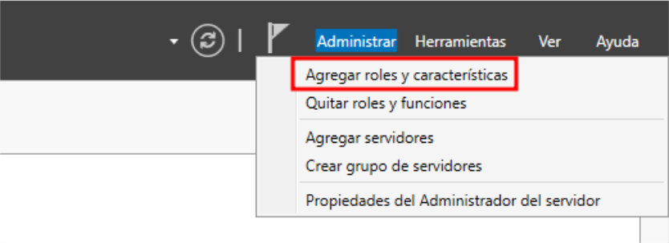

1.2 Seleccionar el rol de **‘Servidor Web (ISS)’** , así como se muestra en la siguiente imagen

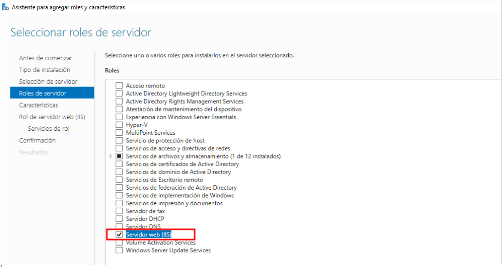

1.3 Instalación de componentes adicionales

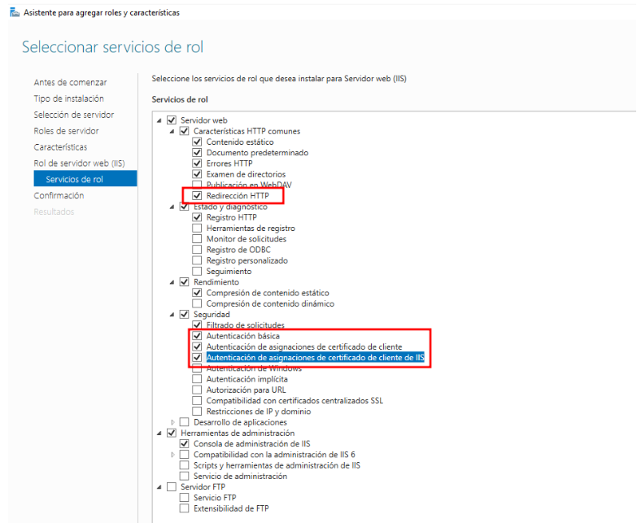

1.4 Acceder a la configuración de ISS 

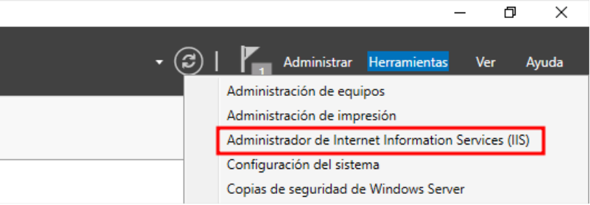

## 2. ⚙️🌍 Configuración del Sitio Global 
 

2.1 Habilitar el examen de directorio para todos los sitios 

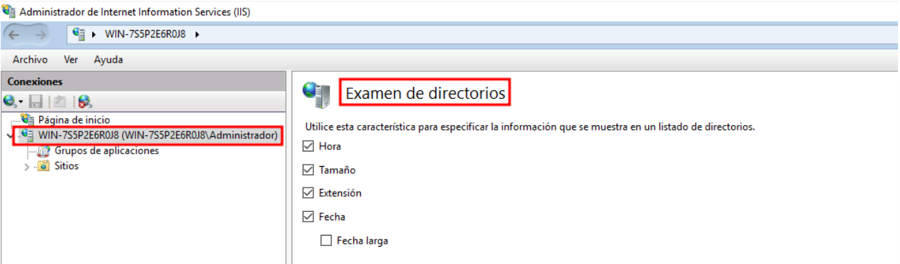

2.2 En el archivo por defecto a mostrar para todos los sitios será  **``index.html``** y **``default.asp``**. No habrá más .

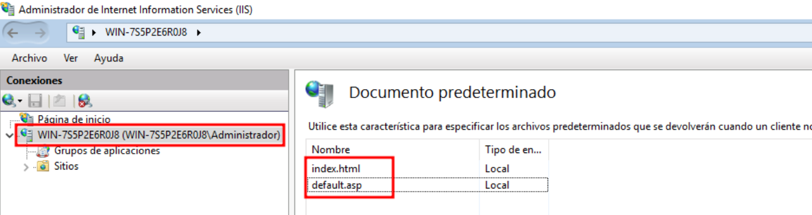

##  🧱🌐 3. Creación de un Nuevo Sitio Web 
 

3.1 Crea un sitio virtual por nombre denominado **``masofieiis.gal``** :   

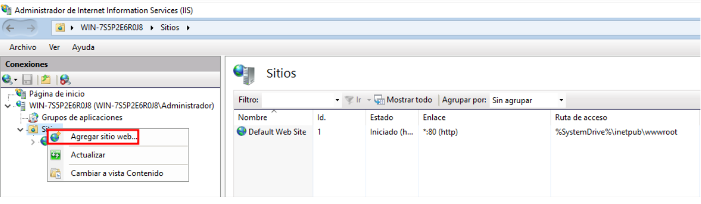

3.2 Debe tener el raíz en **``c:/masofieiis.gal``** . También atender peticiones tanto por ip que por nombre **``www.masofieiis.gal``**   

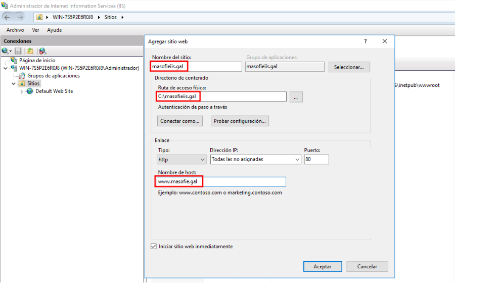

3.3 Crea una carpeta virtual (alias) denominada privado que este situada en **``c:/privado``**   

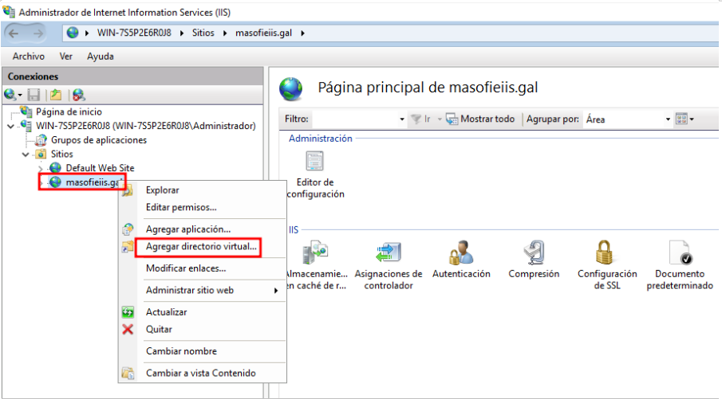

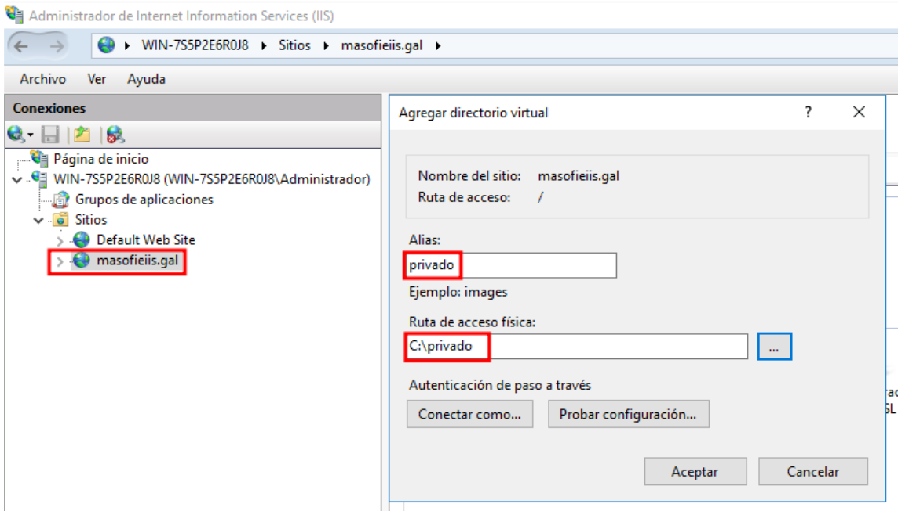

Directorio virtual creado correctamente   

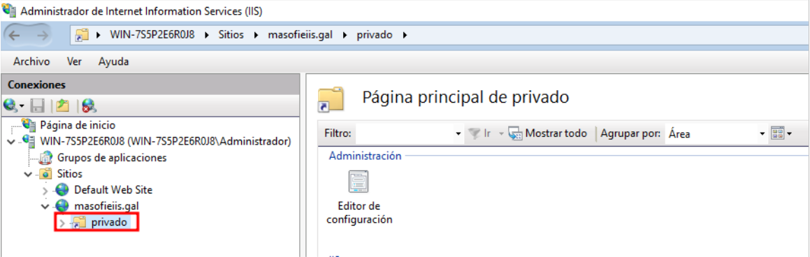

3.4 Cuando se produzca un error **``404``** deberás mostrar una página llamada **``error_404.html``** . Esta página deberá contener el texto **“Cometiste un ERROR 404  , no se encontrado ningún resultado en la búsqueda ”**.   

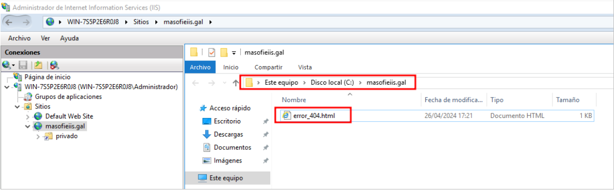
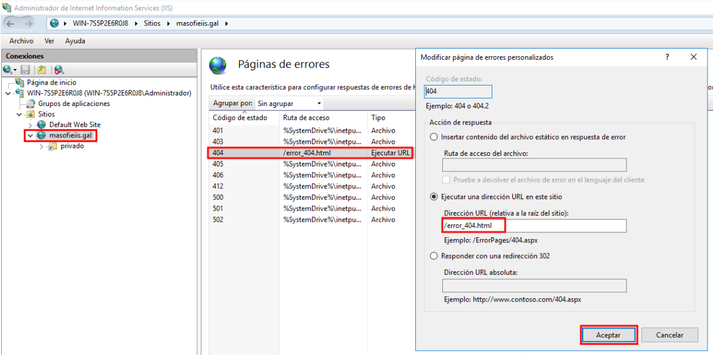

3.5 Crea un archivo denominado index.html en la raíz de este sitio que contenga **``Esta es la página principal del sitio web masofieiis.gal``** ” .   

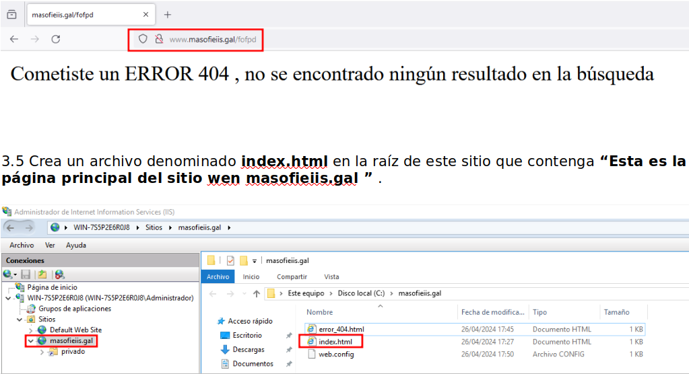

3.6 Crea un archivo privado.html en el directorio virtual privado que tenga dentro **“Bienvenido a esta carpeta PRIVADO del sitio web masofieiis.gal”** .   

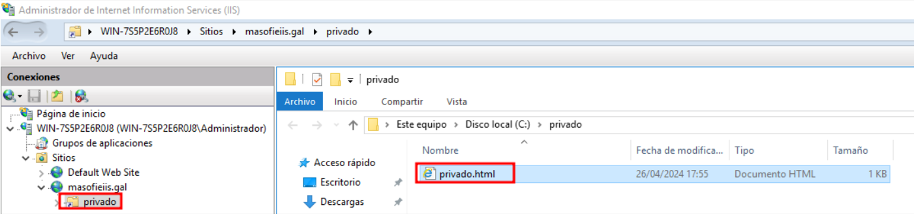

3.7 Que tenga autenticación basic este directorio   

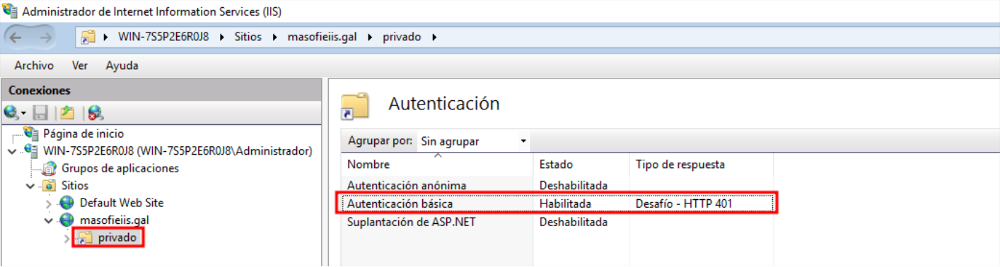

Añadimos el usuario por defecto en iss para poder acceder al directorio   

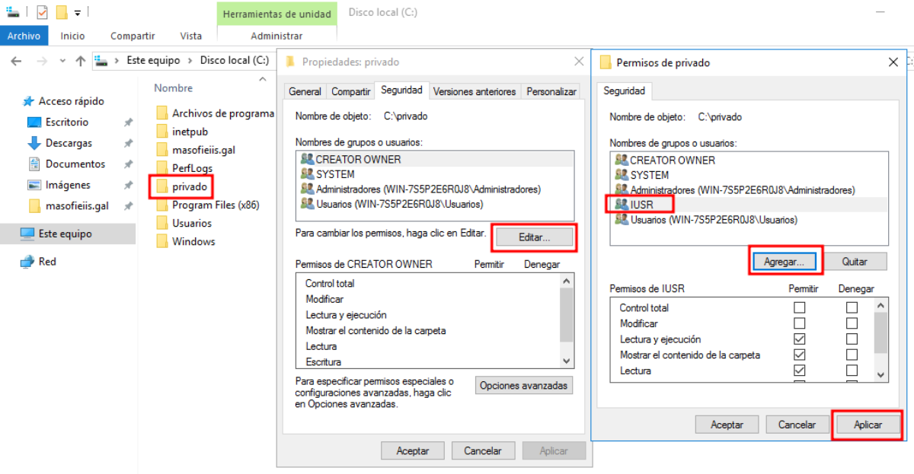

Crear usuario nuevo para acceder al directorio virtual   

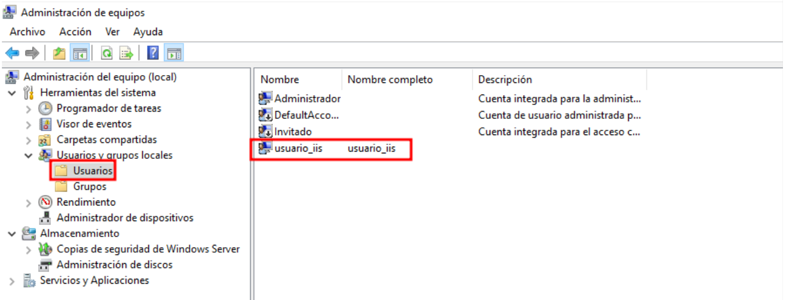

Comprobación la accesibilidad , nos va ha fallar si hacemos esto porque entes en los directorios predeterminados solo teníamos **``index.html``** y **``default.asp``** , y como este directorio tiene un fichero llamado **``privado.html``** .   

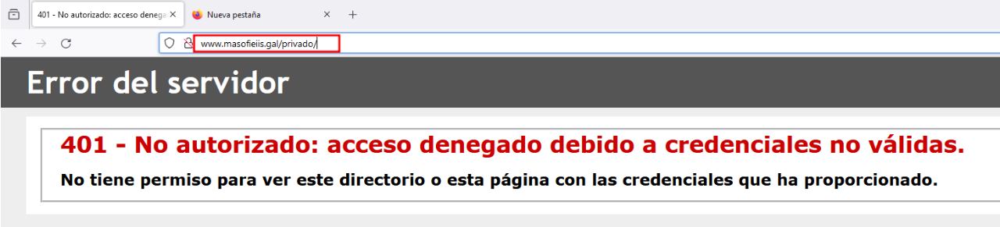

Para solucionar este problema solo hay que buscarlo de esta manera y funcionara correctamente   

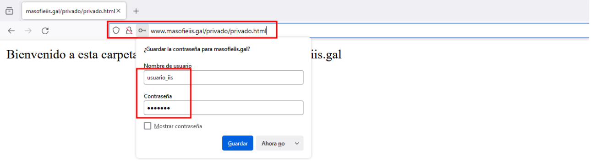

## 🔁🔒 4. Redirección de HTTP a HTTPS 
 

4.1 Crea un certificado y redije al puerto **``443``** . Para eso solo hay que ir a la configuración global del servidor y ir a **‘Certificados de Servidor – Certificado Auto-firmado’** y lo creamos de la siguiente manera .   

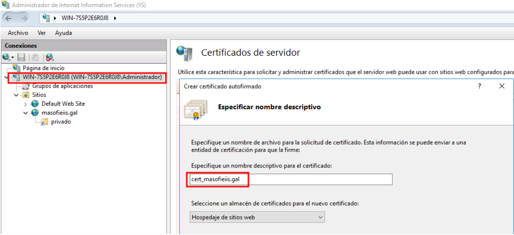

Creamos un enlace para redirigir , lo hacemos de la siguiente manera    
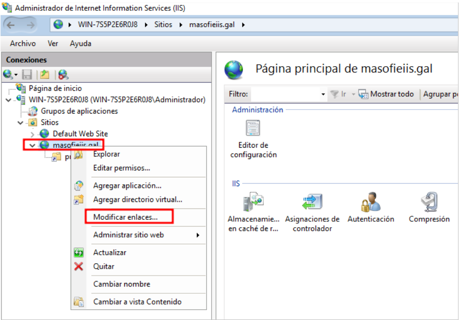

Y cuando lo tengamos así , solo hay que añadir el certificado que hemos creado antes    

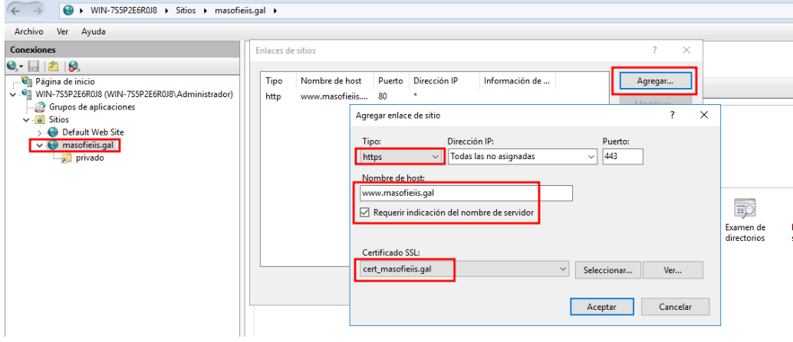

Ahora volvemos al navegador y escribimos la misma **``url``** pero en ves de poner **``http``** ponemos **``https``** y nos mostrara la siguiente advertencia    

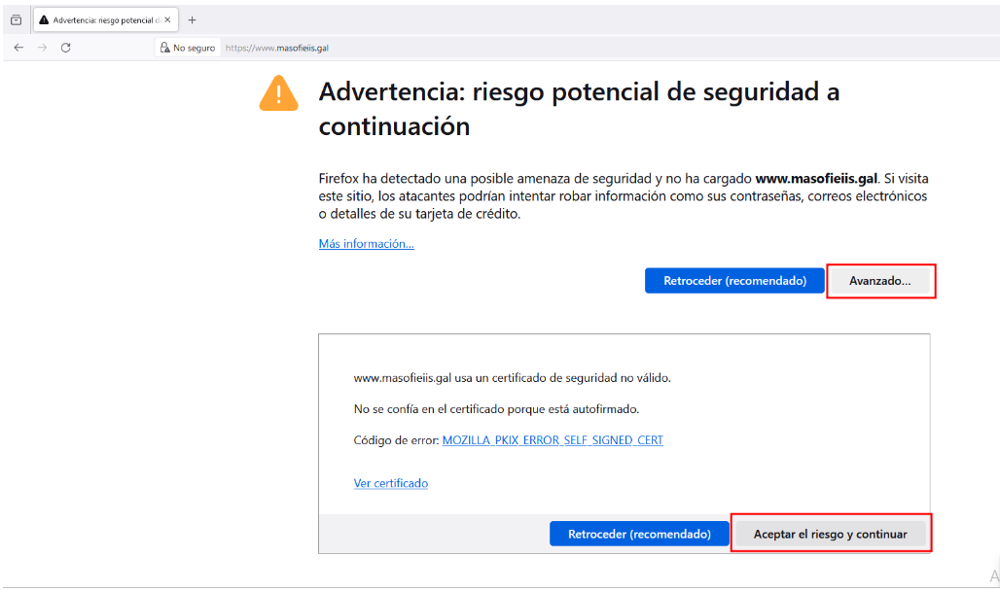

Como podemos ver se ha redirigido correctamente y nos muestra también el certificado que hemos creado antes   

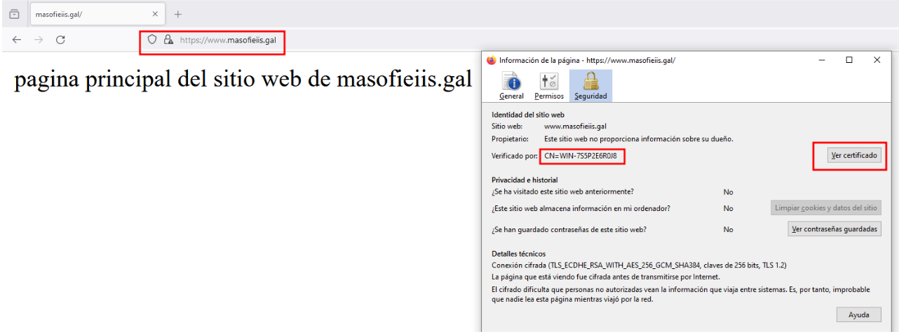

 

**💡 Consejo Final**
>Antes de publicar tu sitio web en **``IIS``** 🪟🌐, asegúrate de que esté correctamente configurado con certificados válidos 🔒✅ para **``HTTPS``** y que la redirección esté activa 🔁🌍.
>Además, verifica los permisos y rutas físicas del sitio para evitar errores de acceso 🚫📁. 