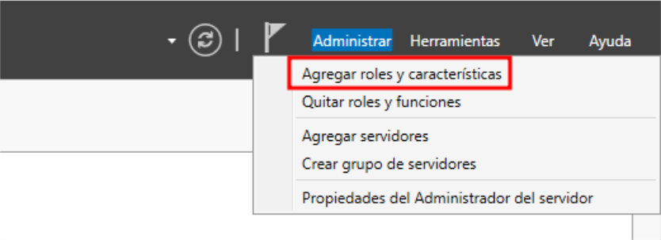
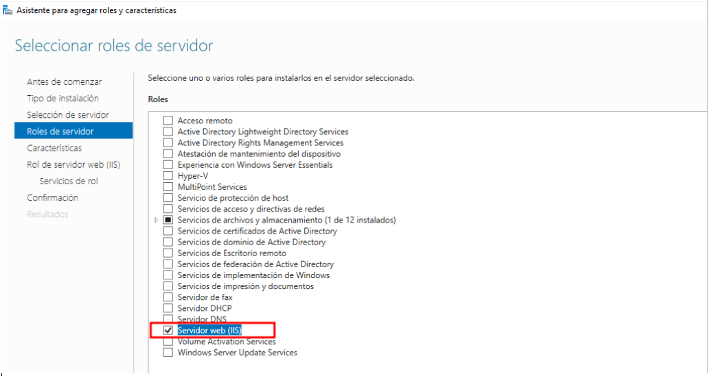
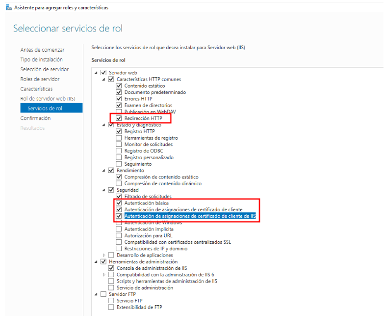
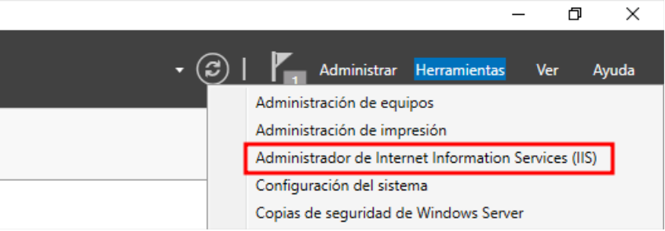
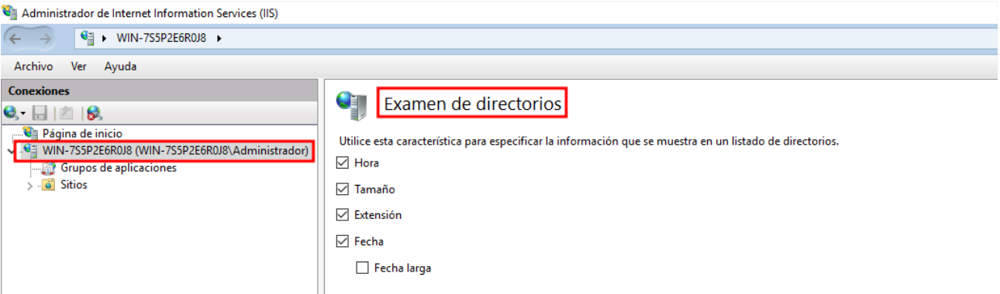
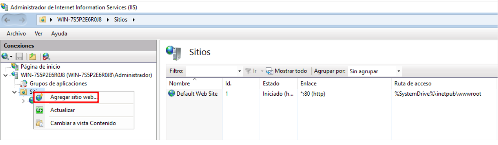
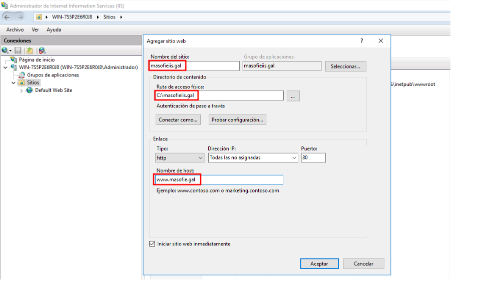
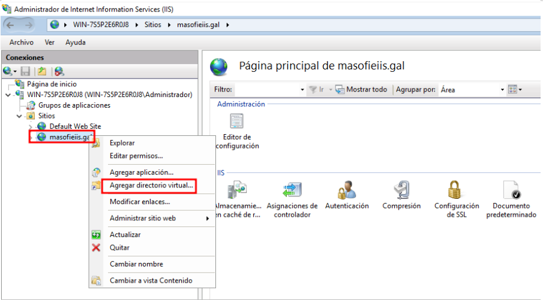
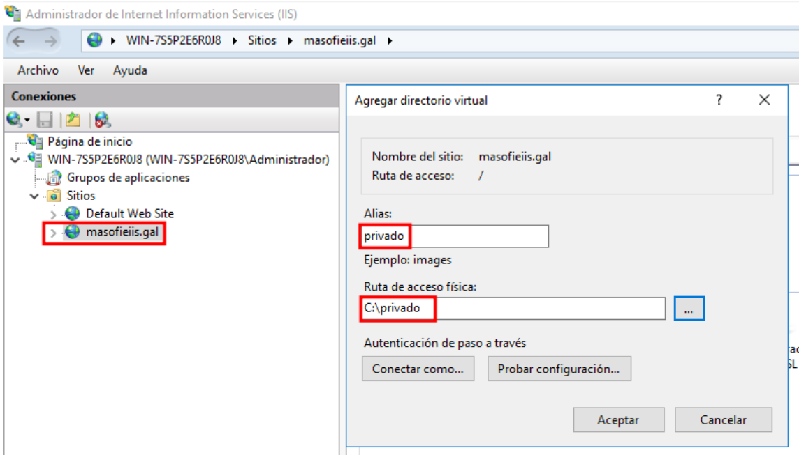
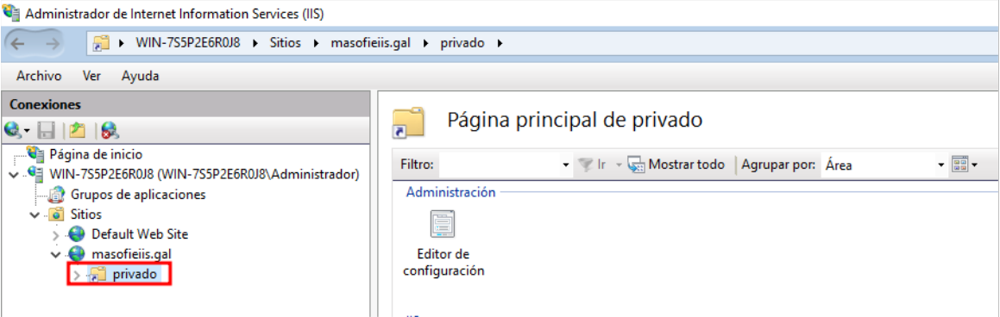

# Instalación y Configuración del Servidor ISS en Windows 

## INDICE

- [Instalación y Configuración del Servidor ISS en Windows](#instalación-y-configuración-del-servidor-iss-en-windows)
  - [INDICE](#indice)
  - [1. Instalación :](#1-instalación-)
  - [2. Configuración del sitio global](#2-configuración-del-sitio-global)
  - [3. Creación de nuevo sitio](#3-creación-de-nuevo-sitio)
  - [4. Re-dirección de http a https](#4-re-dirección-de-http-a-https)

## 1. Instalación :

1.1 Agregar roles y características 

1.2 Seleccionar el rol de ‘Servidor Web (ISS)’ , así como se muestra en la siguiente imagen

1.3 Instalación de componentes adicionales

1.4 Acceder a la configuración de ISS 

## 2. Configuración del sitio global

2.1 Habilitar el examen de directorio para todos los sitios 

2.2 En el archivo por defecto a mostrar para todos los sitios será index.html y default.asp . No habrá más .

## 3. Creación de nuevo sitio 

3.1 Crea un sitio virtual por nombre denominado masofieiis.gal :

3.2 Debe tener el raíz en c:/masofieiis.gal . También atender peticiones tanto por ip que por nombre www.masofieiis.gal

3.3 Crea una carpeta virtual (alias) denominada privado que este situada en c:/privado

Directorio virtual creado correctamente 

3.4 Cuando se produzca un error 404 deberás mostrar una página llamada error_404.html . Esta página deberá contener el texto “Cometiste un ERROR 404  , no se encontrado ningún resultado en la búsqueda ” .Comprobar error 404 

3.5 Crea un archivo denominado index.html en la raíz de este sitio que contenga “Esta es la página principal del sitio wen masofieiis.gal ” .Comprobar sitio principal

3.6 Crea un archivo privado.html en el directorio virtual privado que tenga dentro “Bienvenido a esta carpeta PRIVADO del sitio web masofieiis.gal” .

3.7 Que tenga autenticación basic este directorioAñadimos el usuario por defecto en iss para poder acceder al directorio 

Crear usuario nuevo para acceder al directorio virtual Comprobación la accesibilidad , nos va ha fallar si hacemos esto porque entes en los directorios predeterminados solo teníamos index.html y default.asp , y como este directorio tiene un fichero llamado privado.html .Para solucionar este problema solo hay que buscarlo de esta manera y funcionara correctamente 

## 4. Re-dirección de http a https 

4.1 Crea un certificado y redije al puerto 443 . Para eso solo hay que ir a la configuración global del servidor y ir a ‘Certificados de Servidor – Certificado Auto-firmado’ y lo creamos de la siguiente manera .

Creamos un enlace para redirigir , lo hacemos de la siguiente manera Y cuando lo tengamos así , solo hay que añadir el certificado que hemos creado antes 

Ahora volvemos al navegador y escribimos la misma url pero en ves de poner http ponemos https y nos mostrara la siguiente advertencia Como podemos ver se ha redirigido correctamente y nos muestra también el certificado que hemos creado antes 