# ⚙️🐧🔒 Creación de Sitio Virtual con *``HTTP/HTTPS``* en Apache2 sobre Debian 
 

**📑 Indice**
- [⚙️🐧🔒 Creación de Sitio Virtual con *``HTTP/HTTPS``* en Apache2 sobre Debian](#️-creación-de-sitio-virtual-con-httphttps-en-apache2-sobre-debian)
  - [🧠 ¿Qué es Apache2?](#-qué-es-apache2)
  - [🛠️🌍 1. Configuración de Sitios Globales](#️-1-configuración-de-sitios-globales)
  - [📝 3. Configuración del Sitio por Defecto](#-3-configuración-del-sitio-por-defecto)
  - [🧱🌐 4. Creación de un Nuevo Sitio Virtual](#-4-creación-de-un-nuevo-sitio-virtual)
  - [✅🔎 5. Comprobaciones del Sitio Virtual](#-5-comprobaciones-del-sitio-virtual)
- [📚📖 Biografía de Apache2](#-biografía-de-apache2)

 

## 🧠 ¿Qué es Apache2? 
 

>*``Apache2``* es un servidor web de código abierto que forma parte del sistema operativo **Debian** . Es uno de los servidores web más populares y ampliamente utilizado en el mundo . *``apache2``* es conocido por su estabilidad , seguridad y flexibilidad , lo que lo convierte en una excelente opción para alojar sitios web de cualquier tamaño .

>La utilización de *``apache2``* en **Debian** permite a los usuarios hospedar sus sitios web , aplicaciones web y servicios en línea de una manera confiable y segura. Con su amplia gama de características y opciones de configuración, *``apache2``* es capaz de manejar una gran cantidad de tráfico y responder eficientemente a las solicitudes de los usuarios. Además, su integración con el sistema operativo **Debian** facilita su instalación y mantenimiento, convirtiéndolo en una herramienta indispensable para desarrolladores y administradores de sistemas.

 

## 🛠️🌍 1. Configuración de Sitios Globales 
 

1 - Instalamos el servidor web *``apache2``* que vamos ha utlizar para crear los sitios web .

~~~~~~~~~~~~~~~~~~~~
# Instalar servidor web
apt install apache2
~~~~~~~~~~~~~~~~~~~~

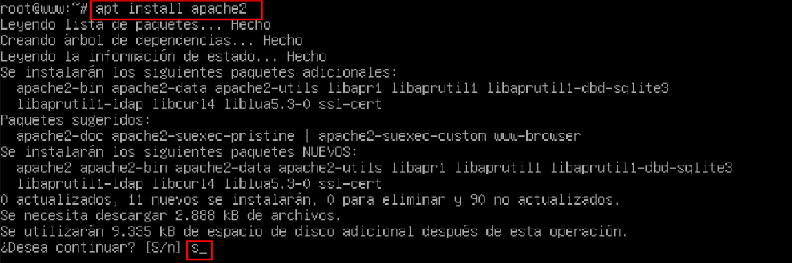
 
 

2 - Instalamos el servicio *``php``* , estos los necesitamos posteriormente .

~~~~~~~~~~~~~~~~~~~~
# Instalar servicio php
apt install php
~~~~~~~~~~~~~~~~~~~~

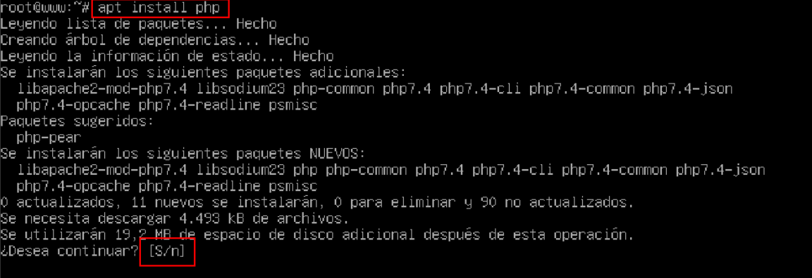
 
 

3 - Modiciamos el fichero apropiado para que el fichero por defecto de un directorio sea *``index.php``* , *``index.asp``* y *``index.html``*

~~~~~~~~~~~~~~~~~~~~~~~~~~~~~~~~~~~~~~~~~~
# Creación de fichero por defecto
nano /etc/apache2/mods-avaliables/dir.conf
~~~~~~~~~~~~~~~~~~~~~~~~~~~~~~~~~~~~~~~~~~

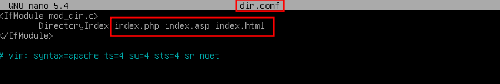
 
 

4 - Habilitar los módulos *``usertrack``* (cookies) y *``userdir``* (sitios personales) 

~~~~~~~~~~~~~~~~~~
# Seguimiento de usuarios (cookies)
a2enmod usertrack

# Sitios personales públicos
a2enmod userdir
~~~~~~~~~~~~~~~~~~

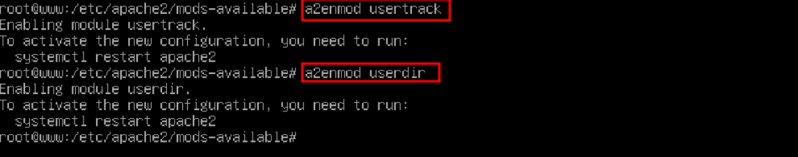
 
 

## 📝 3. Configuración del Sitio por Defecto 
 

1 - El sitio por defecto tiene que mostrar *``Este es el fichero del sitio por defecto``*

 
 

2 - Debe atender peticiones a mayores , en el puerto *``9999``* 

~~~
# Fichero de configuración de los puertos
/etc/apache2/sites-available/000-default.conf
~~~

 
 

## 🧱🌐 4. Creación de un Nuevo Sitio Virtual 
 

1 – Crear un sitio virtual llamado *``ciudad.gal``* que atienda en los puertos *``80``* y *``9999``* .

~~~
<VirtualHost 192.168.18.97:80 192.168.18.97:9999>
        ServerName www.ciudad.gal
        ServerAlias ciudad.gal
        DocumentRoot /var/www/ciudad.gal
</VirtualHost>
~~~

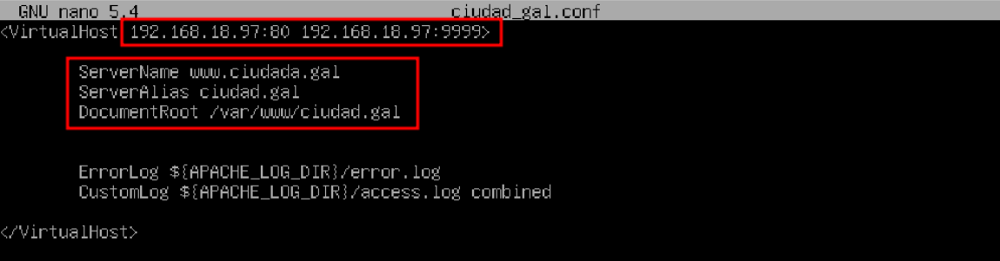
 
 

2 – Modificar los archivos de *``logs``* para que sean específicos .

~~~~
# Errores de logs modificado
ErrorLog ${APACHE_LOG_DIR}/error_ciudad_gal.log
CustomLog ${APACHE_LOG_DIR}/access.log_ciudad_gal.log combined
~~~~

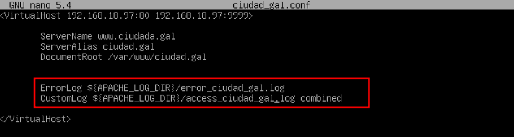
 
 

Formato *``combined``* incluye :

- Dirección *``ip``* del cliente
- Fecha y hora
- Método y *``URL``* de la petición
- Código de respuesta *``http``*
- Tamaño de la respuesta
- Referer (de dónde vino el visitante)
- *``User-Agent``* (navegador o cliente usado)

 
 

3 – Cuando se produzca un error *``404``* se mostrar un mensaje *``No se ha podido encontrar ningún resultado en la búsqueda``* , que este alojado en el directorio *``/var/www/ciudad.gal/error_404.html``* .

~~~
# Añadir error 404
ErrorDocument 404 /error_404.html
~~~

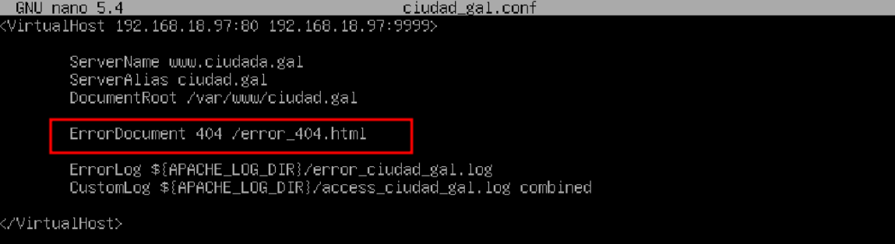
 
 

4 – Cuando se produzca un error *``403``* mostrar un mensaje de *``PROHIBIDO``* .

~~~
# Añadir error 403
ErrorDocument 403 "PROIBIDO"
~~~

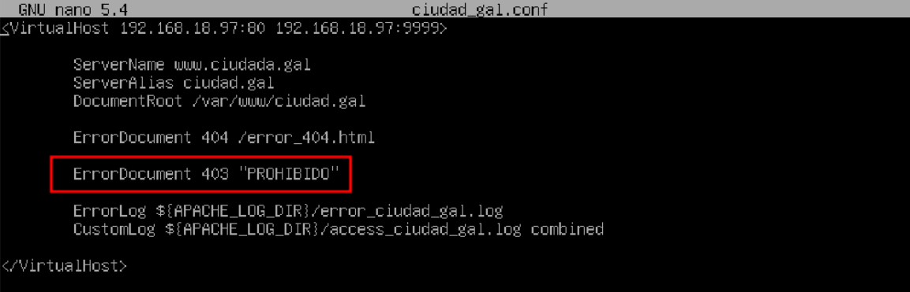
 
 

5 – Los archivos de este sitio a mostrar por defecto serán *``index.html``* e *``index.php``*

~~~
# Mostrar archivos por defecto
<Directory /var/www/ciudad.gal>
    DirectoryIndex index.html index.php
</Directory    
~~~

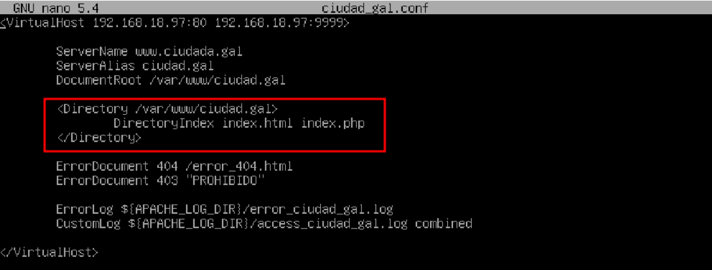
 
 

6 – No permitir que se listen los contenidos de las carpetas , al no encontrar ninguno de los documentos por defecto .

~~~
# Listar contenido de las carpetas
<Directory /var/www/ciudad.gal>
    DirectoryIndex index.html index.php
    Options -Indexes
</Directory    
~~~

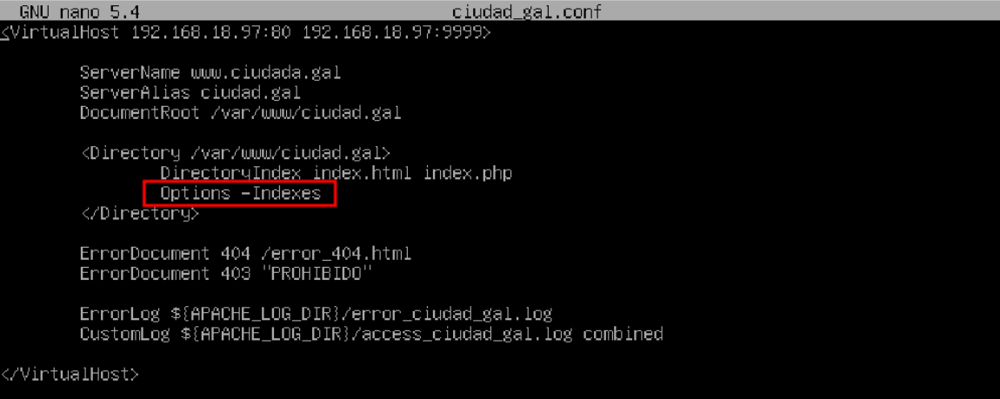
 
 

7 – Crea un *``alias``* que se redirija la *``url``* *``./docs  ./documentos``* , que se debe crear previamente .

~~~
# Añadir un alias en directorio en especifico
Alias "/docs" "/var/www/ciudad.gal/documentos"
~~~

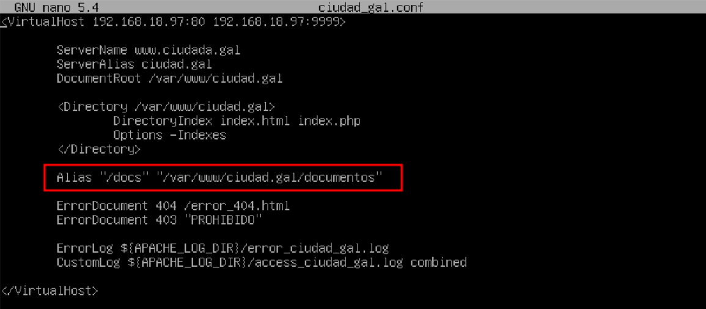
 
 

8 – Crea una carpeta denominada *``carpetacuidad``* . El acceso a esta carpeta debe ser restringida para los usuarios *``user1``* y *``user2``* con contraseña *``abc123.``* mediante *``Autenticación Basic``* .

~~~
# Añadir acceso limitado 
htpasswd -c /usr/local/apache/passwd/passwords user1
htpasswd -c /usr/local/apache/passwd/passwords user2
~~~

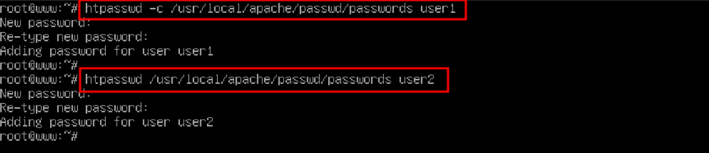
 
 

9 – Crea un archivo denominado *``index.html``* en la carpeta ciudad.gal que tenga en el contenido *``Bienvenido al Sitio Virtual ciudad.gal``* .

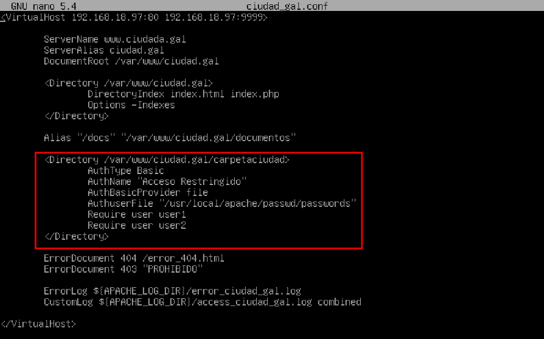
 
 

10 – Habilita en el sitio wen anterior un acceso por *``ssl``* con la creación de la *``claves RSA``*. Debe redirigir las peticiones del puerto *``80``* al puerto *``443``* .

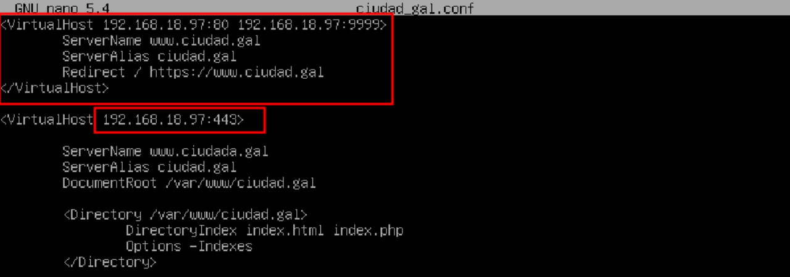
 
 

## ✅🔎 5. Comprobaciones del Sitio Virtual 
 

*``Para comprobar que todo esta funcionando correctamente , lo comprobaremos un cliente Windows , desde el navegador web . Entones vamos hacer las siguintes pruebas desde el navegador :``*

1 - Desde *``w10``* mostramos el sitio por defecto utilizando la *``ip``* del equipo

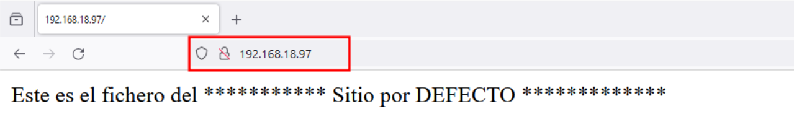
 
 

# 📚📖 Biografía de Apache2 
 

 **Página Oficial :** 
   - *``https://httpd.apache.org/``*
 **Wikipedia :** 
   - *``https://es.wikipedia.org/wiki/Servidor_HTTP_Apache``*
 **Ionos :** 
   - *``https://www.ionos.es/digitalguide/servidores/configuracion/instalar-apache-en-ubuntu/``*

 
 

**💡 Consejo Final**

> No olvides habilitar el nuevo sitio con *``a2ensite nombredelsitio.conf``* ✅ y recargar *``Apache``* con **``sudo systemctl reload apache2``** 🔁.
> Si vas a usar *``https``* , asegúrate de que el módulo *``ssl``* esté activado con *``a2enmod ssl``* 🔒 y que el certificado esté correctamente configurado.
> Haz pruebas con el navegador 🧪 o con comandos como *``curl -I``* para verificar que el sitio responde en ambos protocolos sin errores. 🌐✨