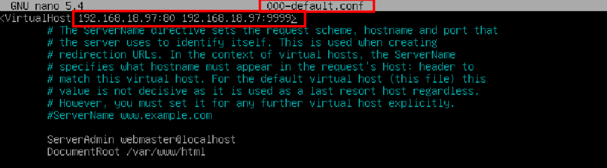

# ⚙️🐧🔒 Creación de Sitio Virtual con HTTP/HTTPS en Apache2 sobre Debian 
 

**📑 Indice**

- [⚙️🐧🔒 Creación de Sitio Virtual con HTTP/HTTPS en Apache2 sobre Debian](#️-creación-de-sitio-virtual-con-httphttps-en-apache2-sobre-debian)
  - [🧠 ¿Qué es Apache2?](#-qué-es-apache2)
  - [🛠️🌍 1. Configuración de Sitios Globales](#️-1-configuración-de-sitios-globales)
  - [📝 3. Configuración del Sitio por Defecto](#-3-configuración-del-sitio-por-defecto)
  - [🧱🌐 4. Creación de un Nuevo Sitio Virtual](#-4-creación-de-un-nuevo-sitio-virtual)
  - [✅🔎 5. Comprobaciones del Sitio Virtual](#-5-comprobaciones-del-sitio-virtual)
- [📚📖 Biografía de Apache2](#-biografía-de-apache2)

## 🧠 ¿Qué es Apache2? 

**Apache2** es un servidor web de código abierto que forma parte del sistema operativo Debian. Es uno de los servidores web más populares y ampliamente utilizado en el mundo. **``apache2``** es conocido por su estabilidad, seguridad y flexibilidad, lo que lo convierte en una excelente opción para alojar sitios web de cualquier tamaño.

La utilización de **``apache2``** en **Debian** permite a los usuarios hospedar sus sitios web, aplicaciones web y servicios en línea de una manera confiable y segura. Con su amplia gama de características y opciones de configuración, **``apache2``** es capaz de manejar una gran cantidad de tráfico y responder eficientemente a las solicitudes de los usuarios. Además, su integración con el sistema operativo Debian facilita su instalación y mantenimiento, convirtiéndolo en una herramienta indispensable para desarrolladores y administradores de sistemas.

## 🛠️🌍 1. Configuración de Sitios Globales 

1 – Instala el servidor web **``apache2``** y  el servicio **``php``** que necesitaremos posteriormente .  

~~~~~~~~~~~~~~~~~~~~
apt install apache2
apt install php

~~~~~~~~~~~~~~~~~~~~

2 – Modifica el archivo apropiado para que el archivo a mostrar por defecto de un directorio sea **``index.php``** , **``index.asp``** y luego **``index.html``** .  

~~~~~~~~~~~~~~~~~~~~~~~~~~~~~~~~~~~~~~~~~~
nano /etc/apache2/mods-avaliables/dir.conf
~~~~~~~~~~~~~~~~~~~~~~~~~~~~~~~~~~~~~~~~~~

3 – Habilita los módulos **``usertrack``** y **``userdir``** de la siguiente manera  

~~~~~~~~~~~~~~~~~~
a2enmod usertrack
a2enmod userdir
~~~~~~~~~~~~~~~~~~

## 📝 3. Configuración del Sitio por Defecto 

1 – Configura el sitio por defecto que muestre **"Este es el fichero del sitio por defecto"** . 

2 – Debe atender peticiones a mayores , en el puerto **``9999``** de la siguiente manera.  

## 🧱🌐 4. Creación de un Nuevo Sitio Virtual 

1 – Crea un sitio virtual por nombre ciudad.gal que atienda en los puertos **``80``** y **``9999``** . 

2 – Modifica los archivos de logs para que sean específicos .  

3 – Cuando se produzca un error **``404``** se mostrara el mensaje **“No se ha podido encontrar ningún resultado en la búsqueda”** , que este alojado en el directorio **``/var/www/ciudad.gal/error_404.html``** .  

4 – Cuando se produzca un error **``403``** se mostrará un mensaje de **``PROHIBIDO``** .  

5 – Los archivos de este sitio a mostrar por defecto serán **``index.html``** e **``index.php``** .  

6 – No se permitirá que se listen los contenidos de las carpetas , al no encontrar ninguno de los documentos por defecto .

7 – Crea un **``alias``** que se redirija la **``url``** **``./docs  ./documentos``** , que se debe crear previamente .  

8 – Crea una carpeta denominada **``carpetacuidad``** . El acceso a esta carpeta debe ser restringida para los usuarios **``user1``** y **``user2``** con contraseña **``abc123.``** mediante **Autenticación Basic** .  

9 – Crea un archivo denominado **``index.html``** en la carpeta ciudad.gal que tenga en el contenido **"Bienvenido al Sitio Virtual ciudad.gal"** .  

10 – Habilita en el anterior sitio web un acceso por **``SSL``** con la creación de la **claves RSA**. Debe redirigir las peticiones del puerto **``80``** al puerto **``443``** .  

## ✅🔎 5. Comprobaciones del Sitio Virtual 

**Para comprobar que todo esta funcionando correctamente , lo comprobaremos un **"cliente Windows"** , desde el navegador web . Entones vamos hacer las siguintes pruebas desde el navegador :**   

1 - Desde **w10** mostramos el sitio por defecto utilizando la ip del equipo  

 

# 📚📖 Biografía de Apache2 

> - ***Página Oficial :*** ***https://httpd.apache.org/***
> - ***Wikipedia :*** ***https://es.wikipedia.org/wiki/Servidor_HTTP_Apache***
> - ***Ionos :*** ***https://www.ionos.es/digitalguide/servidores/configuracion/instalar-apache-en-ubuntu/***

 

**💡 Consejo Final**

> No olvides habilitar el nuevo sitio con **``a2ensite nombredelsitio.conf``** ✅ y recargar **Apache** con **``sudo systemctl reload apache2``** 🔁.
> Si vas a usar **HTTPS** , asegúrate de que el módulo **``SSL``** esté activado con **``a2enmod ssl``** 🔒 y que el certificado esté correctamente configurado.
> Haz pruebas con el navegador 🧪 o con comandos como **``curl -I``** para verificar que el sitio responde en ambos protocolos sin errores. 🌐✨