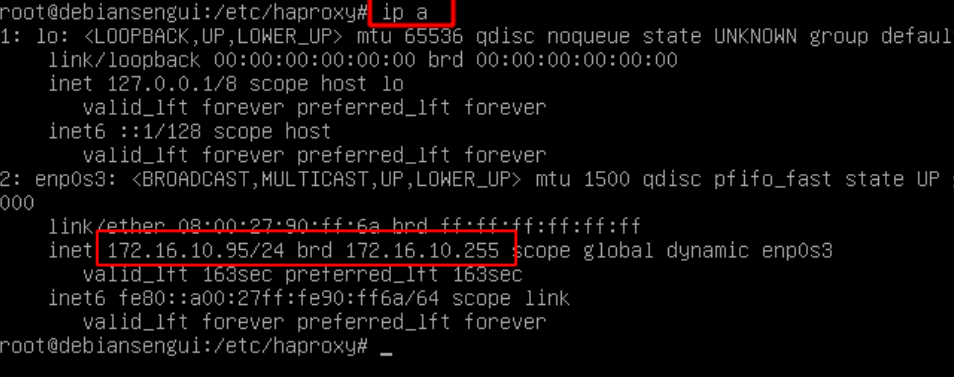
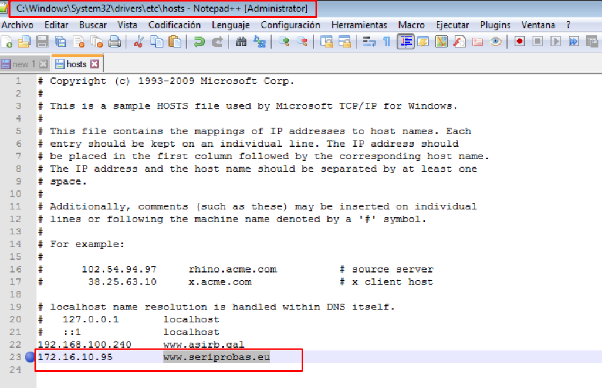
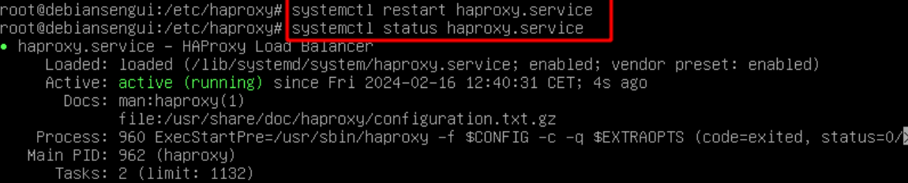

# 🔄 Alta Disponibilidad con *``HAProxy``*
 

**📑 Indice**
- [🔄 Alta Disponibilidad con *``HAProxy``*](#-alta-disponibilidad-con-haproxy)
  - [📝 Definición](#-definición)
  - [⚙️ 1. HAProxy como Terminador *``SSL``*](#️-1-haproxy-como-terminador-ssl)
    - [🛠️ 1.1 Instalación y Comprobación de *``HAProxy``*](#️-11-instalación-y-comprobación-de-haproxy)
    - [️🌐 1.2 Instalación del Servidor Apache2](#️-12-instalación-del-servidor-apache2)
    - [📦 1.3 Instalación de Módulos *``PHP``* Necesario](#-13-instalación-de-módulos-php-necesario)
  - [🔧 2. Configuración de *``HAProxy``*](#-2-configuración-de-haproxy)
    - [🖥️ 2.1 Crear Servidores de Respaldo *``(Backends)``*](#️-21-crear-servidores-de-respaldo-backends)
    - [✅ 2.2 Comprobaciones de Funcionamiento](#-22-comprobaciones-de-funcionamiento)

 

## 📝 Definición 
 

*``HAProxy``* es un software de código abierto que proporciona balanceo de carga y proxy inverso para servidores web . Es utilizado comúnmente en entornos de alta disponibilidad para distribuir la carga entre varios servidores y garantizar la disponibilidad y rendimiento de los servicios web . En Debian *``HAProxy``* se puede instalar a través del gestor de paquetes *``apt-get``*.

 

## ⚙️ 1. HAProxy como Terminador *``SSL``*
 

### 🛠️ 1.1 Instalación y Comprobación de *``HAProxy``*
 

1 - En una máquina nueva instalamos el paquete *``haproxy``* usando el comando *``apt``* como se muestra en el terminal .

~~~~~~~~~~~~~~~~~~~~
# Instalación de Servicio
apt install haproxy
~~~~~~~~~~~~~~~~~~~~

 
 

2 - Comprobamos que se instalo visualizando la versión que hemos instalado

~~~~~~~~~~~~
# Visualizar verisión
haproxy -v
~~~~~~~~~~~~

 
 

3 - Hacemos una copia de seguridad del fichero , copiandolo con otro nombre . Esto por si queremos volver a tener el fichero original .

~~~~~~~~~~~~~~~~~~~~~~~~~~~~~~~~~~~~~~~~~~~~~~~~~~~~~~~~~~~~~~
# Copiar fichero y modificar nombre
cp /etc/haproxy/haproxy.cfg /etc/haproxy/haproxy.cfg.original
~~~~~~~~~~~~~~~~~~~~~~~~~~~~~~~~~~~~~~~~~~~~~~~~~~~~~~~~~~~~~~

 
 

### ️🌐 1.2 Instalación del Servidor Apache2

En el equipo *``ww1``* instalamos el servicio de *``apache2``* (en el equipo del sitio web) .

~~~~~~~~~~~~~~~~~~~~
# Instalar  servicio
apt install apache2
~~~~~~~~~~~~~~~~~~~~

 
 

### 📦 1.3 Instalación de Módulos *``PHP``* Necesario

1 - Instalamos el módulo *``php``* , es un módulo necesario para ajecutar apache2 .

~~~~~~~~~~~~~~~~~~~~~~~~~~~~~~~~~~~~~~~~~~~~~~~~~~~~
# Instalación de paquetes 
sudo apt-get install apache2 php libapache2-mod-php
~~~~~~~~~~~~~~~~~~~~~~~~~~~~~~~~~~~~~~~~~~~~~~~~~~~~

 
 

2 - Reiniciamos el servicio *``apache2``* para guradar los cambios realizados . Y mostramos el estado a ver si todo esta correcto .

~~~~~~~~~~~~~~~~~~~~~~~~~~
# Reiniciamos el servicio 
systemclt restart apache2

# Ver estado del servicio
systemclt status apache2
~~~~~~~~~~~~~~~~~~~~~~~~~~

 
 

3 - Creamos un nuevo sitio web llamado *``seriprobas.eu``* . Para no tener que hacerlo todo desde el principio copiamos el sitio por defecto y le damos otro nombre .

~~~~~~~~~~~~~~~~~~~~~~~~~~~~~~~~~~~~~~~~~~~~~~~~~~~~~~~~~~~~~~~~~~~~~~~~~~~~~~~~~~~~~~~~~~~~~~~~~~~~
# Copiar fichero de sitio por defecto
cp /etc/apache2/sites-available/000-default.conf /etc/apache2/sites-available/www.seriprobas.eu.conf
~~~~~~~~~~~~~~~~~~~~~~~~~~~~~~~~~~~~~~~~~~~~~~~~~~~~~~~~~~~~~~~~~~~~~~~~~~~~~~~~~~~~~~~~~~~~~~~~~~~~

 
 

4 - Creamos un fichero llamado *``index.php``* referencia a  *``seriprobas.eu``* , usando el comando *``nano``* . 

~~~~~~~~~~~~~~~~~~~~~~~~~~~~~~~~~~~~~~~~~
3 Abrir y crear fichero index
nano var/www/www.seriprobas.eu/index.php
~~~~~~~~~~~~~~~~~~~~~~~~~~~~~~~~~~~~~~~~~

 
 

5 - Comprobamos el funcionamiento del sitio web desde el navegador del equipo cliente .

 
 

## 🔧 2. Configuración de *``HAProxy``*
 

### 🖥️ 2.1 Crear Servidores de Respaldo *``(Backends)``*
 

1 - Iniciamos en el equipo *``haproxy``* y visualizamos la dirección *``ip``* . 

 
 

2 - En el fichero *``host``* eliminamos la ip que teniamos y añadimos la del equipo *``haproxy``* .

 
 

3 - Abrimos el fichero *``haproxy.cfg``* y añadimos las siguientes lineas .

~~~~~~~~~~~~~~~~~~~~~~~~~~~~~~~~~~~~~~~~~~~~~~~~~~~~~~~~~~~~~~~
# Fichero de configuración de haproxy
frontend apache_front
	bind *:80
	acl host_www_seriprobas.eu hdr(host) -i www.seriprobas.eu
	use_bckend apache_backend_servers if hos_www_seriprobas.eu
	option forwardfor

frontend apache_backend_serves
	balance roundrobin
	server backend01 172.16.10.96:80 check
	server backend01 172.16.10.91:80 check
~~~~~~~~~~~~~~~~~~~~~~~~~~~~~~~~~~~~~~~~~~~~~~~~~~~~~~~~~~~~~~~

 
 

4 - Reiniciamos el servicio *``haproxy``* , visualizamos el estado para comprobar que todo este correcto .

 
 

### ✅ 2.2 Comprobaciones de Funcionamiento
 

1 - Hay que tener los *``3``* equipos encendidos (*``haproxy``** , *``www1``* , *``www2``*) . Accedemos al sitio web desde el cliente . Como podemos ver nos responde el equipo *``www1``*

 
 

2 Luego apagamos el equipo *``www1``* y realizamos la misma comprobación y nos responde el equipo *``www2``* .

 
 

3 - Ahora apagamos el servidor *``www2``* (ten en ceunta que solo tenemos encendido el equipo *``haproxy``*) . Resultado *``"NO FUNCIONA"``* , asi tiene que ser .

 
 

**💡 Consejo Final**

>Asegúrate de que todos los servidores backend estén activos 🟢 y correctamente configurados antes de levantar *``HAProxy``* 🛠️.
>Utiliza el modo balanceo de carga *``round-robin``* 🔁 para distribuir tráfico de forma equitativa y mejorar el rendimiento.
>Puedes verificar el estado en tiempo real con herramientas como *``haproxy -c -f /ruta/al/config.cfg``* o accediendo a la interfaz de estadísticas si está habilitada 📊.
>¡No olvides reiniciar el servicio tras cada cambio con *``sudo systemctl restart haproxy``* ! 🔄