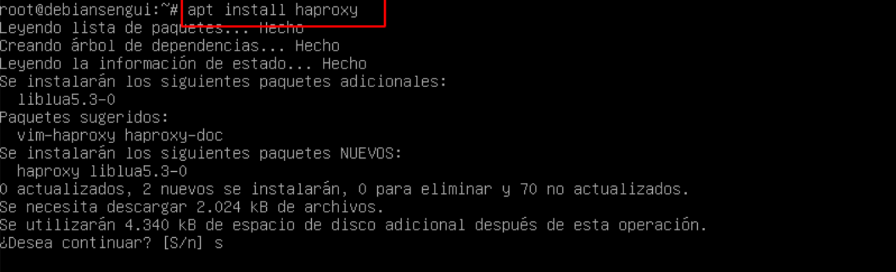
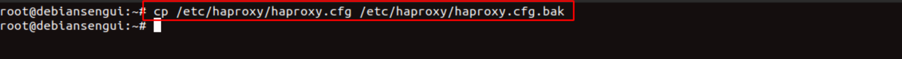
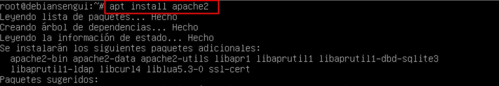
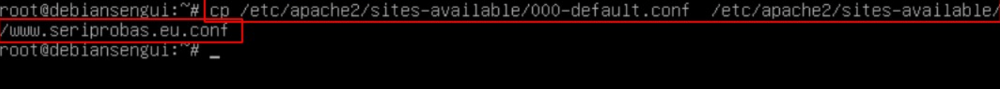

# Alta Disponibilidad con ***HAProxy***

## Indice

## Definición 

***HAProxy*** es un software de código abierto que proporciona balanceo de carga y proxy inverso para servidores web. Es utilizado comúnmente en entornos de alta disponibilidad para distribuir la carga entre varios servidores y garantizar la disponibilidad y rendimiento de los servicios web. En **Debian**, ***HAProxy*** se puede instalar a través del gestor de paquetes ***apt-get***.

## 1. HAProxy SSL Terminador

### 1.1 Instalación y Comprobación

Creamos una máquina nueva e instalamos el paquete haproxy 

~~~
apt install haproxy
~~~

Mostramos la versión que hemos instalamos

~~~
haproxy -v
~~~

Copiamos el fichero original de haproxy para tener una copia de seguridad

~~~
cp /etc/haproxy/haproxy.cfg /etc/haproxy/haproxy.cfg.original
~~~

### 1.2 Instalación de Apache2

Ahora instalamos apache en la máquina del sitio web (www1)

~~~
apt install apache2
~~~

### 1.3 Instalación de Módulos PHP

E instalamos el modulo de php

~~~
sudo apt-get install apache2 php libapache2-mod-php
~~~

Reiniciamos el servicio de apache2 para guardar cambios

~~~
systemclt restart apache2
~~~
~~~
systemclt status apache2
~~~

Copiamos el sitio por defecto y cambiamos el nombre

~~~
cp /etc/apache2/sites-available/000-default.conf /etc/apache2/sites-available/www.seriprobas.eu.conf
~~~

Creamos un fichero index.php alusivo al sitio web de seriprobas.eu

~~~
nano var/www/www.seriprobas.eu/index.php
~~~

Vamos al navegador del cliente y comprobamos que podemos acceder al sitio web

