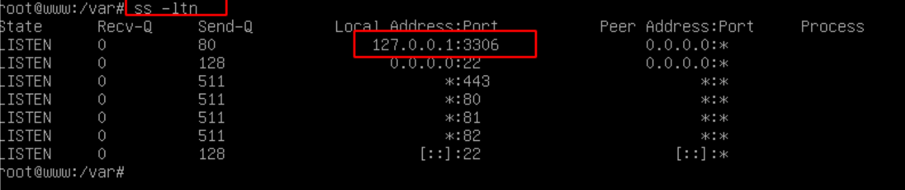
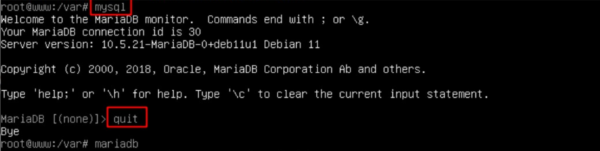
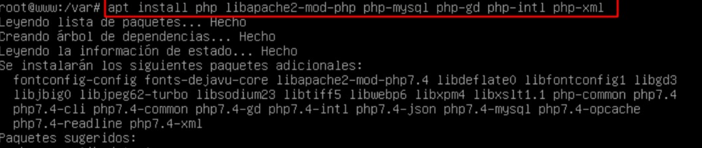
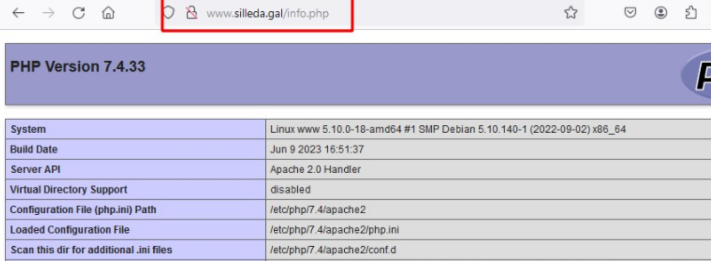
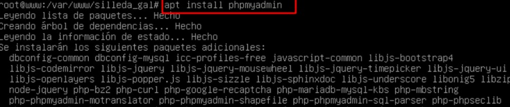
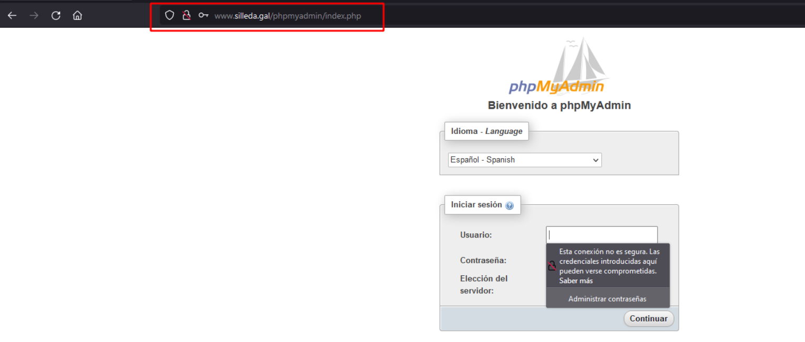

# 🖥️ Montar Apache, PHP y MariaDB
 

**📑 Indice**
- [🖥️ Montar Apache, PHP y MariaDB](#️-montar-apache-php-y-mariadb)
  - [📘 Definición](#-definición)
  - [🧰 1. Sitio Web con *``phpMyAdmin``*](#-1-sitio-web-con-phpmyadmin)
    - [🛢️ 1.1 Instalación de *``MariaDB``* y Verificación de su Funcionamiento](#️-11-instalación-de-mariadb-y-verificación-de-su-funcionamiento)
    - [⚙️ 1.2 Instalación de *``php``* y Comprobación en Servidor](#️-12-instalación-de-php-y-comprobación-en-servidor)
    - [🧑‍💻 1.3 Instalación de *``phpMyAdmin``* y Pruebas Finales de Acceso](#-13-instalación-de-phpmyadmin-y-pruebas-finales-de-acceso)

 

## 📘 Definición
 

> *``Apache``* : Es un servidor web de código abierto que permite publicar páginas web en Internet. Es muy popular y es ampliamente utilizado en la mayoría de los sistemas operativoc.

> *``PHP``* : Es un lenguaje de programación de código abierto especialmente diseñado para el desarrollo web. Se utiliza para crear sitios web dinámicos e interactivos , ya que puede integrarse fácilmente con bases de datos y otros servicios web .

> *``MariaDB``* : Es un sistema de gestión de bases de datos relacional de código abierto que se ha convertido en una alternativa popular a *``mysql``* . Ofrece un rendimiento rápidoc, alta disponibilidad y robustezc , haciendo que sea muy utilizado en entornos web y de aplicaciones empresariales .

 

## 🧰 1. Sitio Web con *``phpMyAdmin``*
 

### 🛢️ 1.1 Instalación de *``MariaDB``* y Verificación de su Funcionamiento
 

1 - Instalamos *``mariadb-server``* en el equipo *``www``* . 

~~~~~~~~~~~~~~~~~~~~~~~~~~
# Instalación de servicio
apt install mariadb-server
~~~~~~~~~~~~~~~~~~~~~~~~~~

 
 

2 - Si queremos saber si se instaló correctamente , visualizamos los puertos con el terminal . Si hay uno *``3306``* es porque se instaló correctamente .

~~~~~~~~
# Visualizamos los puertos abiertos 
ss -ltn
~~~~~~~~

 
 

3 - Hacemos una una comprobación de su funcionamiento iniciando sesión en *``mysql``* desd el terminal .

 
 

### ⚙️ 1.2 Instalación de *``php``* y Comprobación en Servidor
 

1 -  Instalamos el servicio *``php``* , lo necesitaremos luego . 

~~~~~~~~~~~~~~~~~~~~~~~~~~~~~~~~~~~~~~~~~~~~~~~~~~~~~~~~~~~~~~~~~~~~~
# Instalación de servicio
apt install php libapache2-mod-php php-mysql php-gd php-intl php-xml
~~~~~~~~~~~~~~~~~~~~~~~~~~~~~~~~~~~~~~~~~~~~~~~~~~~~~~~~~~~~~~~~~~~~~

 
 

2 - En el cliente comprobamos que este instalado correctamente .

 
 

### 🧑‍💻 1.3 Instalación de *``phpMyAdmin``* y Pruebas Finales de Acceso
 

1 - Instalamos el *``phpmyadmin``* en el equipo 

~~~~~~~~~~~~~~~~~~~~~~~
# Instalación de phpadmin
apt install phpmyadmin
~~~~~~~~~~~~~~~~~~~~~~~

 
 

2 - Accedemos al cliente para comprobar el correcto funcionamiento del servicio .

 
 

**💡 Consejo Final**

>Asegúrate de reiniciar los servicios *``(apache2, mariadb)``* después de cada instalación o cambio importante. ✅
>Además, verifica los permisos y credenciales para que *``phpMyAdmin``* funcione sin errores de acceso. ¡Una buena configuración hoy te evita muchos dolores de cabeza mañana! 🧠🛠️