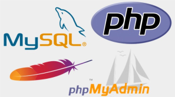

# Montar Apache, PHP y MariaDB

## Indice

## Definición

***Apache*** : Es un servidor web de código abierto que permite publicar páginas web en Internet. Es muy popular y es ampliamente utilizado en la mayoría de los sistemas operativo

***PHP*** : Es un lenguaje de programación de código abierto especialmente diseñado para el desarrollo web. Se utiliza para crear sitios web dinámicos e interactivos, ya que puede integrarse fácilmente con bases de datos y otros servicios web

***MariaDB*** : Es un sistema de gestión de bases de datos relacional de código abierto que se ha convertido en una alternativa popular a **MySQL**. Ofrece un rendimiento rápido, alta disponibilidad y robustez, haciendo que sea muy utilizado en entornos web y de aplicaciones empresariales

