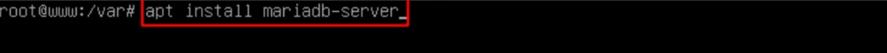

# Montar Apache, PHP y MariaDB

## Indice

## Definición

***Apache*** : Es un servidor web de código abierto que permite publicar páginas web en Internet. Es muy popular y es ampliamente utilizado en la mayoría de los sistemas operativo

***PHP*** : Es un lenguaje de programación de código abierto especialmente diseñado para el desarrollo web. Se utiliza para crear sitios web dinámicos e interactivos, ya que puede integrarse fácilmente con bases de datos y otros servicios web

***MariaDB*** : Es un sistema de gestión de bases de datos relacional de código abierto que se ha convertido en una alternativa popular a **MySQL**. Ofrece un rendimiento rápido, alta disponibilidad y robustez, haciendo que sea muy utilizado en entornos web y de aplicaciones empresariales

## 1. Sitio Web con Phpmyadmin

### 1.1 Instalación de MariaDB y Comprobación

Primero instalamos mariadb-server , en nuestra máquina www

~~~
apt install mariadb-server
~~~

Para comprobar que se instalo correctamente visualizamos los puertos y si esta el 3306 es porque esta instalado e iniciamos sesión en mysql

~~~
ss -ltn
~~~

 

### 1.2 Instalación de PHP y Comprobación

Instalamos los servicios php que vamos a necesitar

~~~
apt install php libapache2-mod-php php-mysql php-gd php-intl php-xml
~~~

En el cliente comprobamos que esta el php instalado

